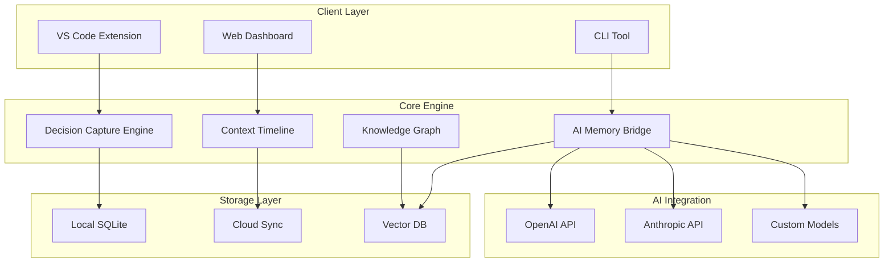

# DecisionFlow 기술 아키텍처

## 🏗️ 시스템 아키텍처 개요



## 💻 핵심 컴포넌트 상세

### 1. VS Code Extension

#### 기술 스택
```json
{
  "core": "TypeScript",
  "framework": "VS Code Extension API",
  "bundler": "esbuild",
  "ui": "Webview + React",
  "testing": "Jest + VS Code Test"
}
```

#### 주요 기능 구현
```typescript
// extension.ts
export function activate(context: vscode.ExtensionContext) {
  // AI 대화 인터셉트
  const aiInterceptor = new AIConversationInterceptor();
  aiInterceptor.on('decision', async (decision) => {
    await decisionEngine.capture(decision);
  });
  
  // 코드 변경 추적
  const codeTracker = new CodeChangeTracker();
  vscode.workspace.onDidChangeTextDocument((e) => {
    codeTracker.track(e);
  });
  
  // 컨텍스트 복원
  const contextProvider = new ContextProvider();
  vscode.commands.registerCommand('decisionflow.restore', () => {
    contextProvider.restore();
  });
}
```

### 2. Decision Capture Engine

#### 아키텍처
```typescript
// Rust 코어 엔진 (WASM으로 컴파일)
pub struct DecisionEngine {
    detector: DecisionDetector,
    extractor: RationaleExtractor,
    linker: CodeLinker,
}

impl DecisionEngine {
    pub fn process_conversation(&self, conv: Conversation) -> Vec<Decision> {
        let decisions = self.detector.detect(&conv);
        for decision in &mut decisions {
            decision.rationale = self.extractor.extract(&conv, &decision);
            decision.code_links = self.linker.link(&decision);
        }
        decisions
    }
}
```

#### ML 모델 통합
```python
# decision_detector.py
class DecisionDetector:
    def __init__(self):
        self.model = AutoModelForSequenceClassification.from_pretrained(
            "decisionflow/decision-detector-v1"
        )
        
    def detect(self, text: str) -> List[DecisionPoint]:
        # BERT 기반 의사결정 포인트 감지
        embeddings = self.tokenizer(text)
        predictions = self.model(embeddings)
        return self.extract_decisions(predictions)
```

### 3. Context Timeline System

#### 데이터 구조
```sql
-- SQLite 스키마
CREATE TABLE decisions (
    id TEXT PRIMARY KEY,
    timestamp INTEGER NOT NULL,
    project_id TEXT NOT NULL,
    prompt TEXT NOT NULL,
    response TEXT NOT NULL,
    selected_option TEXT NOT NULL,
    rationale TEXT,
    embedding BLOB -- 벡터 임베딩
);

CREATE TABLE code_changes (
    id TEXT PRIMARY KEY,
    decision_id TEXT REFERENCES decisions(id),
    file_path TEXT NOT NULL,
    diff TEXT NOT NULL,
    timestamp INTEGER NOT NULL
);

CREATE TABLE decision_links (
    parent_id TEXT REFERENCES decisions(id),
    child_id TEXT REFERENCES decisions(id),
    relationship TEXT NOT NULL
);
```

#### CRDT 동기화
```typescript
// Y.js 기반 실시간 협업
import * as Y from 'yjs';
import { WebrtcProvider } from 'y-webrtc';

class DecisionSync {
  private doc = new Y.Doc();
  private decisions = this.doc.getMap('decisions');
  
  constructor() {
    // P2P 실시간 동기화
    new WebrtcProvider('decisionflow-room', this.doc);
  }
  
  addDecision(decision: Decision) {
    this.decisions.set(decision.id, decision);
  }
}
```

### 4. AI Memory Bridge

#### 컨텍스트 주입 시스템
```typescript
class MemoryInjector {
  async enhancePrompt(originalPrompt: string): Promise<string> {
    // 1. 관련 의사결정 검색
    const relevantDecisions = await this.searchDecisions(originalPrompt);
    
    // 2. 컨텍스트 구성
    const context = this.buildContext(relevantDecisions);
    
    // 3. 프롬프트 증강
    return `
${context}

Current request: ${originalPrompt}
    `;
  }
  
  private async searchDecisions(query: string): Promise<Decision[]> {
    // 벡터 유사도 검색
    const embedding = await this.embed(query);
    return this.vectorDB.search(embedding, { limit: 5 });
  }
}
```

### 5. Knowledge Graph

#### Neo4j 스타일 구현
```typescript
// LibSQL + 그래프 쿼리
class KnowledgeGraph {
  async findDecisionPath(from: string, to: string): Promise<Path> {
    const query = `
      WITH RECURSIVE path AS (
        SELECT id, rationale, 0 as depth
        FROM decisions
        WHERE id = ?
        
        UNION ALL
        
        SELECT d.id, d.rationale, p.depth + 1
        FROM decisions d
        JOIN decision_links dl ON d.id = dl.child_id
        JOIN path p ON dl.parent_id = p.id
        WHERE p.depth < 10
      )
      SELECT * FROM path WHERE id = ?
    `;
    
    return this.db.execute(query, [from, to]);
  }
}
```

## 🔧 개발 환경 설정

### 필수 도구
```bash
# Rust (Tauri 백엔드)
curl --proto '=https' --tlsv1.2 -sSf https://sh.rustup.rs | sh

# Node.js (프론트엔드)
nvm install 20
nvm use 20

# Python (ML 모델)
pyenv install 3.11
pyenv local 3.11

# 데이터베이스
brew install libsql
brew install redis
```

### 프로젝트 구조
```
decisionflow/
├── packages/
│   ├── extension/        # VS Code Extension
│   ├── core/            # Rust 코어 엔진
│   ├── web/             # 웹 대시보드
│   └── shared/          # 공유 타입/유틸
├── models/
│   ├── detector/        # 의사결정 감지 ML
│   └── embedder/        # 텍스트 임베딩
├── docker/
│   ├── Dockerfile
│   └── docker-compose.yml
└── scripts/
    ├── build.sh
    └── deploy.sh
```

## 🚀 배포 아키텍처

### 로컬 우선 모드
```yaml
# Tauri 앱으로 패키징
name: DecisionFlow
version: 1.0.0
targets:
  - windows
  - macos
  - linux
bundle:
  - deb
  - rpm
  - dmg
  - msi
```

### 클라우드 동기화
```typescript
// Cloudflare Workers + Durable Objects
export class DecisionSyncWorker {
  async fetch(request: Request, env: Env) {
    const roomId = new URL(request.url).pathname.slice(1);
    const room = env.DECISION_ROOMS.get(
      env.DECISION_ROOMS.idFromName(roomId)
    );
    return room.fetch(request);
  }
}

export class DecisionRoom {
  private state: DurableObjectState;
  private decisions: Map<string, Decision> = new Map();
  
  async fetch(request: Request) {
    // WebSocket으로 실시간 동기화
    const upgradeHeader = request.headers.get('Upgrade');
    if (upgradeHeader === 'websocket') {
      return this.handleWebSocket(request);
    }
  }
}
```

## 🔒 보안 및 프라이버시

### 데이터 암호화
```typescript
// E2E 암호화
class Encryption {
  private async deriveKey(password: string): Promise<CryptoKey> {
    const encoder = new TextEncoder();
    const salt = crypto.getRandomValues(new Uint8Array(16));
    
    return crypto.subtle.deriveKey(
      {
        name: 'PBKDF2',
        salt,
        iterations: 100000,
        hash: 'SHA-256'
      },
      await crypto.subtle.importKey(
        'raw',
        encoder.encode(password),
        'PBKDF2',
        false,
        ['deriveKey']
      ),
      { name: 'AES-GCM', length: 256 },
      false,
      ['encrypt', 'decrypt']
    );
  }
}
```

### 접근 제어
```typescript
// Zero-Knowledge 인증
class ZKAuth {
  async authenticate(proof: Proof): Promise<boolean> {
    // 비밀번호 노출 없이 인증
    return this.verifier.verify(proof);
  }
}
```

## 📊 성능 최적화

### 인덱싱 전략
```sql
-- 빠른 검색을 위한 인덱스
CREATE INDEX idx_decisions_timestamp ON decisions(timestamp);
CREATE INDEX idx_decisions_project ON decisions(project_id);
CREATE INDEX idx_code_changes_decision ON code_changes(decision_id);

-- Full-text search
CREATE VIRTUAL TABLE decisions_fts USING fts5(
    rationale, 
    prompt, 
    response
);
```

### 캐싱 전략
```typescript
// Redis 캐싱
class DecisionCache {
  private redis: Redis;
  
  async get(key: string): Promise<Decision | null> {
    const cached = await this.redis.get(key);
    if (cached) {
      return JSON.parse(cached);
    }
    return null;
  }
  
  async set(key: string, decision: Decision) {
    await this.redis.setex(
      key, 
      3600, // 1시간 TTL
      JSON.stringify(decision)
    );
  }
}
```

## 🧪 테스팅 전략

### 단위 테스트
```typescript
// Jest 테스트
describe('DecisionDetector', () => {
  it('should detect decision points', async () => {
    const detector = new DecisionDetector();
    const conversation = {
      prompt: "Should I use JWT or session cookies?",
      response: "JWT would be better for..."
    };
    
    const decisions = await detector.detect(conversation);
    expect(decisions).toHaveLength(1);
    expect(decisions[0].options).toContain('JWT');
    expect(decisions[0].options).toContain('session cookies');
  });
});
```

### E2E 테스트
```typescript
// Playwright 테스트
test('full decision capture flow', async ({ page }) => {
  await page.goto('http://localhost:3000');
  await page.click('[data-testid="start-capture"]');
  
  // AI 대화 시뮬레이션
  await page.fill('[data-testid="ai-prompt"]', 'Which database?');
  await page.click('[data-testid="send"]');
  
  // 의사결정 캡처 확인
  await expect(page.locator('[data-testid="decision-list"]'))
    .toContainText('Database selection');
});
```

## 📈 모니터링

### 메트릭 수집
```typescript
// OpenTelemetry 통합
import { metrics } from '@opentelemetry/api';

const meter = metrics.getMeter('decisionflow');
const decisionCounter = meter.createCounter('decisions_captured');
const latencyHistogram = meter.createHistogram('capture_latency');

export function captureDecision(decision: Decision) {
  const start = Date.now();
  
  // 의사결정 캡처 로직
  
  decisionCounter.add(1, { type: decision.type });
  latencyHistogram.record(Date.now() - start);
}
```

이 아키텍처는 확장 가능하고, 보안이 강화되며, 뛰어난 개발자 경험을 제공하도록 설계되었습니다.