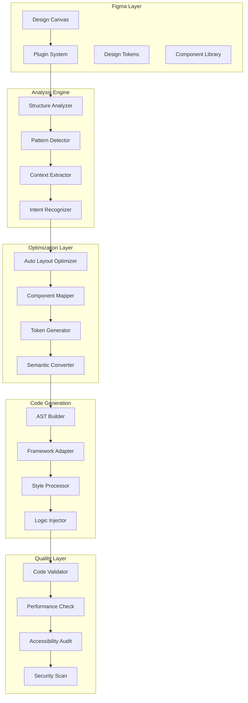
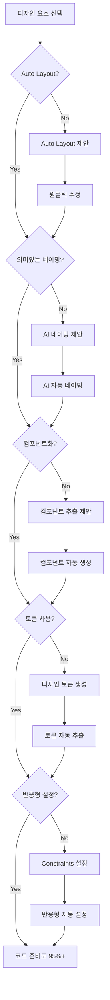
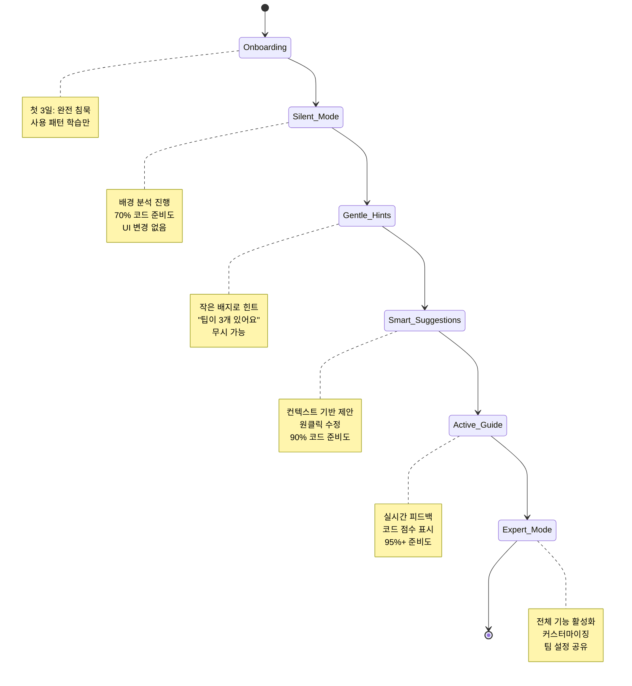
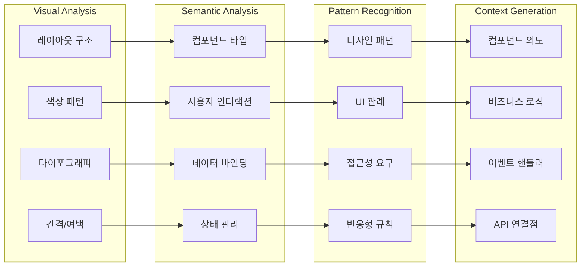
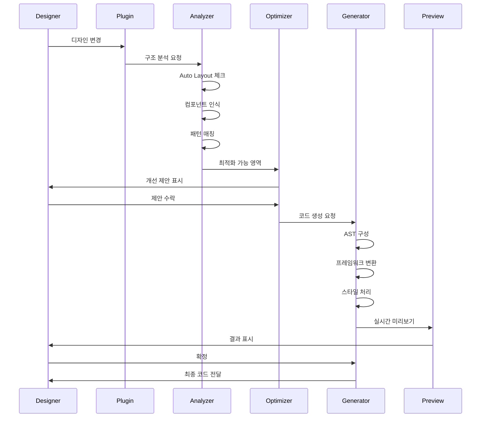
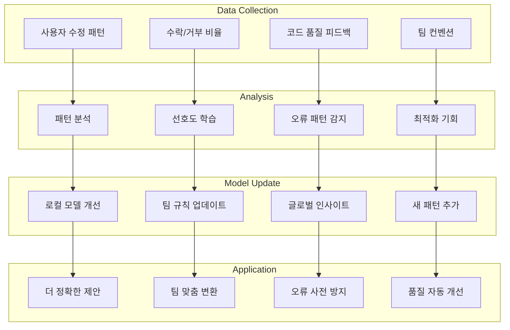
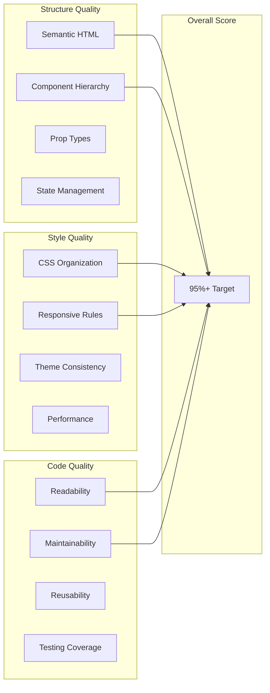
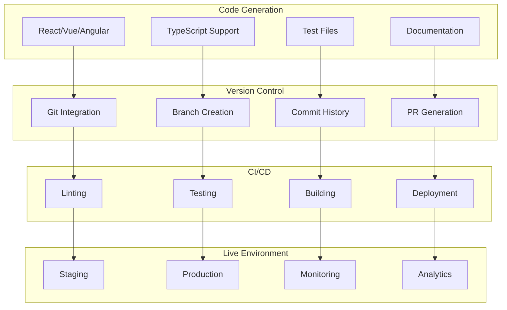
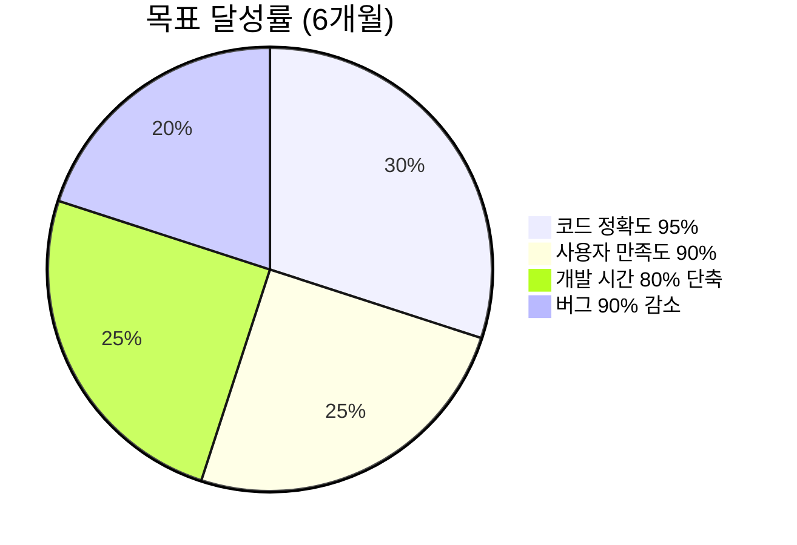

# 🎨 Figma → Code 완벽 변환 시스템 상세 설계

## 🏗️ 핵심 시스템 아키텍처

## 🔍 Design Linter 상세 기능

## 🎯 Progressive Disclosure UX Flow

## 🧠 AI 컨텍스트 이해 시스템

## 💫 실시간 변환 프로세스

## 🎨 컴포넌트 매핑 시스템

```mermaid
graph TD
    subgraph "Figma Components"
        FC1[Button Instance]
        FC2[Card Frame]
        FC3[Input Field]
        FC4[Navigation]
    end
    
    subgraph "Pattern Matching"
        PM1[버튼 패턴 인식]
        PM2[카드 레이아웃 감지]
        PM3[폼 요소 식별]
        PM4[네비게이션 구조]
    end
    
    subgraph "Code Components"
        CC1[<Button />]
        CC2[<Card />]
        CC3[<Input />]
        CC4[<Nav />]
    end
    
    subgraph "Props Extraction"
        PE1[onClick, variant, size]
        PE2[title, content, actions]
        PE3[value, onChange, validation]
        PE4[links, activeItem, style]
    end
    
    FC1 --> PM1
    FC2 --> PM2
    FC3 --> PM3
    FC4 --> PM4
    
    PM1 --> CC1
    PM2 --> CC2
    PM3 --> CC3
    PM4 --> CC4
    
    CC1 --> PE1
    CC2 --> PE2
    CC3 --> PE3
    CC4 --> PE4
```

## 🔄 학습 시스템

## 📊 코드 품질 메트릭

## 🚀 배포 파이프라인

## 💡 혁신 포인트 요약

| 기능 | 기존 도구 | 우리 솔루션 | 차별점 |
|------|----------|------------|--------|
| **변환 정확도** | 70-80% | 95%+ | AI + 규칙 하이브리드 |
| **UX 접근** | 새 도구 학습 필요 | Progressive Disclosure | 자연스러운 적응 |
| **컨텍스트 이해** | UI만 변환 | 의도와 로직 파악 | 완전한 컴포넌트 |
| **품질 보장** | 수동 검증 | 자동 품질 체크 | 실시간 피드백 |
| **학습 능력** | 고정된 규칙 | 지속적 개선 | 팀 맞춤 최적화 |

---

## 🎯 성공 지표

---

*이 문서는 Figma → Code 완벽 변환 시스템의 상세 기술 설계를 담고 있습니다.*