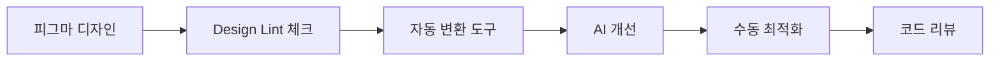

# 🎯 피그마 → 코드 실용적 변환 가이드

## 핵심 원칙: "완벽한 자동화보다 효율적인 반자동화"

자동 변환 80% + 수동 개선 20% = 실용적인 결과물

---

## 📋 Step 1: 피그마 디자인 준비 (필수)

### 1.1 Auto Layout 적용
```
모든 컨테이너에 Auto Layout 설정:
- Horizontal/Vertical 방향 설정
- Padding과 Gap 일관성 있게
- Resizing 규칙 명확히 (Fill, Hug, Fixed)
```

### 1.2 의미있는 네이밍
```
❌ 나쁜 예:
- Rectangle 23
- Group 5
- Frame 123

✅ 좋은 예:
- Header/Navigation
- Card/ProductCard
- Button/PrimaryButton
```

### 1.3 컴포넌트화
```
재사용 요소는 반드시 Component로:
- 버튼, 카드, 입력필드
- Variants 활용 (상태별 디자인)
- Properties 설정 (텍스트, 아이콘 등)
```

### 1.4 디자인 토큰 정의
```javascript
// 색상 토큰
Primary/500: #3B82F6
Primary/600: #2563EB
Text/Primary: #1F2937
Text/Secondary: #6B7280

// 간격 토큰
Space/xs: 4px
Space/sm: 8px
Space/md: 16px
Space/lg: 24px
```

---

## 🤖 Step 2: AI 활용 전략

### 2.1 컨텍스트 풍부한 프롬프트
```markdown
# 나쁜 프롬프트
"이 디자인을 React 코드로 변환해줘"

# 좋은 프롬프트
"이 ProductCard 컴포넌트를 React + Tailwind로 변환해줘.
- 호버시 shadow 효과 추가
- 이미지는 lazy loading 적용
- 가격은 toLocaleString()으로 포맷팅
- 장바구니 버튼은 onClick 이벤트 준비"
```

### 2.2 단계별 변환
```
1단계: 구조(HTML/JSX) 생성
2단계: 스타일링 추가
3단계: 인터랙션 로직 추가
4단계: 반응형 처리
```

### 2.3 Claude/ChatGPT 활용 팁
```markdown
# 이미지와 함께 제공할 정보:

## 컴포넌트 정보
- 용도: 상품 목록에서 사용하는 카드
- 상태: default, hover, selected, disabled
- 데이터: {title, price, image, rating}

## 기술 스택
- Framework: React 18
- Styling: Tailwind CSS
- State: useState, useEffect
- API: fetch로 데이터 로드

## 요구사항
- 모바일 우선 반응형
- 웹 접근성 준수
- 성능 최적화 (이미지 lazy loading)
```

---

## 🛠️ Step 3: 실용적인 도구 조합

### 3.1 자동 변환 도구 (기본 구조용)
```yaml
1차 변환 (기본 구조):
- Builder.io (Figma to Code)
- Anima
- Figma Dev Mode

용도: HTML/CSS 기본 구조 빠르게 생성
기대치: 60-70% 정확도
```

### 3.2 AI 도구 (개선용)
```yaml
구조 개선:
- Claude (이미지 분석 + 코드 생성)
- ChatGPT-4 Vision
- Cursor AI (코드 에디터 통합)

용도: 
- 의미있는 컴포넌트 구조화
- 상태 관리 로직 추가
- 최적화 제안
```

### 3.3 수동 개선 체크리스트
```markdown
□ Semantic HTML 적용 (div → header, nav, main, article)
□ 접근성 속성 추가 (aria-label, role)
□ 반응형 브레이크포인트 조정
□ 하드코딩된 값 → 변수/props로 변경
□ 이벤트 핸들러 연결
□ 에러/로딩 상태 추가
□ 성능 최적화 (memo, lazy, suspense)
```

---

## 📐 Step 4: 프로젝트별 템플릿 구축

### 4.1 컴포넌트 템플릿
```typescript
// BaseCard.template.tsx
interface BaseCardProps {
  title: string
  description?: string
  image?: string
  actions?: ReactNode
}

export const BaseCard: FC<BaseCardProps> = ({
  title,
  description,
  image,
  actions
}) => {
  // 기본 구조 정의
  return (
    <article className="card">
      {image && }
      <h3>{title}</h3>
      {description && <p>{description}</p>}
      {actions && <div className="card-actions">{actions}</div>}
    </article>
  )
}
```

### 4.2 스타일 시스템
```css
/* design-tokens.css */
:root {
  /* 피그마 토큰과 1:1 매칭 */
  --color-primary: #3B82F6;
  --space-sm: 8px;
  --radius-md: 8px;
  --shadow-sm: 0 1px 3px rgba(0,0,0,0.12);
}

/* utilities.css */
.card {
  padding: var(--space-md);
  border-radius: var(--radius-md);
  box-shadow: var(--shadow-sm);
}
```

---

## 🔄 Step 5: 워크플로우 최적화

### 5.1 피그마 → 코드 파이프라인


### 5.2 팀 협업 규칙
```yaml
디자이너:
- Auto Layout 필수
- 컴포넌트 Variants 활용
- 개발자와 네이밍 규칙 합의

개발자:
- 디자인 토큰 즉시 코드화
- 재사용 컴포넌트 라이브러리 구축
- 피그마 플러그인으로 피드백

공통:
- 주간 디자인-개발 싱크업
- 컴포넌트 단위로 작업
- 실시간 프리뷰로 검증
```

---

## 💡 Step 6: 실전 팁

### 6.1 MCP + 이미지 활용법
```markdown
1. 스크린샷 준비
   - 전체 화면보다 컴포넌트 단위로
   - 여러 상태 캡처 (default, hover, active)

2. 구조화된 요청
   "이 헤더 컴포넌트를 React로 변환:
   - 모바일: 햄버거 메뉴
   - 데스크톱: 가로 네비게이션
   - 스크롤시 sticky
   - 현재 페이지 하이라이트"

3. 반복적 개선
   - 1차: 기본 구조
   - 2차: 반응형 추가
   - 3차: 인터랙션 추가
   - 4차: 최적화
```

### 6.2 자주 발생하는 문제 해결
```yaml
문제: 절대 위치 요소들
해결: Flexbox/Grid로 재구성

문제: 픽셀 단위 고정값
해결: rem/%, CSS 변수 활용

문제: 이미지 깨짐
해결: aspect-ratio, object-fit 활용

문제: 반응형 깨짐
해결: 모바일 우선 설계, 컨테이너 쿼리
```

---

## 📊 현실적인 기대치

### 달성 가능한 것들 ✅
- 기본 레이아웃 구조 80% 자동화
- 스타일링 70% 정확도
- 컴포넌트 분리 가이드
- 디자인 토큰 추출

### 수동 작업 필요한 것들 ⚠️
- 상태 관리 로직
- API 연동
- 애니메이션 세부 조정
- 성능 최적화
- 접근성 완성도

---

## 🚀 Quick Start 체크리스트

```markdown
□ 피그마 Auto Layout 적용
□ 컴포넌트 네이밍 정리
□ 디자인 토큰 정의
□ Builder.io로 1차 변환
□ Claude/ChatGPT로 구조 개선
□ 상태 관리 로직 추가
□ 반응형 처리
□ 성능 최적화
□ 코드 리뷰
```

---

## 💭 핵심 마인드셋

> "완벽한 자동 변환을 기대하지 말고,
> 빠른 기초 작업 + 효율적인 수동 개선으로
> 전체 개발 시간을 단축하는 것이 목표"

**실제 시간 단축:**
- 기존: 처음부터 100% 수동 코딩 (8시간)
- 개선: 자동 60% + AI 20% + 수동 20% (3시간)
- **효율: 62.5% 시간 절약**

---

## 📚 추가 리소스

- [Figma Auto Layout 가이드](https://figma.com/auto-layout)
- [Design Tokens W3C 표준](https://www.w3.org/community/design-tokens/)
- [React 컴포넌트 패턴](https://patterns.dev)
- [Tailwind CSS 유틸리티](https://tailwindcss.com)

*실용적인 접근으로 오늘부터 바로 적용 가능합니다!* 🎯