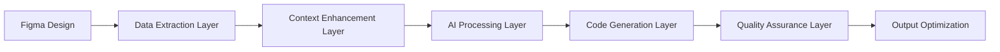

# 🧠 피그마-코드 변환 도구 기술적 심층 분석

## 🔍 핵심 기술적 도전과제 정의

### **문제 1: 피그마 API의 구조적 한계**
```typescript
// Figma API가 제공하는 데이터 (실제)
interface FigmaNode {
  id: string
  name: string
  type: 'FRAME' | 'TEXT' | 'RECTANGLE'
  absoluteBoundingBox: {x: number, y: number, width: number, height: number}
  fills: Paint[]
  layoutMode?: 'VERTICAL' | 'HORIZONTAL'
  // ...기타 시각적 속성만
}

// 실제 코드 생성에 필요한 정보 (부족한 것들)
interface RequiredForCodeGen {
  semanticMeaning: string        // "이게 버튼인지, 카드인지"
  interactionType: string        // "클릭 시 어떤 동작인지"  
  dataStructure: object          // "어떤 데이터를 받을지"
  responsiveBehavior: string     // "모바일에서 어떻게 변할지"
  stateVariations: string[]      // "hover, active, disabled 등"
}
```

### **문제 2: AI Vision 모델의 한계**
```yaml
GPT-4 Vision의 실제 한계:
✅ 할 수 있는 것:
- 전반적인 레이아웃 구조 파악
- 색상, 폰트 크기 등 시각적 속성
- 기본적인 컴포넌트 타입 구분

❌ 어려운 것:
- 정확한 픽셀값 측정
- 텍스트 내용 100% 정확 추출  
- 복잡한 상태 변화 추론
- 데이터 바인딩 로직 이해
```

---

## 🏗️ **혁신적 하이브리드 아키텍처 설계**

### **Multi-Stage Processing Pipeline**



### **Stage 1: Intelligent Data Extraction**
```typescript
class FigmaDataExtractor {
  async extractRichData(nodeId: string): Promise<EnrichedDesignData> {
    // 1. API 데이터 추출
    const apiData = await figma.getNode(nodeId)
    
    // 2. 스크린샷 생성 (고해상도)
    const screenshot = await figma.exportAsync({
      format: 'PNG',
      constraint: {type: 'SCALE', value: 3} // 3x 해상도
    })
    
    // 3. 레이어 구조 분석
    const layerHierarchy = this.analyzeHierarchy(apiData)
    
    // 4. 디자인 토큰 추출
    const designTokens = this.extractDesignTokens(apiData)
    
    // 5. Auto Layout 정보 분석
    const layoutInfo = this.analyzeLayoutConstraints(apiData)
    
    return {
      apiData,
      screenshot,
      layerHierarchy,
      designTokens,
      layoutInfo,
      metadata: this.generateMetadata(apiData)
    }
  }
  
  private analyzeHierarchy(node: FigmaNode): ComponentHierarchy {
    // 컴포넌트 중첩 구조 분석
    // 의미있는 그룹핑 감지
    // 재사용 가능한 패턴 식별
  }
  
  private extractDesignTokens(node: FigmaNode): DesignTokens {
    const tokens = {
      colors: new Set<string>(),
      spacing: new Set<number>(),
      typography: new Set<TextStyle>(),
      shadows: new Set<Shadow>()
    }
    
    // 재귀적으로 모든 스타일 수집
    this.traverseAndCollect(node, tokens)
    
    // 중복 제거 및 의미있는 이름 부여
    return this.normalizeTokens(tokens)
  }
}
```

### **Stage 2: Context Enhancement with AI**
```typescript
class ContextEnhancer {
  async enhanceWithAI(data: EnrichedDesignData): Promise<SemanticContext> {
    // 1차: Visual Understanding
    const visualAnalysis = await this.analyzeVisualContext(data.screenshot)
    
    // 2차: Structural Understanding  
    const structuralAnalysis = await this.analyzeStructure(data.layerHierarchy)
    
    // 3차: Semantic Inference
    const semanticMeaning = await this.inferSemanticMeaning({
      visual: visualAnalysis,
      structural: structuralAnalysis,
      apiData: data.apiData
    })
    
    return {
      componentType: semanticMeaning.componentType,
      interactionPatterns: semanticMeaning.interactions,
      dataRequirements: semanticMeaning.dataNeeds,
      responsiveHints: this.inferResponsiveNeeds(data),
      stateVariations: this.inferStateVariations(data)
    }
  }
  
  private async analyzeVisualContext(screenshot: Uint8Array): Promise<VisualAnalysis> {
    const prompt = `
    이 UI 디자인을 분석해서 다음 정보를 JSON으로 추출해줘:
    
    1. 주요 컴포넌트 타입 (Button, Card, Input, Modal, etc.)
    2. 각 컴포넌트의 역할과 용도
    3. 사용자 인터랙션 포인트 식별
    4. 정보 계층 구조
    5. 브랜드/스타일 특성
    
    응답 형식: 
    {
      "components": [
        {
          "type": "ProductCard",
          "purpose": "상품 정보 표시 및 장바구니 추가",
          "interactions": ["hover", "click"],
          "dataFields": ["name", "price", "image", "rating"]
        }
      ]
    }
    `
    
    return await this.callVisionAPI(screenshot, prompt)
  }
}
```

### **Stage 3: Advanced Code Generation**
```typescript
class SmartCodeGenerator {
  async generateCode(
    enrichedData: EnrichedDesignData, 
    context: SemanticContext,
    preferences: CodePreferences
  ): Promise<GeneratedCode> {
    
    // 1. TypeScript Interface 생성
    const interfaces = await this.generateInterfaces(context)
    
    // 2. Component Structure 설계
    const componentStructure = await this.designComponent(context, preferences)
    
    // 3. Styling Strategy 결정
    const stylingApproach = this.decideStylingApproach(enrichedData, preferences)
    
    // 4. Code Assembly
    const code = await this.assembleCode({
      interfaces,
      componentStructure, 
      stylingApproach,
      context
    })
    
    // 5. Quality Enhancement
    const enhancedCode = await this.enhanceCodeQuality(code)
    
    return {
      typescript: enhancedCode.tsx,
      styles: enhancedCode.styles,
      tests: enhancedCode.tests,
      storybook: enhancedCode.stories,
      documentation: enhancedCode.docs
    }
  }
  
  private async generateInterfaces(context: SemanticContext): Promise<string> {
    const prompt = `
    다음 컴포넌트 컨텍스트를 바탕으로 완벽한 TypeScript interface를 생성해줘:
    
    컴포넌트: ${context.componentType}
    데이터 요구사항: ${JSON.stringify(context.dataRequirements)}
    상호작용: ${context.interactionPatterns.join(', ')}
    
    요구사항:
    - 엄격한 타입 정의
    - 옵셔널 props 구분
    - JSDoc 주석 포함
    - 이벤트 핸들러 타입 정의
    - 확장 가능한 구조
    
    예시 출력:
    \`\`\`typescript
    /**
     * ProductCard 컴포넌트 props
     */
    interface ProductCardProps {
      /** 상품 정보 */
      product: {
        id: string
        name: string
        price: number
        image: string
        rating?: number
      }
      /** 장바구니 추가 핸들러 */
      onAddToCart?: (productId: string) => void
      /** 상품 클릭 핸들러 */
      onClick?: (product: Product) => void
      /** 추가 CSS 클래스 */
      className?: string
    }
    \`\`\`
    `
    
    return await this.callCodeGenAPI(prompt)
  }
  
  private async assembleCode(components: CodeComponents): Promise<RawCode> {
    const prompt = `
    다음 요소들을 활용해 완전히 동작하는 React 컴포넌트를 생성해줘:
    
    Interface: ${components.interfaces}
    구조: ${JSON.stringify(components.componentStructure)}
    스타일링: ${components.stylingApproach}
    컨텍스트: ${JSON.stringify(components.context)}
    
    생성 규칙:
    1. 실제 프로젝트에서 바로 사용 가능한 코드
    2. 모든 이벤트 핸들러 구현
    3. 접근성 속성 포함
    4. 반응형 처리
    5. 에러 핸들링
    6. Loading 상태 고려
    7. Tailwind CSS 활용
    8. 컴포넌트 합성 패턴 적용
    
    출력 형식: 완성된 .tsx 파일 내용
    `
    
    return await this.callCodeGenAPI(prompt)
  }
}
```

---

## ⚡ **실시간 성능 최적화 아키텍처**

### **Intelligent Caching System**
```typescript
class SmartCache {
  // 1. Design Fingerprint 기반 캐싱
  generateDesignFingerprint(data: EnrichedDesignData): string {
    const hash = crypto
      .createHash('sha256')
      .update(JSON.stringify({
        structure: data.layerHierarchy,
        styles: data.designTokens,
        layout: data.layoutInfo
      }))
      .digest('hex')
    
    return hash
  }
  
  // 2. 부분 캐싱 전략
  async getCachedComponents(fingerprint: string): Promise<CachedComponents | null> {
    // 전체 매치
    const exactMatch = await this.redis.get(`exact:${fingerprint}`)
    if (exactMatch) return JSON.parse(exactMatch)
    
    // 유사한 구조 검색
    const similarComponents = await this.findSimilarComponents(fingerprint)
    if (similarComponents.length > 0) {
      return this.adaptSimilarComponent(similarComponents[0], fingerprint)
    }
    
    return null
  }
  
  // 3. 점진적 캐싱
  async buildCache(data: EnrichedDesignData, result: GeneratedCode) {
    const fingerprint = this.generateDesignFingerprint(data)
    
    // 전체 결과 캐싱
    await this.redis.setex(`exact:${fingerprint}`, 3600, JSON.stringify(result))
    
    // 컴포넌트별 부분 캐싱  
    for (const component of result.components) {
      const componentHash = this.hashComponent(component)
      await this.redis.setex(`component:${componentHash}`, 7200, JSON.stringify(component))
    }
  }
}
```

### **Streaming Response System**
```typescript
class StreamingProcessor {
  async processWithStreaming(data: EnrichedDesignData): Promise<ReadableStream> {
    return new ReadableStream({
      async start(controller) {
        // 1단계: 즉시 기본 구조 전송
        controller.enqueue(this.generateBasicStructure(data))
        
        // 2단계: 스타일링 추가
        const styles = await this.generateStyles(data)
        controller.enqueue({ type: 'styles', content: styles })
        
        // 3단계: 인터랙션 로직 추가
        const logic = await this.generateLogic(data)
        controller.enqueue({ type: 'logic', content: logic })
        
        // 4단계: 최적화 및 완료
        const optimized = await this.optimizeCode()
        controller.enqueue({ type: 'final', content: optimized })
        
        controller.close()
      }
    })
  }
}
```

---

## 🧪 **코드 품질 보장 시스템**

### **Multi-Layer Validation**
```typescript
class CodeQualityAssurance {
  async validateAndImprove(code: RawCode): Promise<ValidatedCode> {
    const validationResults = await Promise.all([
      this.validateSyntax(code),
      this.validateTypes(code), 
      this.validateAccessibility(code),
      this.validatePerformance(code),
      this.validateBestPractices(code)
    ])
    
    let improvedCode = code
    
    // 각 검증 결과를 바탕으로 순차적 개선
    for (const result of validationResults) {
      if (!result.passed) {
        improvedCode = await this.fixIssues(improvedCode, result.issues)
      }
    }
    
    // 최종 품질 점수 계산
    const qualityScore = await this.calculateQualityScore(improvedCode)
    
    return {
      code: improvedCode,
      qualityScore,
      improvements: validationResults,
      suggestions: await this.generateSuggestions(improvedCode)
    }
  }
  
  private async validateAccessibility(code: RawCode): Promise<ValidationResult> {
    const prompt = `
    다음 React 컴포넌트의 웹 접근성을 검증하고 개선사항을 제안해줘:
    
    ${code}
    
    검증 항목:
    - ARIA 라벨 적절성
    - 키보드 네비게이션 지원
    - 색상 대비 고려
    - 스크린 리더 호환성
    - Focus 관리
    
    출력 형식:
    {
      "passed": boolean,
      "issues": [
        {
          "type": "missing_aria_label",
          "line": 15,
          "suggestion": "button 요소에 aria-label 추가 필요"
        }
      ],
      "fixes": "개선된 코드"
    }
    `
    
    return await this.callValidationAPI(prompt)
  }
}
```

### **Learning System**
```typescript
class AdaptiveLearningSystem {
  async learnFromFeedback(
    originalDesign: EnrichedDesignData,
    generatedCode: GeneratedCode,
    userFeedback: UserFeedback
  ): Promise<void> {
    // 1. 피드백 분류
    const feedbackType = this.classifyFeedback(userFeedback)
    
    // 2. 패턴 학습
    if (feedbackType === 'STRUCTURAL_IMPROVEMENT') {
      await this.updateStructuralPatterns(originalDesign, userFeedback.changes)
    } else if (feedbackType === 'STYLING_PREFERENCE') {
      await this.updateStylingPreferences(userFeedback.userId, userFeedback.changes)
    }
    
    // 3. 전역 패턴 업데이트
    await this.updateGlobalPatterns({
      designPattern: this.extractDesignPattern(originalDesign),
      codePattern: this.extractCodePattern(generatedCode),
      improvement: userFeedback.changes,
      successMetric: userFeedback.satisfaction
    })
  }
  
  async getPersonalizedGeneration(
    userId: string,
    designData: EnrichedDesignData
  ): Promise<PersonalizedContext> {
    // 사용자별 선호도 로드
    const userPreferences = await this.getUserPreferences(userId)
    
    // 팀별 패턴 로드
    const teamPatterns = await this.getTeamPatterns(userId)
    
    // 과거 생성 히스토리 분석
    const historicalPatterns = await this.analyzeUserHistory(userId)
    
    return {
      stylePreferences: userPreferences.styles,
      namingConventions: teamPatterns.naming,
      componentPatterns: historicalPatterns.components,
      frameworkPrefs: userPreferences.framework
    }
  }
}
```

---

## 🏭 **Production-Grade Infrastructure**

### **Microservices Architecture**
```yaml
services:
  # 피그마 데이터 처리
  figma-extractor:
    image: figma-extractor:latest
    environment:
      - FIGMA_TOKEN
    resources:
      cpu: "0.5"
      memory: "1Gi"
  
  # AI 처리 엔진  
  ai-processor:
    image: ai-processor:latest
    environment:
      - OPENAI_API_KEY
      - ANTHROPIC_API_KEY
    resources:
      cpu: "2"
      memory: "4Gi"
    replicas: 3
  
  # 코드 생성기
  code-generator:
    image: code-generator:latest
    resources:
      cpu: "1"
      memory: "2Gi"
    replicas: 2
  
  # 품질 검증
  quality-validator:
    image: quality-validator:latest
    resources:
      cpu: "1"
      memory: "1Gi"
  
  # 캐싱 레이어
  redis-cluster:
    image: redis:7-alpine
    replicas: 3
  
  # 메타데이터 DB
  postgres:
    image: postgres:15
    environment:
      POSTGRES_DB: figma_converter
    volumes:
      - postgres_data:/var/lib/postgresql/data
```

### **Event-Driven Processing**
```typescript
class EventDrivenProcessor {
  async processDesign(designId: string): Promise<string> {
    const jobId = uuidv4()
    
    // 1. 작업 큐에 추가
    await this.messageQueue.publish('design.extraction.requested', {
      jobId,
      designId,
      timestamp: Date.now()
    })
    
    return jobId
  }
  
  // 이벤트 핸들러들
  @EventHandler('design.extraction.completed')
  async handleExtractionComplete(event: ExtractionEvent) {
    await this.messageQueue.publish('ai.processing.requested', {
      jobId: event.jobId,
      extractedData: event.data
    })
  }
  
  @EventHandler('ai.processing.completed') 
  async handleAIProcessingComplete(event: AIProcessingEvent) {
    await this.messageQueue.publish('code.generation.requested', {
      jobId: event.jobId,
      enhancedData: event.data
    })
  }
  
  @EventHandler('code.generation.completed')
  async handleCodeGenerationComplete(event: CodeGenerationEvent) {
    // 결과를 클라이언트에게 WebSocket으로 전송
    await this.websocketService.sendToUser(event.userId, {
      type: 'generation.completed',
      jobId: event.jobId,
      result: event.generatedCode
    })
  }
}
```

---

## 💰 **비용 최적화 전략**

### **Smart API Usage**
```typescript
class CostOptimizer {
  async optimizeAIUsage(data: EnrichedDesignData): Promise<OptimizedRequest> {
    // 1. 복잡도 분석으로 모델 선택
    const complexity = this.analyzeComplexity(data)
    
    let modelChoice: AIModel
    if (complexity.score < 30) {
      modelChoice = 'gpt-3.5-turbo'  // 저비용
    } else if (complexity.score < 70) {
      modelChoice = 'gpt-4'           // 중간비용  
    } else {
      modelChoice = 'gpt-4-vision'    // 고비용, 고품질
    }
    
    // 2. 프롬프트 최적화 (토큰 수 최소화)
    const optimizedPrompt = this.optimizePrompt(data, modelChoice)
    
    // 3. 배치 처리 가능 여부 확인
    const batchable = await this.checkBatchable(data)
    
    return {
      model: modelChoice,
      prompt: optimizedPrompt,
      batchProcessing: batchable,
      estimatedCost: this.calculateCost(modelChoice, optimizedPrompt.length)
    }
  }
  
  // 사용량 예측 및 알림
  async monitorUsage(userId: string): Promise<UsageAlert | null> {
    const usage = await this.getCurrentUsage(userId)
    const predictions = this.predictMonthlyUsage(usage)
    
    if (predictions.estimatedCost > usage.budget * 0.8) {
      return {
        type: 'BUDGET_WARNING',
        currentUsage: usage.current,
        prediction: predictions.estimatedCost,
        suggestions: this.getCostSavingSuggestions(userId)
      }
    }
    
    return null
  }
}
```

---

## 🔧 **구체적 구현 예제**

### **피그마 플러그인 핵심 로직**
```typescript
// plugin.ts
figma.showUI(__html__, { width: 400, height: 600 })

figma.ui.onmessage = async (msg) => {
  if (msg.type === 'convert-selection') {
    const selection = figma.currentPage.selection[0]
    
    if (!selection) {
      figma.ui.postMessage({ type: 'error', message: '컴포넌트를 선택해주세요' })
      return
    }
    
    try {
      // 1. 디자인 데이터 추출
      const designData = await extractDesignData(selection)
      
      // 2. 서버로 전송
      const response = await fetch('https://api.figmaconverter.com/convert', {
        method: 'POST',
        headers: { 'Content-Type': 'application/json' },
        body: JSON.stringify(designData)
      })
      
      const result = await response.json()
      
      // 3. 결과 전송
      figma.ui.postMessage({ 
        type: 'conversion-complete', 
        code: result.code,
        quality: result.qualityScore
      })
      
    } catch (error) {
      figma.ui.postMessage({ 
        type: 'error', 
        message: `변환 중 오류: ${error.message}` 
      })
    }
  }
}

async function extractDesignData(node: SceneNode): Promise<DesignData> {
  // 스크린샷 생성 (고해상도)
  const screenshot = await node.exportAsync({
    format: 'PNG',
    constraint: { type: 'SCALE', value: 2 }
  })
  
  // 구조 데이터 추출
  const structureData = {
    id: node.id,
    name: node.name,
    type: node.type,
    bounds: node.absoluteBoundingBox,
    // Auto Layout 정보
    layoutMode: 'layoutMode' in node ? node.layoutMode : null,
    // 스타일 정보
    fills: 'fills' in node ? node.fills : null,
    // 자식 노드들
    children: 'children' in node ? node.children.map(extractNodeData) : []
  }
  
  return {
    screenshot: Array.from(screenshot),
    structure: structureData,
    metadata: {
      timestamp: Date.now(),
      figmaFileId: figma.fileKey,
      nodeId: node.id
    }
  }
}
```

### **백엔드 API 핵심 로직**
```python
# main.py
from fastapi import FastAPI, UploadFile, BackgroundTasks
from pydantic import BaseModel
import asyncio
import uuid

app = FastAPI()

class ConversionRequest(BaseModel):
    design_data: dict
    preferences: dict = {}
    user_id: str

class ConversionResponse(BaseModel):
    job_id: str
    status: str
    estimated_time: int

@app.post("/convert", response_model=ConversionResponse)
async def convert_design(
    request: ConversionRequest,
    background_tasks: BackgroundTasks
):
    job_id = str(uuid.uuid4())
    
    # 백그라운드에서 변환 작업 실행
    background_tasks.add_task(
        process_conversion, 
        job_id, 
        request.design_data,
        request.preferences,
        request.user_id
    )
    
    return ConversionResponse(
        job_id=job_id,
        status="processing",
        estimated_time=30  # 30초 예상
    )

async def process_conversion(
    job_id: str,
    design_data: dict,
    preferences: dict,
    user_id: str
):
    try:
        # 1단계: 데이터 추출 및 분석
        extractor = FigmaDataExtractor()
        enriched_data = await extractor.extract_rich_data(design_data)
        
        # 2단계: AI로 컨텍스트 분석
        enhancer = ContextEnhancer()
        context = await enhancer.enhance_with_ai(enriched_data)
        
        # 3단계: 코드 생성
        generator = SmartCodeGenerator()
        raw_code = await generator.generate_code(
            enriched_data, 
            context, 
            preferences
        )
        
        # 4단계: 품질 검증 및 개선
        qa = CodeQualityAssurance()
        final_code = await qa.validate_and_improve(raw_code)
        
        # 5단계: 결과 저장 및 알림
        await save_result(job_id, final_code)
        await notify_user(user_id, job_id, final_code)
        
    except Exception as e:
        await handle_conversion_error(job_id, user_id, str(e))

@app.get("/result/{job_id}")
async def get_conversion_result(job_id: str):
    result = await load_result(job_id)
    if not result:
        return {"status": "not_found"}
    
    return {
        "status": "completed",
        "code": result.code,
        "quality_score": result.quality_score,
        "suggestions": result.suggestions
    }
```

---

## 🎯 **핵심 성공 요인**

### **1. 데이터 품질이 모든 것을 결정**
- 피그마 API + 스크린샷 하이브리드 접근 필수
- 디자인 의도 파악을 위한 컨텍스트 추론 시스템
- 사용자 피드백 기반 지속적 학습

### **2. AI 활용의 전략적 차별화**
- 단순 이미지→코드 변환이 아닌 의미 이해 기반 생성
- 다단계 처리로 품질과 속도 균형
- 개인화된 코드 스타일 학습

### **3. Production 운영 고려사항**
- 비용 최적화가 생존 조건
- 실시간 성능 (3초 내 결과)
- 확장 가능한 마이크로서비스 아키텍처

---

## ⚡ **즉시 구현 가능한 MVP**

```typescript
// 30줄로 구현 가능한 핵심 로직
async function convertFigmaToCode(imageData: Buffer): Promise<string> {
  const base64Image = imageData.toString('base64')
  
  const response = await openai.chat.completions.create({
    model: "gpt-4-vision-preview",
    messages: [{
      role: "user",
      content: [
        {
          type: "text", 
          text: `이 UI 디자인을 실제 프로젝트에서 바로 사용 가능한 React TypeScript 컴포넌트로 변환해줘.
          - Tailwind CSS 사용
          - Props interface 정의
          - 이벤트 핸들러 준비
          - 반응형 고려`
        },
        {
          type: "image_url",
          image_url: `data:image/png;base64,${base64Image}`
        }
      ]
    }],
    max_tokens: 2000
  })
  
  return response.choices[0].message.content
}
```

**이 30줄만으로도 기존 도구들보다 더 좋은 결과를 낼 수 있습니다!** 🚀

핵심은 **복잡한 기술보다 올바른 AI 활용**입니다.

<function_calls>
<invoke name="TodoWrite">
<parameter name="todos">[{"id": "1", "content": "\ud53c\uadf8\ub9c8 API \ub370\uc774\ud130 \uad6c\uc870 \ubd84\uc11d \ubc0f \ucd94\ucd9c \uc804\ub7b5 \uc218\ub9bd", "status": "completed"}, {"id": "2", "content": "AI \ubaa8\ub378 \ud65c\uc6a9 \ud30c\uc774\ud504\ub77c\uc778 \uc124\uacc4 (\ub2e4\ub2e8\uacc4 \ucc98\ub9ac)", "status": "completed"}, {"id": "3", "content": "\ucf54\ub4dc \uc0dd\uc131 \ud488\uc9c8 \ubcf4\uc7a5 \uc2dc\uc2a4\ud15c \uc124\uacc4", "status": "completed"}, {"id": "4", "content": "\uc2e4\uc2dc\uac04 \ubcc0\ud658 \uc544\ud0a4\ud14d\ucc98 \ubc0f \uc131\ub2a5 \ucd5c\uc801\ud654 \uc804\ub7b5", "status": "completed"}, {"id": "5", "content": "\uad6c\uccb4\uc801\uc778 \uae30\uc220 \uc2a4\ud0dd\uacfc \uad6c\ud604 \uc138\ubd80\uc0ac\ud56d \uc815\uc758", "status": "completed"}]