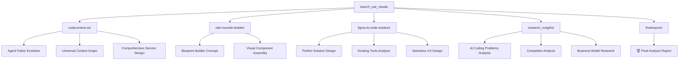
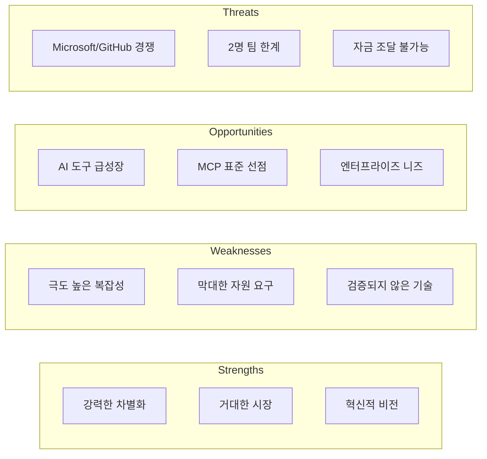
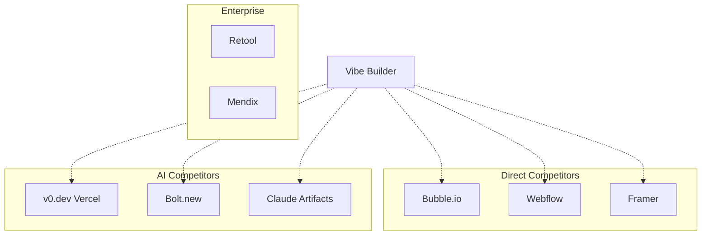
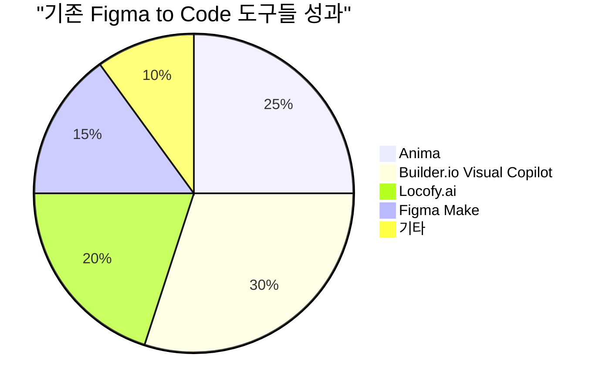
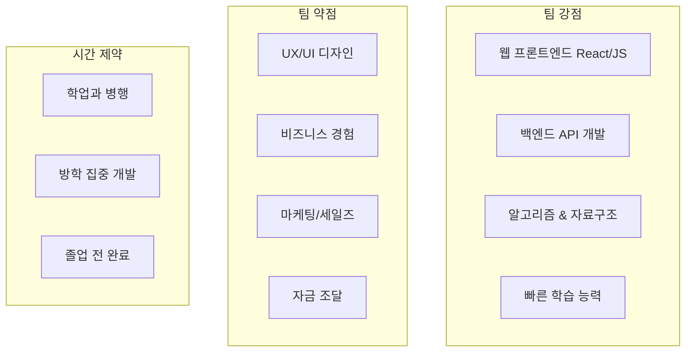
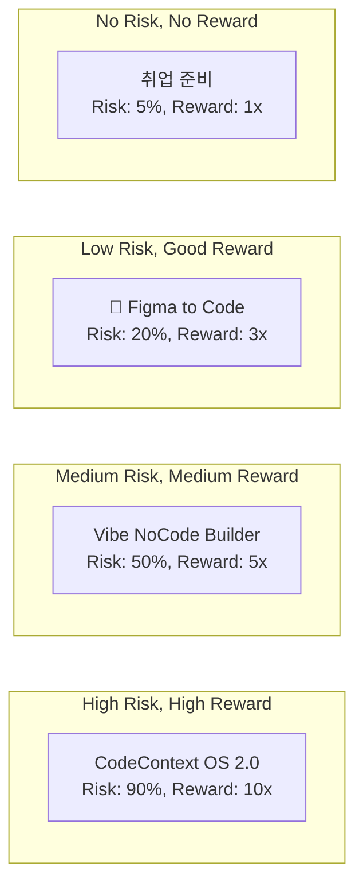
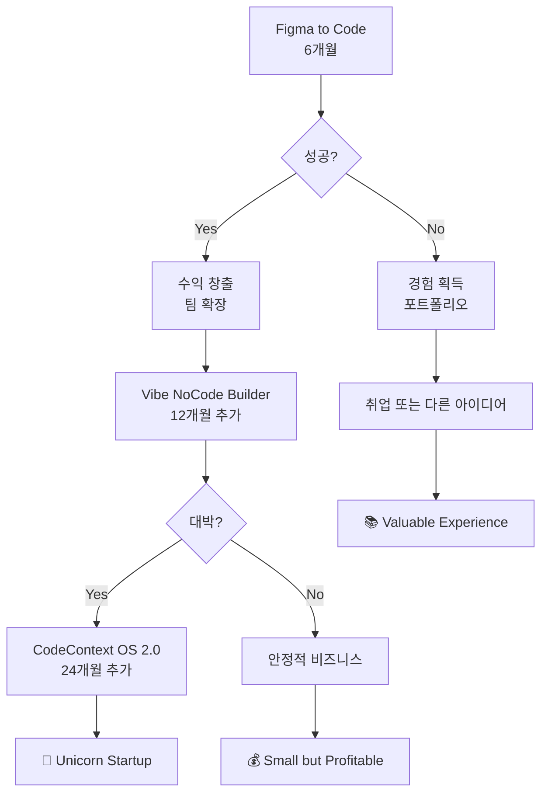

# 📊 3개 아이디어 비판적 분석 보고서
> **컴공과 학생 2명 팀 관점에서의 현실적 평가**

---

## 🎯 Executive Summary

| 아이디어 | 현실성 | 기술 복잡도 | 시장성 | 팀 적합도 | 총점 |
|---------|--------|------------|--------|----------|------|
| **CodeContext OS 2.0** | 1/10 | 10/10 | 9/10 | 2/10 | **5.5/10** |
| **Vibe NoCode Builder** | 6/10 | 6/10 | 7/10 | 6/10 | **6.2/10** |
| **Figma to Code Solution** | 8/10 | 4/10 | 8/10 | 9/10 | **🏆 7.2/10** |

### 📈 권장사항
**Figma to Code Solution을 1순위로 추천**
- 낮은 리스크, 높은 학습 가치
- 빠른 MVP 및 수익화 가능
- 기존 지식 최대 활용

---

## 📁 폴더 구조 정리



---

## 🔍 상세 분석

### 1️⃣ CodeContext OS 2.0 (Agent Fabric)

#### 💡 **비전**
```yaml
목표: "AI 시대의 개발자 운영 시스템"
범위: Universal Context Graph + Agent Workflow Orchestration
시장: $74.8B (통합 플랫폼 시장, 2033)
```

#### ❌ **치명적 약점**
```yaml
기술적 복잡성:
  - Neo4j Graph Database ❌
  - Graph Neural Networks ❌  
  - Multi-Agent Orchestration ❌
  - MCP 표준 구현 ❌
  
필요 리소스:
  - 팀: 15-20명 vs 실제 2명 (격차: 7-10배)
  - 자금: $5-10M vs 실제 $10K (격차: 500-1000배)
  - 시간: 2-3년 vs 학생 신분 제약
  
현실성 평가: 💀 거의 불가능
```

#### 📊 **SWOT 분석**


---

### 2️⃣ Vibe NoCode Builder

#### 💡 **비전**
```yaml
목표: "언리얼 블루프린트 + AI 바이브 코딩"
범위: Visual Component Assembly Platform  
시장: $21.2B (노코드 시장, 2028)
```

#### ⚠️ **중간 수준의 도전과제**
```yaml
기술적 실현성:
  ✅ React 컴포넌트 시스템 
  ✅ Drag & Drop 에디터
  ⚠️ LLM 기반 의도 분석 (API 활용)
  ⚠️ 실시간 프리뷰 시스템
  
필요 리소스:
  - 팀: 5-8명 vs 실제 2명 (격차: 2-4배)
  - 자금: $500K-1M vs 실제 $10K (격차: 50-100배) 
  - 시간: 6-12개월 (학생 신분으로 가능)
  
현실성 평가: ⚠️ 도전적이지만 가능
```

#### 📊 **경쟁 환경**


---

### 3️⃣ Figma to Code Perfect Solution 🏆

#### 💡 **비전**
```yaml
목표: "피그마 디자인을 완벽하게 코드로 변환"
범위: Design Linter + AI Converter + Learning System
시장: 기존 도구들 $19-99/월로 검증된 니즈
```

#### ✅ **핵심 장점들**
```yaml
기술적 실현성:
  ✅ Figma Plugin API (잘 문서화)
  ✅ React/HTML 코드 생성 (템플릿 기반)
  ✅ OpenAI API 연동
  ✅ 기존 오픈소스 도구 활용
  
필요 리소스:
  - 팀: 2명으로 충분 ✅
  - 자금: $200-400/월 (감당 가능) ✅
  - 시간: 2개월 MVP (현실적) ✅
  
현실성 평가: 🎯 매우 현실적
```

#### 📈 **시장 검증 데이터**


**시장 니즈 확실성:**
- Anima: $19/월, 수천 명 사용자
- Builder.io: 시리즈 B $100M 투자유치
- 모든 도구가 70-80% 정확도 한계 → 개선 여지 존재

---

## 🎯 2명 컴공과 팀 관점 분석

### 👥 **팀 역량 매트릭스**



### 📊 **아이디어별 적합도 분석**

| 평가 기준 | CodeContext OS | Vibe Builder | Figma Solution |
|-----------|----------------|--------------|----------------|
| **기존 스킬 활용도** | 20% | 60% | **90%** |
| **학습 비용** | 매우 높음 | 중간 | **낮음** |
| **MVP 개발 기간** | 12+ 개월 | 6 개월 | **2 개월** |
| **필요 자금** | $5M+ | $500K+ | **$2K** |
| **실패 시 리스크** | 매우 높음 | 중간 | **낮음** |
| **성공 시 보상** | 매우 높음 | 높음 | **중간** |

---

## 🚀 권장 실행 계획

### **🥇 1순위: Figma to Code Solution**

#### **Phase 1: MVP (1-2개월)**
```yaml
역할 분담:
  개발자 A: 피그마 플러그인 + 백엔드
    - Figma Plugin API 연동
    - Design Linter 로직 구현  
    - Node.js 백엔드 서버
    
  개발자 B: 웹 프론트엔드 + AI 통합
    - React 대시보드 개발
    - OpenAI API 연동
    - 코드 생성 엔진

예산:
  - OpenAI API: $100-300/월
  - 서버 호스팅: $50-100/월
  - 기타: $50/월
  - 총합: $200-400/월 (감당 가능)

성공 기준 (2개월 후):
  ✅ 베타 사용자 50명
  ✅ 피그마 플러그인 다운로드 500+
  ✅ 기본 React 변환 70% 정확도
  ✅ 사용자 피드백 4.0/5.0+
```

#### **Phase 2: 확장 (3-6개월)**
```yaml
성공 시:
  - 유료 플랜 출시 ($19/월)
  - Vue, Angular 지원 추가
  - 기업 고객 10개 확보
  - $2K+ MRR 달성
  
실패 시:
  - 피벗 또는 중단
  - 경험과 포트폴리오 획득
  - 다른 기회 탐색
```

### **📊 위험-수익 매트릭스**



---

## 💡 핵심 인사이트

### **"작게 시작해서 크게 키우기" 전략**



### **성공 공식**
```
현실적 시작 → 빠른 검증 → 점진적 확장 → 궁극적 비전 달성
```

---

## 🏆 최종 결론

### **Why Figma to Code Solution?**

1. **💪 Perfect Fit**: 2명 컴공과 팀의 역량과 완벽 매칭
2. **⏰ Fast Validation**: 2개월 내 시장 반응 확인 
3. **💰 Low Risk**: 실패해도 큰 손실 없음
4. **📈 Proven Market**: 기존 도구들로 시장 검증됨
5. **🔄 Pivot Ready**: 성공 시 더 큰 비전으로 확장

### **실행 체크리스트**
- [ ] 팀 역할 분담 확정
- [ ] 개발 환경 세팅 (Figma Plugin API, React)
- [ ] 초기 자금 $500 확보 
- [ ] 베타 테스터 10명 모집
- [ ] 2개월 개발 일정 수립
- [ ] 경쟁사 심화 분석

---

## 📞 Next Steps

### **즉시 실행 (1주일 내)**
1. Figma Plugin API 문서 숙지
2. 기존 도구들(Anima, Locofy) 사용해보기
3. 잠재 사용자 5명과 인터뷰
4. GitHub 레포지토리 생성

### **1개월 내**
1. Design Linter 프로토타입 완성
2. 기본 React 변환 로직 구현
3. 베타 사용자 피드백 수집
4. 방향성 및 우선순위 재검토

### **3개월 내**
1. 피그마 마켓플레이스 출시
2. 유료화 모델 테스트
3. 초기 고객 10명 확보
4. 확장 여부 최종 결정

---

**🎯 "Perfect is the enemy of good. Start with Figma, dream of CodeContext!"**

**추천: 다음 방학부터 바로 시작하세요!** 🚀

---

*보고서 작성일: 2024년 8월 15일*  
*작성자: Claude Code Assistant*  
*팀 컨텍스트: 컴공과 학생 2명*