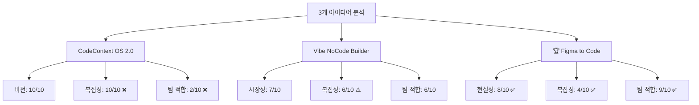

# 📁 Final Reports

> 3개 아이디어에 대한 종합적인 비판적 분석 최종 보고서

## 📊 보고서 목록

### 🏆 주요 분석 보고서
- [`3-concepts-critical-analysis.md`](./3-concepts-critical-analysis.md) - **3개 아이디어 비판적 분석**
  - CodeContext OS 2.0 (Agent Fabric)
  - Vibe NoCode Builder  
  - Figma to Code Perfect Solution
  - 컴공과 학생 2명 팀 관점에서의 현실적 평가

## 🎯 핵심 결론

### 권장 순위
| 순위 | 아이디어 | 점수 | 핵심 이유 |
|------|----------|------|-----------|
| 🥇 **1위** | **Figma to Code Solution** | **7.2/10** | 높은 현실성, 팀 적합도 완벽 |
| 🥈 2위 | Vibe NoCode Builder | 6.2/10 | 중간 리스크, 좋은 시장성 |
| 🥉 3위 | CodeContext OS 2.0 | 5.5/10 | 훌륭한 비전, 극도로 높은 복잡성 |

### 🎪 시각적 분석



## 📈 실행 권장사항

### Phase 1: Figma to Code Solution (2-6개월)
- **목표**: MVP 개발 및 시장 검증
- **예산**: $200-400/월
- **성공 기준**: 베타 사용자 50명, MRR $1K+

### Phase 2: 확장 또는 피벗 (6-12개월)
```yaml
성공 시: Vibe NoCode Builder로 확장
실패 시: 다른 아이디어 탐색 또는 취업
학습: 실무 경험, 포트폴리오, 네트워킹
```

### Phase 3: 궁극적 비전 (12-36개월)
```yaml
최종 목표: CodeContext OS 2.0 수준의 혁신
조건: 충분한 자금과 팀, 시장 검증 완료
접근: 점진적 확장과 기술 진화
```

## 💡 Key Insights

> **"Perfect is the enemy of good. Start small, think big."**

1. **현실적 시작이 성공의 열쇠**
2. **팀 역량과 아이디어 복잡성의 균형**
3. **빠른 검증을 통한 리스크 최소화**
4. **점진적 확장을 통한 궁극적 비전 달성**

---

## 📞 연락처

**프로젝트 문의**: 컴공과 학생 2명 팀  
**분석 기간**: 2024년 8월 15일  
**분석 도구**: Claude Code Assistant

---

*"작게 시작해서 크게 키우는 스타트업의 여정을 응원합니다!"* 🚀