# 🗺️ Project Roadmap & Visual Analysis

> **3개 아이디어의 시각적 분석 및 실행 로드맵**

---

## 📊 종합 비교 대시보드

### 🎯 아이디어별 종합 점수

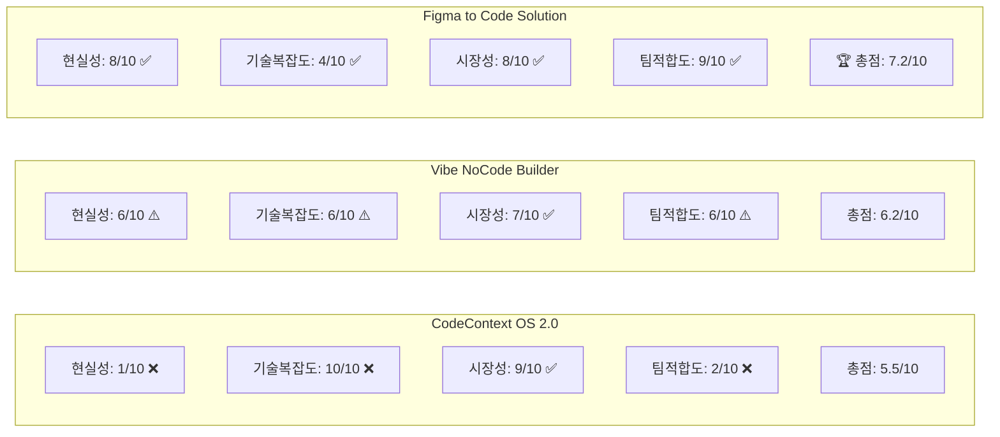

### 📈 위험-수익 매트릭스

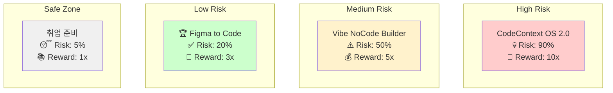

---

## 🚀 단계별 실행 로드맵

### 📅 전체 타임라인 (36개월 비전)

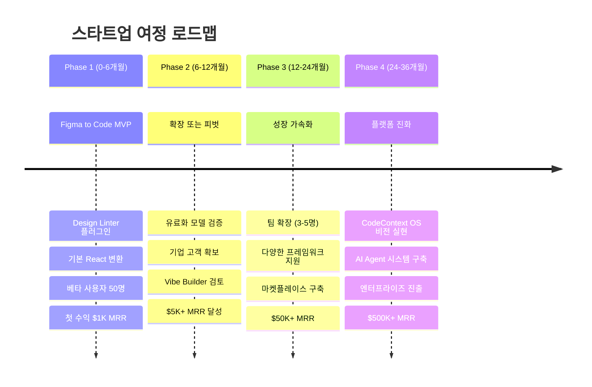

### 🎯 Phase 1 상세 실행 계획 (6개월)

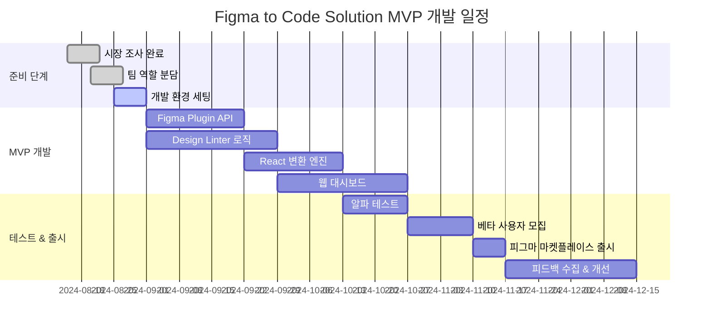

---

## 💰 비즈니스 모델 시각화

### 📊 수익 예측 모델

```mermaid
graph TD
    A[Figma to Code Solution] --> B[월간 사용자]
    
    B --> C[Free Tier<br/>월 10회 변환<br/>70% 사용자]
    B --> D[Pro Tier<br/>$19/월<br/>25% 사용자] 
    B --> E[Team Tier<br/>$99/월<br/>5% 사용자]
    
    F[6개월차 목표]
    F --> G[사용자: 1,000명]
    G --> H[Free: 700명 ($0)]
    G --> I[Pro: 250명 ($4,750)]
    G --> J[Team: 50명 ($4,950)]
    
    K[예상 MRR: $9,700]
```

### 💸 비용 구조

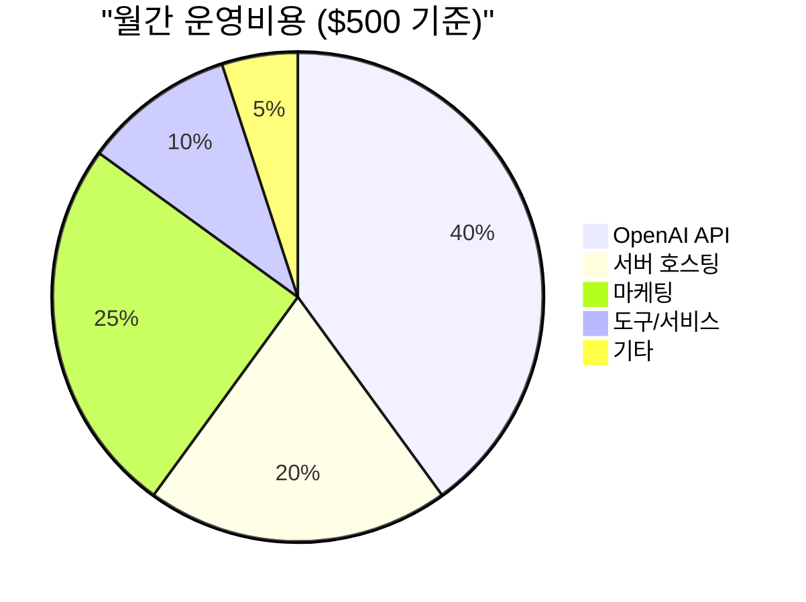

---

## 🏗️ 기술 아키텍처 비교

### 🔍 복잡도 비교

```mermaid
graph TD
    subgraph "CodeContext OS 2.0 - 극도 복잡"
        A1[Neo4j Graph DB] --> A2[Graph Neural Networks]
        A2 --> A3[Multi-Agent Orchestration] 
        A3 --> A4[MCP Protocol]
        A4 --> A5[Universal Context Graph]
        A5 --> A6[Real-time Sync Engine]
    end
    
    subgraph "Vibe NoCode Builder - 중간 복잡"  
        B1[React Components] --> B2[Drag & Drop Editor]
        B2 --> B3[LLM Intent Analyzer]
        B3 --> B4[Visual Assembly Engine]
        B4 --> B5[Real-time Preview]
    end
    
    subgraph "Figma to Code - 단순 명확"
        C1[Figma Plugin API] --> C2[Design Linter]
        C2 --> C3[AST Parser] 
        C3 --> C4[Code Generator]
        C4 --> C5[Web Dashboard]
    end
    
    style A1 fill:#ff9999
    style A2 fill:#ff9999
    style A3 fill:#ff9999
    style A4 fill:#ff9999
    style A5 fill:#ff9999
    style A6 fill:#ff9999
    
    style B1 fill:#ffcc99
    style B2 fill:#ffcc99
    style B3 fill:#ffcc99
    style B4 fill:#ffcc99
    style B5 fill:#ffcc99
    
    style C1 fill:#99ff99
    style C2 fill:#99ff99
    style C3 fill:#99ff99
    style C4 fill:#99ff99
    style C5 fill:#99ff99
```

### 🛠️ 필요 기술 스킬셋

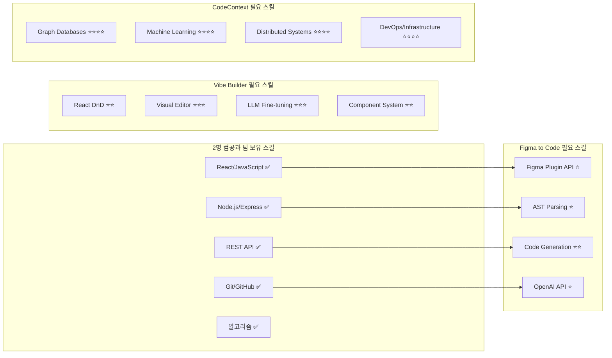

---

## 🎯 성공 시나리오 분석

### 📈 각 아이디어별 성장 곡선

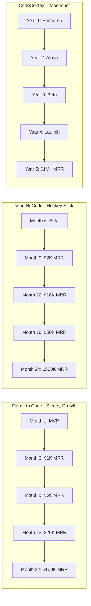

### 🏆 성공 확률 매트릭스

| 시나리오 | Figma to Code | Vibe NoCode | CodeContext OS |
|----------|---------------|-------------|----------------|
| **완전 실패** | 20% | 40% | 80% |
| **부분적 성공** | 60% | 40% | 15% |  
| **대박 성공** | 20% | 20% | 5% |

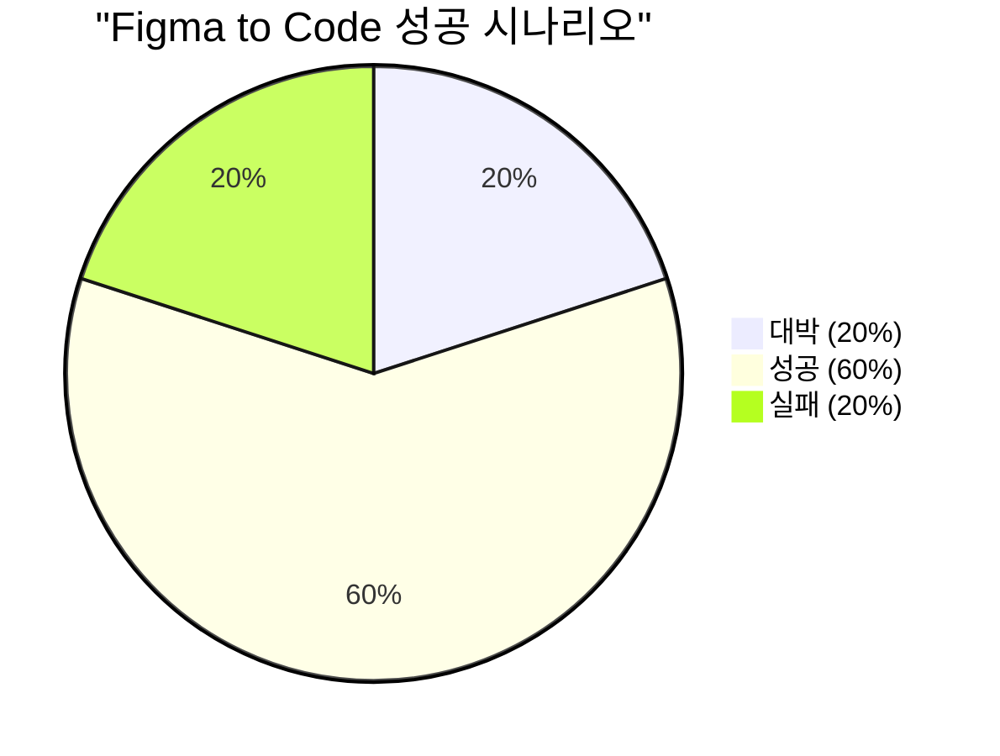

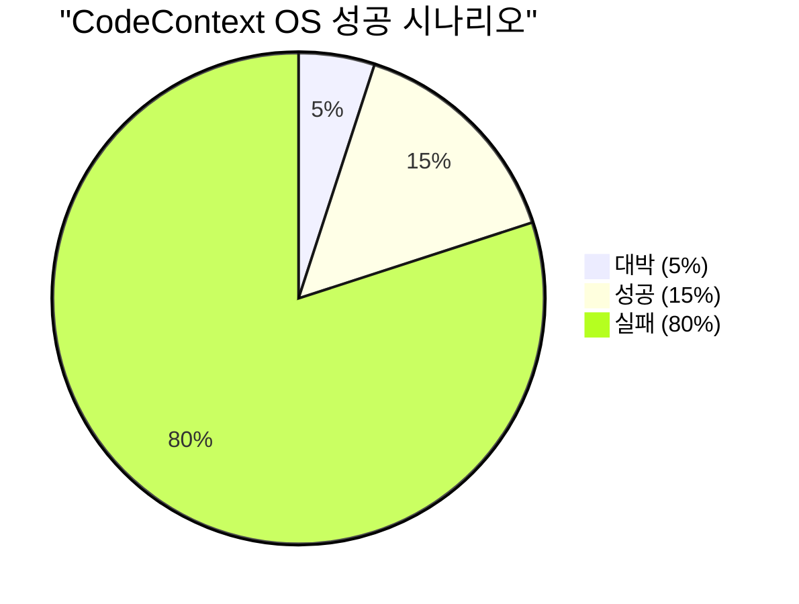

---

## 🎪 최종 의사결정 프레임워크

### 🤔 결정 매트릭스

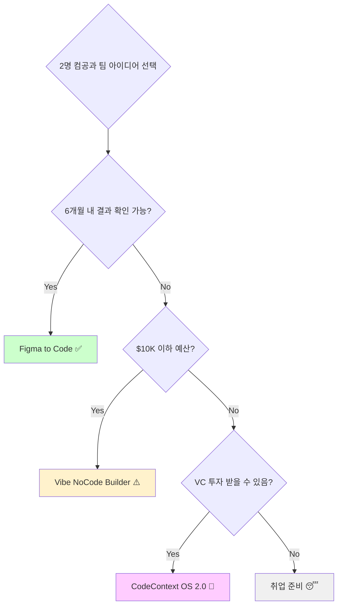

### ✅ 실행 체크리스트

#### **Figma to Code Solution 선택 시**
- [ ] Figma Developer 계정 생성
- [ ] Plugin API 문서 정독 (1주)  
- [ ] 기존 도구들 사용해보기 (Anima, Locofy)
- [ ] 잠재 고객 10명 인터뷰
- [ ] GitHub 레포지토리 생성
- [ ] MVP 기능 명세서 작성
- [ ] 베타 테스터 20명 모집 리스트
- [ ] 월 $500 예산 확보

#### **공통 준비사항**
- [ ] 팀 역할 분담 명확화
- [ ] 개발 일정표 작성 
- [ ] 경쟁사 심화 분석
- [ ] 사업자등록증 준비 (수익화 대비)
- [ ] 개인정보처리방침 및 약관 준비

---

## 🚀 Call to Action

### 🎯 **추천 Action Items (Next 7 Days)**

1. **Today**: Figma Developer 계정 생성 및 API 문서 읽기 시작
2. **Day 2-3**: Anima, Locofy 등 기존 도구들 직접 사용해보기  
3. **Day 4-5**: 디자이너 친구들 10명에게 pain point 인터뷰
4. **Day 6**: 팀 역할 분담 및 개발 환경 세팅 계획 수립
5. **Day 7**: GitHub 레포지토리 생성 및 첫 커밋

### 📞 **1개월 후 중간 점검**
- MVP 기능 80% 완성도 달성
- 베타 테스터 최소 10명 확보
- 시장 반응 데이터 수집 완료
- Go/No-Go 결정

---

## 🎊 마무리 메시지

> **"The best time to plant a tree was 20 years ago. The second best time is now."**

### 🌟 핵심 메시지

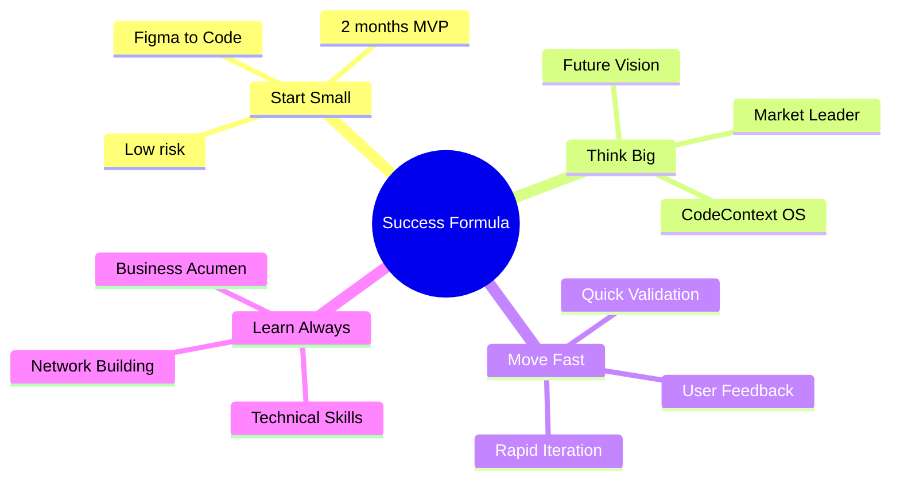

**🎯 Remember**: 
- 완벽한 계획보다 빠른 실행
- 큰 꿈을 가지되 작은 단계부터
- 실패도 성공의 과정

**🚀 Let's Build Something Amazing!**

---

*"From students to startup founders - your journey starts now!"* 

**Good luck! 🍀**