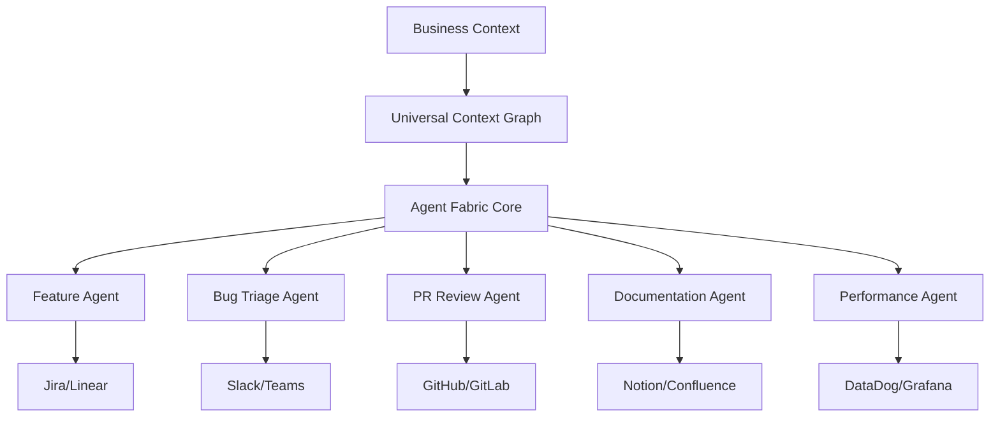

# CodeContext OS 2.0: Agent Fabric으로의 진화 - 심화 연구 보고서

## 📋 목차
1. [핵심 비전의 전환](#1-핵심-비전의-전환)
2. [Universal Context Graph (UCG) 심화 설계](#2-universal-context-graph-ucg-심화-설계)
3. [Agentic Workflow Engine 구현 전략](#3-agentic-workflow-engine-구현-전략)
4. [Model Context Protocol (MCP) 통합](#4-model-context-protocol-mcp-통합)
5. [비즈니스 컨텍스트 관리 시스템](#5-비즈니스-컨텍스트-관리-시스템)
6. [확장된 비전과 실행 전략](#6-확장된-비전과-실행-전략)

---

## 1. 핵심 비전의 전환

### 🎯 **From OS to Fabric: 패러다임 시프트**

#### 기존 비전 (CodeContext OS 1.0)
```yaml
역할: 수동적 컨텍스트 제공자
초점: 도구 통합 및 연결
사용자: 개발자 개인
범위: 코드베이스 중심
```

#### 진화된 비전 (Agent Fabric 2.0)
```yaml
역할: 능동적 워크플로우 수행자
초점: 자율적 문제 해결
사용자: 개발 조직 전체
범위: 비즈니스 프로세스 전반
```

### 🧬 **Agent Fabric의 핵심 개념**

**"보이지 않는 신경망"**으로서 조직의 모든 개발 활동을 연결하고 자동화하는 지능형 인프라



---

## 2. Universal Context Graph (UCG) 심화 설계

### 🌐 **다차원 지식 그래프 아키텍처**

#### 레이어 1: Data Sources Integration
```yaml
Code Layer:
  - Git 히스토리 (모든 커밋, 브랜치, 머지)
  - AST 분석 (함수 호출 그래프)
  - 의존성 트리 (패키지, 모듈)
  - 테스트 커버리지 맵

Planning Layer:
  - Jira/Linear 티켓 (요구사항, 우선순위)
  - Notion/Confluence 문서 (설계, API 명세)
  - Figma 디자인 (UI/UX 결정사항)
  - 로드맵 및 마일스톤

Communication Layer:
  - Slack/Teams 대화 (기술 토론, 의사결정)
  - 코드 리뷰 코멘트
  - 이메일 스레드
  - 회의록 및 녹취

Runtime Layer:
  - 프로덕션 로그 (에러, 성능)
  - APM 데이터 (New Relic, DataDog)
  - 사용자 피드백 (Zendesk, Intercom)
  - A/B 테스트 결과
```

#### 레이어 2: Graph Neural Networks (GNN) 처리
```python
class UniversalContextGraph:
    def __init__(self):
        self.neo4j = Neo4jConnector()
        self.vector_store = PineconeConnector()
        self.gnn_model = GraphSAGE()  # 또는 GAT, GCN
        
    async def build_context_graph(self, organization_id: str):
        """
        조직의 모든 데이터 소스를 통합하여 UCG 구축
        """
        # 1. 다중 소스 데이터 수집
        code_graph = await self.build_code_graph()
        planning_graph = await self.build_planning_graph()
        comm_graph = await self.build_communication_graph()
        runtime_graph = await self.build_runtime_graph()
        
        # 2. 이질적 그래프 통합
        unified_graph = self.merge_heterogeneous_graphs([
            code_graph, planning_graph, comm_graph, runtime_graph
        ])
        
        # 3. GNN을 통한 관계 학습
        embeddings = self.gnn_model.learn_embeddings(unified_graph)
        
        # 4. 시맨틱 인덱싱
        await self.vector_store.index_embeddings(embeddings)
        
        return unified_graph
    
    async def query_context(self, query: str, depth: int = 3):
        """
        복잡한 크로스 도메인 질의 처리
        예: "이 버그가 발생한 원인과 관련 Jira 티켓, 
             그리고 이를 논의한 Slack 대화를 찾아줘"
        """
        # 1. 자연어 → 그래프 쿼리 변환
        graph_query = self.nl_to_cypher(query)
        
        # 2. 다중 홉 그래프 탐색
        results = await self.neo4j.execute_multi_hop_query(
            graph_query, max_hops=depth
        )
        
        # 3. 컨텍스트 증강
        enriched_results = await self.enrich_with_embeddings(results)
        
        return enriched_results
```

#### 레이어 3: Temporal Context Tracking
```yaml
시간 기반 컨텍스트 추적:
  - 코드 진화 패턴 (어떤 코드가 자주 변경되는가)
  - 이슈 재발 패턴 (유사한 버그가 언제 발생했는가)
  - 팀 협업 패턴 (누가 언제 어떤 부분을 작업하는가)
  - 릴리즈 주기와 품질 상관관계
```

### 🧠 **비즈니스 컨텍스트 이해 엔진**

#### Business Context Modeling
```python
class BusinessContextEngine:
    def __init__(self, ucg: UniversalContextGraph):
        self.ucg = ucg
        self.llm = ClaudeOpus()  # 또는 GPT-4
        
    async def understand_business_impact(self, code_change: Dict):
        """
        코드 변경이 비즈니스에 미치는 영향 분석
        """
        # 1. 기술적 영향 분석
        technical_impact = await self.analyze_technical_impact(code_change)
        
        # 2. 비즈니스 메트릭 매핑
        business_metrics = await self.map_to_business_metrics(technical_impact)
        
        # 3. 리스크 평가
        risk_assessment = await self.assess_business_risk(business_metrics)
        
        # 4. 스테이크홀더 영향 분석
        stakeholder_impact = await self.analyze_stakeholder_impact(
            business_metrics
        )
        
        return {
            "technical": technical_impact,
            "business": business_metrics,
            "risk": risk_assessment,
            "stakeholders": stakeholder_impact
        }
    
    async def generate_executive_summary(self, sprint_data: Dict):
        """
        경영진을 위한 기술 진행 상황 요약
        """
        prompt = f"""
        Based on the following sprint data from our UCG:
        - Completed features: {sprint_data['completed']}
        - Technical debt addressed: {sprint_data['tech_debt']}
        - Customer issues resolved: {sprint_data['issues']}
        
        Generate an executive summary that:
        1. Translates technical achievements to business value
        2. Highlights ROI and efficiency gains
        3. Identifies potential risks and opportunities
        """
        
        return await self.llm.generate(prompt)
```

---

## 3. Agentic Workflow Engine 구현 전략

### 🤖 **고급 에이전트 아키텍처**

#### Multi-Agent Orchestration System
```python
class AgentOrchestrator:
    def __init__(self):
        self.agents = {
            'feature': FeatureAgent(),
            'bug_triage': BugTriageAgent(),
            'pr_review': PRReviewAgent(),
            'refactor': RefactorAgent(),
            'documentation': DocumentationAgent(),
            'performance': PerformanceAgent()
        }
        self.mcp_client = MCPClient()  # Model Context Protocol
        
    async def execute_complex_workflow(self, task: Dict):
        """
        다단계 워크플로우 자율 실행
        """
        # 1. 작업 분해
        subtasks = await self.decompose_task(task)
        
        # 2. 에이전트 할당
        agent_assignments = await self.assign_agents(subtasks)
        
        # 3. 병렬/순차 실행
        results = await self.execute_with_dependencies(agent_assignments)
        
        # 4. 결과 통합 및 검증
        final_output = await self.integrate_and_validate(results)
        
        return final_output
```

#### Advanced Agent Examples

##### 1. **Refactor Agent**
```python
class RefactorAgent:
    """
    기술 부채를 자동으로 식별하고 해결하는 에이전트
    """
    async def identify_refactoring_opportunities(self, codebase: Dict):
        opportunities = []
        
        # 1. 코드 복잡도 분석
        complexity_issues = await self.analyze_complexity(codebase)
        
        # 2. 중복 코드 탐지
        duplications = await self.detect_duplications(codebase)
        
        # 3. 아키텍처 위반 확인
        violations = await self.check_architecture_violations(codebase)
        
        # 4. 성능 병목 지점 식별
        bottlenecks = await self.identify_performance_bottlenecks(codebase)
        
        # 5. 우선순위 매기기
        prioritized = await self.prioritize_by_business_impact(
            complexity_issues + duplications + violations + bottlenecks
        )
        
        return prioritized
    
    async def execute_refactoring(self, target: Dict):
        """
        실제 리팩토링 수행
        """
        # 1. 안전성 검증
        if not await self.verify_safe_to_refactor(target):
            return {"status": "unsafe", "reason": "High risk detected"}
        
        # 2. 테스트 생성 (리팩토링 전)
        tests = await self.generate_characterization_tests(target)
        
        # 3. 리팩토링 실행
        refactored_code = await self.apply_refactoring_pattern(target)
        
        # 4. 테스트 실행
        test_results = await self.run_tests(tests, refactored_code)
        
        # 5. PR 생성
        if test_results['passed']:
            pr = await self.create_pull_request(refactored_code)
            return {"status": "success", "pr": pr}
        
        return {"status": "failed", "test_results": test_results}
```

##### 2. **Architecture Guardian Agent**
```python
class ArchitectureGuardianAgent:
    """
    아키텍처 일관성을 유지하는 에이전트
    """
    async def monitor_architecture_compliance(self, pr: Dict):
        # 1. 의존성 규칙 체크
        dependency_violations = await self.check_dependency_rules(pr)
        
        # 2. 레이어 위반 체크
        layer_violations = await self.check_layer_boundaries(pr)
        
        # 3. 패턴 일관성 체크
        pattern_violations = await self.check_design_patterns(pr)
        
        # 4. 보안 정책 체크
        security_issues = await self.check_security_policies(pr)
        
        if any([dependency_violations, layer_violations, 
                pattern_violations, security_issues]):
            await self.block_pr_with_feedback(pr, violations)
        else:
            await self.approve_pr(pr)
```

##### 3. **Intelligent Migration Agent**
```python
class MigrationAgent:
    """
    대규모 마이그레이션을 자동화하는 에이전트
    """
    async def plan_migration(self, source: str, target: str):
        """
        예: React 16 → React 18 마이그레이션
        """
        # 1. 영향 범위 분석
        impact_analysis = await self.analyze_migration_impact(source, target)
        
        # 2. 단계별 계획 수립
        migration_plan = await self.create_phased_plan(impact_analysis)
        
        # 3. 리스크 평가
        risks = await self.assess_migration_risks(migration_plan)
        
        # 4. 롤백 계획 수립
        rollback_plan = await self.create_rollback_strategy(migration_plan)
        
        return {
            "plan": migration_plan,
            "risks": risks,
            "rollback": rollback_plan,
            "estimated_effort": self.estimate_effort(migration_plan)
        }
    
    async def execute_migration_phase(self, phase: Dict):
        # 자동화된 마이그레이션 실행
        pass
```

---

## 4. Model Context Protocol (MCP) 통합

### 🔌 **MCP 기반 통합 아키텍처**

#### MCP의 핵심 가치
```yaml
2024년 11월 Anthropic 발표:
- OpenAI, Google DeepMind 채택 (2025년 3월)
- Microsoft Copilot Studio 통합 (2025년 5월)
- 업계 표준으로 자리잡음

핵심 기능:
- Tools: AI가 실행할 액션
- Resources: 앱이 제공하는 컨텍스트
- Prompts: 사용자 호출 상호작용
```

#### CodeContext MCP Server 구현
```python
from mcp import MCPServer, Tool, Resource, Prompt

class CodeContextMCPServer(MCPServer):
    """
    CodeContext OS를 MCP 표준으로 노출
    """
    def __init__(self):
        super().__init__("codecontext-mcp-server")
        self.ucg = UniversalContextGraph()
        self.agent_orchestrator = AgentOrchestrator()
        
    @Tool("analyze_codebase")
    async def analyze_codebase(self, params: Dict):
        """
        외부 AI 시스템이 우리 UCG를 쿼리할 수 있게 함
        """
        return await self.ucg.query_context(params['query'])
    
    @Tool("execute_workflow")
    async def execute_workflow(self, params: Dict):
        """
        외부에서 에이전트 워크플로우 트리거
        """
        return await self.agent_orchestrator.execute_complex_workflow(
            params['workflow']
        )
    
    @Resource("project_context")
    async def get_project_context(self):
        """
        프로젝트 전체 컨텍스트를 MCP 리소스로 제공
        """
        return await self.ucg.get_full_context()
    
    @Prompt("fix_bug")
    def fix_bug_prompt(self):
        """
        버그 수정을 위한 구조화된 프롬프트 템플릿
        """
        return {
            "name": "fix_bug",
            "description": "Fix a bug with full context",
            "parameters": {
                "bug_id": "string",
                "priority": "enum[low,medium,high,critical]"
            }
        }
```

#### MCP 클라이언트 통합
```python
class MCPIntegration:
    """
    다른 MCP 서버들과 통합
    """
    def __init__(self):
        self.servers = {
            'jira': MCPClient('jira-mcp-server'),
            'slack': MCPClient('slack-mcp-server'),
            'github': MCPClient('github-mcp-server'),
            'datadog': MCPClient('datadog-mcp-server')
        }
    
    async def cross_platform_workflow(self, incident: Dict):
        """
        인시던트 대응 자동화 예시
        """
        # 1. DataDog에서 알림 수신
        alert = await self.servers['datadog'].get_alert(incident['id'])
        
        # 2. GitHub에서 관련 코드 찾기
        related_code = await self.servers['github'].find_related_code(
            alert['stack_trace']
        )
        
        # 3. Jira에 티켓 생성
        ticket = await self.servers['jira'].create_incident_ticket({
            'title': alert['title'],
            'code': related_code,
            'severity': alert['severity']
        })
        
        # 4. Slack에 알림
        await self.servers['slack'].notify_channel({
            'channel': '#incidents',
            'ticket': ticket,
            'assignee': self.find_oncall_engineer()
        })
```

---

## 5. 비즈니스 컨텍스트 관리 시스템

### 📊 **Enterprise Context Management**

#### 조직 지식 그래프
```python
class OrganizationKnowledgeGraph:
    """
    조직 전체의 비즈니스 컨텍스트 관리
    """
    def __init__(self):
        self.business_metrics = BusinessMetricsConnector()
        self.team_structure = TeamStructureConnector()
        self.customer_data = CustomerDataConnector()
        
    async def build_business_context(self):
        """
        기술과 비즈니스를 연결하는 컨텍스트 구축
        """
        context = {
            # 비즈니스 목표
            'okrs': await self.fetch_current_okrs(),
            'kpis': await self.fetch_key_metrics(),
            
            # 팀 구조와 책임
            'teams': await self.map_team_responsibilities(),
            'ownership': await self.map_code_ownership(),
            
            # 고객 영향
            'customer_segments': await self.analyze_customer_segments(),
            'feature_usage': await self.track_feature_usage(),
            
            # 재무 영향
            'revenue_impact': await self.calculate_revenue_impact(),
            'cost_analysis': await self.analyze_infrastructure_costs()
        }
        
        return context
    
    async def translate_technical_to_business(self, technical_change: Dict):
        """
        기술적 변경을 비즈니스 언어로 번역
        """
        impact = {
            'customer_impact': await self.assess_customer_impact(technical_change),
            'revenue_impact': await self.estimate_revenue_impact(technical_change),
            'risk_assessment': await self.evaluate_business_risk(technical_change),
            'compliance_check': await self.check_compliance_requirements(technical_change)
        }
        
        # LLM을 통한 자연어 요약 생성
        summary = await self.generate_executive_summary(impact)
        
        return {
            'detailed_analysis': impact,
            'executive_summary': summary
        }
```

#### Context Governance Framework
```yaml
컨텍스트 거버넌스:
  데이터 프라이버시:
    - 민감 정보 자동 마스킹
    - 역할 기반 접근 제어 (RBAC)
    - 감사 로그 자동 생성
    
  컨텍스트 품질:
    - 자동 데이터 검증
    - 중복 제거 및 정규화
    - 시간 기반 관련성 스코어링
    
  규정 준수:
    - GDPR, CCPA 준수
    - SOC2, ISO27001 인증 지원
    - 자동 컴플라이언스 리포팅
```

---

## 6. 확장된 비전과 실행 전략

### 🚀 **The Smart PR MVP - 상세 구현 계획**

#### Phase 1: GitHub App 개발 (1-2개월)
```typescript
// Smart PR GitHub App
class SmartPRApp {
    constructor() {
        this.ucg = new UniversalContextGraph();
        this.mcp = new MCPClient();
        this.agents = new AgentOrchestrator();
    }
    
    async onPullRequestOpened(context: Context) {
        const pr = context.payload.pull_request;
        
        // 1. 자동 컨텍스트 연결
        const jiraTicket = await this.extractJiraTicket(pr.body);
        const enrichedContext = await this.enrichWithJiraContext(jiraTicket);
        
        // 2. 지능형 리뷰어 추천
        const reviewers = await this.recommendReviewers(pr);
        
        // 3. 문서화 필요성 분석
        const docNeeds = await this.analyzeDocumentationNeeds(pr);
        
        // 4. 숨겨진 작업 식별
        const hiddenTasks = await this.identifyHiddenDependencies(pr);
        
        // 5. PR 코멘트 생성
        await this.createIntelligentComment({
            context: enrichedContext,
            reviewers: reviewers,
            documentation: docNeeds,
            dependencies: hiddenTasks
        });
    }
    
    async recommendReviewers(pr: PullRequest) {
        // UCG를 활용한 지능형 리뷰어 추천
        const codeOwners = await this.ucg.findCodeOwners(pr.files);
        const recentContributors = await this.ucg.findRecentContributors(pr.files);
        const domainExperts = await this.ucg.findDomainExperts(pr.title);
        
        return this.rankReviewers([
            ...codeOwners,
            ...recentContributors,
            ...domainExperts
        ]);
    }
}
```

#### Phase 2: UCG Lite 구축 (2-3개월)
```yaml
최소 기능 UCG:
  데이터 소스:
    - GitHub (코드, PR, 이슈)
    - Jira (티켓, 에픽)
    - Slack (공개 채널만)
    
  그래프 구조:
    - 노드: 파일, 함수, 티켓, 사용자, 대화
    - 엣지: 수정, 언급, 의존, 소유
    
  쿼리 능력:
    - "이 코드를 누가 마지막으로 수정했나?"
    - "관련된 Jira 티켓은 무엇인가?"
    - "이 기능에 대한 Slack 논의는?"
```

#### Phase 3: Agent 능력 확장 (3-6개월)
```yaml
단계별 에이전트 추가:
  Month 3: Basic PR Agent
    - 자동 컨텍스트 연결
    - 리뷰어 추천
    
  Month 4: Documentation Agent
    - 문서 자동 업데이트
    - API 문서 생성
    
  Month 5: Bug Triage Agent
    - 버그 자동 분류
    - 우선순위 제안
    
  Month 6: Feature Planning Agent
    - 요구사항 분해
    - 작업 자동 생성
```

### 🎯 **차별화 전략: "Context-First Development"**

#### 핵심 메시지
```yaml
"우리는 AI 코딩 도구가 아닙니다.
우리는 조직의 전체 개발 프로세스를 이해하고
자동화하는 지능형 패브릭입니다."

경쟁 우위:
1. 유일한 통합 컨텍스트 그래프
2. MCP 표준 완벽 지원
3. 비즈니스 컨텍스트 이해
4. 자율 에이전트 오케스트레이션
```

### 📈 **성장 시나리오**

#### Year 1: Foundation (2025)
```yaml
목표:
  - 100개 기업 파일럿
  - $1M ARR
  - 3개 주요 에이전트 출시
  
핵심 지표:
  - 컨텍스트 정확도 95%+
  - 워크플로우 자동화율 30%
  - 개발 속도 향상 2x
```

#### Year 2: Expansion (2026)
```yaml
목표:
  - 1,000개 기업 고객
  - $10M ARR
  - 10개 에이전트 생태계
  
확장:
  - 엔터프라이즈 온프레미스
  - 산업별 특화 에이전트
  - 파트너 에이전트 마켓플레이스
```

#### Year 3: Platform (2027)
```yaml
목표:
  - 10,000개 조직
  - $100M ARR
  - 개발 프로세스 표준

비전 실현:
  - 업계 표준 Agent Fabric
  - M&A 또는 IPO 준비
```

---

## 🎯 결론: Agent Fabric의 핵심 가치

### ✨ **왜 Agent Fabric인가?**

1. **컨텍스트가 왕이다**: 모든 AI의 성능은 컨텍스트의 질에 달려있음
2. **자동화가 미래다**: 수동 작업을 자동화하는 것이 진정한 생산성
3. **통합이 차별화다**: 파편화된 도구들을 연결하는 것이 핵심 가치
4. **비즈니스 이해가 필수다**: 기술과 비즈니스를 연결해야 진정한 가치 창출

### 🚀 **Next Steps**

1. **즉시 시작**: Smart PR GitHub App 프로토타입
2. **파트너십 구축**: Jira, Slack, Linear와 초기 통합
3. **커뮤니티 구축**: 오픈소스 에이전트 생태계 조성
4. **투자 유치**: Seed 라운드 $5M 목표

**"From connecting tools to orchestrating intelligence"** - 이것이 CodeContext OS 2.0: Agent Fabric의 비전입니다.