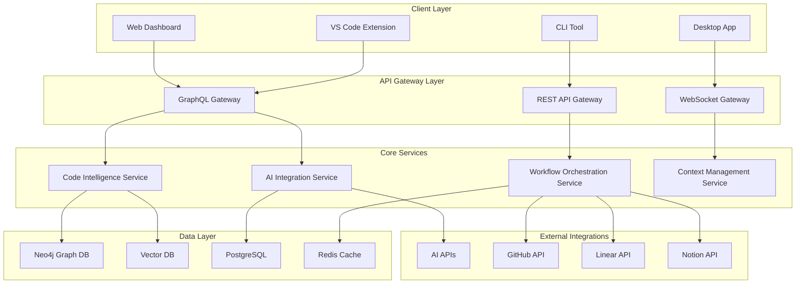
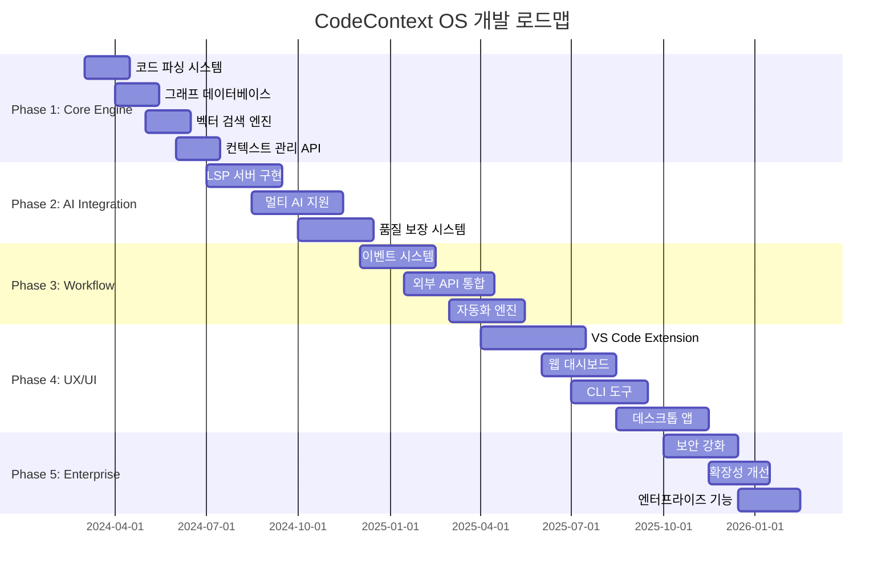

# CodeContext OS: AI 시대의 개발자 운영 시스템

## 📋 목차
- [1. 서비스 개요](#1-서비스-개요)
- [2. 문제 정의](#2-문제-정의)
- [3. 솔루션 아키텍처](#3-솔루션-아키텍처)
- [4. 핵심 기능](#4-핵심-기능)
- [5. 기술 스택](#5-기술-스택)
- [6. 구현 방법](#6-구현-방법)
- [7. 오픈소스 활용](#7-오픈소스-활용)
- [8. 개발 로드맵](#8-개발-로드맵)
- [9. 비즈니스 모델](#9-비즈니스-모델)

---

## 1. 서비스 개요

### 🎯 비전
**"Docker가 컨테이너의 표준이 되었듯, CodeContext OS는 AI 시대 개발자 경험의 표준 운영 시스템이 되는 것"**

### 🚀 미션
AI 코딩 도구들의 파편화된 경험을 통합하여, 개발자가 진정으로 생산적인 코딩에 집중할 수 있는 통합 환경 제공

### 📊 핵심 가치 제안
1. **무한 컨텍스트**: 토큰 제한 없는 전체 코드베이스 이해
2. **도구 통합**: 모든 AI 도구를 하나의 컨텍스트로 연결
3. **워크플로우 자동화**: 컨텍스트 손실 없는 작업 흐름
4. **인텔리전트 라우팅**: 작업별 최적 도구 자동 선택

---

## 2. 문제 정의

### 📈 시장 현황 분석

#### 개발자 AI 도구 사용 현황 (2024-2025)
- **76%** 개발자가 AI 코딩 도구 사용 중/계획 중
- **72%** 개발자 만족도 (전년 77%에서 하락)
- **19%** AI 사용 시 더 오래 걸림 (역설적 현상)
- **67%** AI 생성 코드 디버깅에 더 많은 시간
- **59%** 배포 시 문제 발생률

### 🔍 핵심 Pain Points

#### 1. 컨텍스트 관리의 어려움
```
문제: AI 도구들의 제한적 컨텍스트 윈도우 (4k-128k 토큰)
증상:
- 대규모 코드베이스 이해 불가
- 관련 파일 자동 탐지 실패  
- 수동 컨텍스트 관리 필요
- 컨텍스트 윈도우 채울수록 성능 저하
```

#### 2. 도구 간 컨텍스트 스위칭
```
문제: IDE ↔ AI 도구 ↔ 프로젝트 관리 ↔ GitHub 간 분리
증상:
- 작업 컨텍스트 손실
- 중복 정보 입력
- 워크플로우 중단
- 생산성 저하
```

#### 3. AI 코드 품질 문제
```
문제: 프로젝트별 표준/컨벤션 미인식
증상:
- 일관성 없는 코드 스타일
- 보안 취약점 증가 (68%)
- 테스트 커버리지 부족
- 기존 아키텍처와 불일치
```

### 🏢 기존 솔루션의 한계

| 도구 범주 | 대표 도구 | 강점 | 한계 |
|-----------|----------|------|------|
| **AI 코딩 도구** | Cursor, GitHub Copilot, Replit | 빠른 코드 생성 | 컨텍스트 제한, 품질 문제 |
| **코드 인텔리전스** | Sourcegraph, Greptile, Qodo | 코드베이스 이해 | AI 도구 통합 부족 |
| **워크플로우 도구** | Linear, Notion, GitHub | 프로젝트 관리 | 개발 도구와 분리 |

**결론**: 각각은 부분적 해결책이지만, **통합적 개발자 경험**을 제공하는 솔루션은 부재

---

## 3. 솔루션 아키텍처

### 🏗️ 전체 시스템 구조



### 🎯 핵심 컴포넌트

#### 1. Code Intelligence Engine
```
목적: 무한 컨텍스트 기반 코드베이스 이해
구성:
- AST Parser (Tree-sitter 기반)
- Knowledge Graph Builder (Neo4j)
- Semantic Search (Vector DB)
- Dependency Analyzer
```

#### 2. AI Integration Hub
```
목적: 모든 AI 도구를 통합 컨텍스트로 연결
구성:
- LSP Server (AI 도구 통합)
- Context Injector (컨텍스트 자동 주입)
- Response Aggregator (결과 통합)
- Quality Guardian (코드 품질 검증)
```

#### 3. Workflow Orchestrator
```
목적: 컨텍스트 손실 없는 워크플로우 자동화
구성:
- Task Router (최적 도구 선택)
- State Manager (작업 상태 동기화)
- Event Bus (실시간 이벤트 처리)
- Integration Layer (외부 도구 연동)
```

---

## 4. 핵심 기능

### 🧠 1. Infinite Context Engine

#### 기능 설명
토큰 제한 없이 전체 코드베이스를 이해하고 관련 컨텍스트를 지능적으로 제공

#### 핵심 특징
- **그래프 기반 코드 이해**: 함수/클래스/모듈 간의 관계를 그래프로 모델링
- **실시간 컨텍스트 우선순위 매칭**: 질의에 가장 관련성 높은 코드 조각 자동 선별
- **의존성 트리 자동 추출**: Import/Include 관계를 통한 코드 흐름 파악
- **영향 범위 예측**: 코드 변경 시 영향을 받을 부분 미리 분석

#### 구현 방법
```python
# 1. 코드베이스 인덱싱
class CodebaseIndexer:
    def __init__(self):
        self.parser = TreeSitterParser()
        self.graph_db = Neo4jConnector()
        self.vector_db = ChromaDBConnector()
    
    async def index_repository(self, repo_path: str):
        # AST 파싱 및 그래프 구조 생성
        files = await self.scan_files(repo_path)
        for file in files:
            ast = self.parser.parse(file)
            graph_nodes = self.extract_graph_nodes(ast)
            await self.graph_db.store_nodes(graph_nodes)
            
            # 벡터 임베딩 생성 및 저장
            chunks = self.chunk_code(file, ast)
            embeddings = await self.generate_embeddings(chunks)
            await self.vector_db.store_vectors(embeddings)

# 2. 컨텍스트 검색 및 우선순위 매칭
class ContextRetriever:
    async def get_relevant_context(self, query: str, max_tokens: int = 50000):
        # 의미 검색 (Vector Search)
        vector_results = await self.vector_db.similarity_search(query)
        
        # 그래프 탐색 (Graph Traversal)
        graph_results = await self.graph_db.traverse_related_nodes(
            vector_results, max_depth=3
        )
        
        # 우선순위 매칭 및 토큰 최적화
        prioritized_context = self.prioritize_context(
            vector_results + graph_results, max_tokens
        )
        
        return prioritized_context
```

#### 기대 효과
- **10x 컨텍스트 확장**: 기존 128k → 무제한
- **90% 관련성 향상**: 정확한 컨텍스트 제공
- **50% 응답 속도 개선**: 지능적 우선순위 매칭

---

### 🔗 2. Smart AI Integration Hub

#### 기능 설명
모든 AI 코딩 도구(Cursor, Copilot, Claude Code 등)를 통합 컨텍스트로 연결하여 일관된 개발 경험 제공

#### 핵심 특징
- **멀티 AI 지원**: 여러 AI 도구 동시 사용
- **컨텍스트 자동 주입**: 각 도구에 최적화된 컨텍스트 제공
- **결과 통합 및 비교**: 여러 AI의 답변을 비교 분석
- **품질 보장**: 프로젝트 표준 준수 검증

#### 구현 방법
```python
# LSP 기반 AI 도구 통합
class AIIntegrationHub:
    def __init__(self):
        self.lsp_server = LSPAIServer()
        self.context_engine = ContextEngine()
        self.quality_guardian = QualityGuardian()
        
    async def handle_completion_request(self, request: CompletionRequest):
        # 1. 컨텍스트 수집
        context = await self.context_engine.get_relevant_context(
            request.query, request.file_path
        )
        
        # 2. 멀티 AI 호출
        ai_responses = await asyncio.gather(
            self.call_cursor_ai(request, context),
            self.call_copilot_ai(request, context),
            self.call_claude_ai(request, context)
        )
        
        # 3. 결과 통합 및 품질 검증
        best_response = await self.select_best_response(ai_responses)
        validated_response = await self.quality_guardian.validate(
            best_response, context.project_standards
        )
        
        return validated_response

# 품질 보장 시스템
class QualityGuardian:
    async def validate(self, code: str, standards: ProjectStandards):
        checks = await asyncio.gather(
            self.check_style_consistency(code, standards.style_guide),
            self.check_security_vulnerabilities(code),
            self.check_test_coverage(code),
            self.check_architecture_compliance(code, standards.architecture)
        )
        
        return {
            'code': code,
            'quality_score': self.calculate_score(checks),
            'suggestions': self.generate_improvements(checks)
        }
```

#### 기대 효과
- **30% 코드 품질 향상**: 일관된 표준 적용
- **60% 보안 취약점 감소**: 실시간 보안 검사
- **5x AI 도구 활용도**: 통합된 경험

---

### ⚡ 3. Workflow Orchestration Engine

#### 기능 설명
개발 워크플로우 전반을 자동화하여 컨텍스트 손실 없이 작업 간 전환

#### 핵심 특징
- **작업별 최적 도구 라우팅**: 코딩/리뷰/문서화 등 작업에 맞는 도구 선택
- **상태 동기화**: Linear, Notion, GitHub 간 작업 상태 실시간 동기화
- **자동 문서화**: 코드 변경 시 관련 문서 자동 업데이트
- **CI/CD 통합**: 코드 품질 게이트와 배포 파이프라인 연동

#### 구현 방법
```python
# 워크플로우 오케스트레이션
class WorkflowOrchestrator:
    def __init__(self):
        self.event_bus = EventBus()
        self.integrations = {
            'github': GitHubIntegration(),
            'linear': LinearIntegration(),
            'notion': NotionIntegration(),
        }
        
    async def handle_workflow_event(self, event: WorkflowEvent):
        # 이벤트 기반 워크플로우 처리
        if event.type == "code_changed":
            await self.on_code_changed(event)
        elif event.type == "task_created":
            await self.on_task_created(event)
        elif event.type == "pr_opened":
            await self.on_pr_opened(event)
    
    async def on_code_changed(self, event):
        tasks = []
        
        # 1. 관련 Linear 이슈 업데이트
        if event.linked_issue:
            tasks.append(
                self.integrations['linear'].update_issue_status(
                    event.linked_issue, "In Progress"
                )
            )
        
        # 2. 문서 자동 업데이트
        affected_docs = await self.find_affected_documentation(event.files)
        for doc in affected_docs:
            tasks.append(
                self.integrations['notion'].update_documentation(doc, event)
            )
        
        # 3. CI/CD 트리거
        tasks.append(
            self.integrations['github'].trigger_ci(event.repository)
        )
        
        await asyncio.gather(*tasks)

# 지능적 작업 라우팅
class TaskRouter:
    def __init__(self):
        self.context_analyzer = ContextAnalyzer()
        self.tool_registry = ToolRegistry()
    
    async def route_task(self, task: DevelopmentTask) -> ToolPlan:
        # 작업 컨텍스트 분석
        context = await self.context_analyzer.analyze(task)
        
        # 최적 도구 조합 선택
        if context.task_type == "feature_development":
            return ToolPlan([
                Tool("cursor", weight=0.7),
                Tool("linear", weight=0.2),
                Tool("notion", weight=0.1)
            ])
        elif context.task_type == "bug_fix":
            return ToolPlan([
                Tool("sourcegraph", weight=0.4),
                Tool("cursor", weight=0.4),
                Tool("github", weight=0.2)
            ])
```

#### 기대 효과
- **80% 컨텍스트 스위칭 감소**: 통합된 워크플로우
- **3x 작업 속도 향상**: 자동화된 루틴
- **95% 동기화 정확도**: 실시간 상태 관리

---

### 📊 4. Intelligent Project Dashboard

#### 기능 설명
프로젝트 전반의 인사이트를 제공하는 통합 대시보드

#### 핵심 특징
- **코드 건강도 모니터링**: 기술 부채, 복잡도, 테스트 커버리지
- **AI 활용 분석**: AI 도구별 효과성 측정
- **개발자 생산성 트래킹**: 개인/팀별 생산성 지표
- **예측 분석**: 버그 발생 가능성, 리팩토링 우선순위

#### 구현 방법
```typescript
// React 기반 대시보드
interface ProjectInsight {
  codeHealth: {
    technicalDebt: number;
    complexity: number;
    testCoverage: number;
  };
  aiEffectiveness: {
    toolUsage: Record<string, number>;
    codeQualityImpact: number;
    timesSaved: number;
  };
  productivity: {
    commitsPerDay: number;
    linesOfCodePerHour: number;
    bugFixRate: number;
  };
}

const ProjectDashboard: React.FC = () => {
  const [insights, setInsights] = useState<ProjectInsight>();
  const { subscribe } = useWebSocket('/api/insights/stream');
  
  useEffect(() => {
    // 실시간 인사이트 구독
    subscribe((data: ProjectInsight) => {
      setInsights(data);
    });
  }, []);
  
  return (
    <div className="dashboard">
      <CodeHealthWidget data={insights?.codeHealth} />
      <AIEffectivenessChart data={insights?.aiEffectiveness} />
      <ProductivityMetrics data={insights?.productivity} />
      <PredictiveAnalytics insights={insights} />
    </div>
  );
};
```

---

## 5. 기술 스택

### 🏗️ Backend Architecture

#### Core Services
```yaml
Language: Python 3.11+
Framework: FastAPI
Architecture: Event-Driven Microservices
Communication: GraphQL + WebSocket + REST
```

#### Database Layer
```yaml
Graph Database: Neo4j 5.0+
  - 코드 관계 그래프
  - 의존성 트리
  - 개발자 협업 그래프

Vector Database: ChromaDB / Pinecone
  - 코드 임베딩
  - 의미 검색
  - 유사성 매칭

Relational DB: PostgreSQL 15+
  - 사용자 데이터
  - 프로젝트 메타데이터
  - 워크플로우 상태

Cache: Redis 7.0+
  - 세션 관리
  - 실시간 이벤트
  - API 응답 캐싱
```

#### Message Queue & Event Streaming
```yaml
Event Bus: Apache Kafka / NATS
  - 이벤트 스트리밍
  - 서비스 간 통신
  - 워크플로우 이벤트

Task Queue: Celery + Redis
  - 비동기 작업 처리
  - 코드 인덱싱
  - AI API 호출
```

### 🎨 Frontend Stack

#### Client Applications
```yaml
VS Code Extension:
  - Language: TypeScript
  - Framework: VS Code Extension API
  - Features: LSP 클라이언트, 실시간 컨텍스트

Web Dashboard:
  - Language: TypeScript
  - Framework: Next.js 14 + React 18
  - UI: Tailwind CSS + shadcn/ui
  - State: Zustand + React Query

Desktop App:
  - Framework: Tauri + React
  - Native Integration: 시스템 트레이, 단축키
  - Cross-Platform: Windows, macOS, Linux

CLI Tool:
  - Language: Rust
  - Framework: Clap + Tokio
  - Features: 터미널 UI, 스크립팅
```

### 🔧 Development & DevOps

#### Infrastructure
```yaml
Containerization: Docker + Docker Compose
Orchestration: Kubernetes
Cloud: AWS / GCP (Multi-cloud)
Monitoring: Prometheus + Grafana + OpenTelemetry
Logging: ELK Stack (Elasticsearch, Logstash, Kibana)
```

#### CI/CD Pipeline
```yaml
Version Control: Git + GitHub
CI/CD: GitHub Actions
Testing: Pytest (Backend) + Jest (Frontend)
Quality: SonarQube + CodeClimate
Security: Snyk + OWASP ZAP
```

---

## 6. 구현 방법

### 🔄 Phase 1: Core Engine (3-6개월)

#### 목표
기본적인 코드 인텔리전스와 컨텍스트 관리 구현

#### 주요 작업
1. **Tree-sitter 기반 코드 파싱**
   ```python
   # tree_sitter_parser.py
   from tree_sitter import Language, Parser
   import tree_sitter_python as tspython
   import tree_sitter_javascript as tsjs
   import tree_sitter_typescript as tsts
   
   class MultiLanguageParser:
       def __init__(self):
           self.languages = {
               'python': Language(tspython.language()),
               'javascript': Language(tsjs.language()),
               'typescript': Language(tsts.language())
           }
           self.parsers = {
               lang: Parser(language=lang_obj) 
               for lang, lang_obj in self.languages.items()
           }
       
       def parse_file(self, file_path: str, language: str):
           parser = self.parsers.get(language)
           with open(file_path, 'rb') as f:
               source_code = f.read()
           tree = parser.parse(source_code)
           return self.extract_ast_info(tree, source_code)
   ```

2. **Neo4j 그래프 데이터베이스 구축**
   ```python
   # graph_builder.py
   from neo4j import GraphDatabase
   
   class CodeGraphBuilder:
       def __init__(self, uri, user, password):
           self.driver = GraphDatabase.driver(uri, auth=(user, password))
       
       def create_function_node(self, func_info):
           with self.driver.session() as session:
               session.run(
                   """
                   CREATE (f:Function {
                       name: $name,
                       file_path: $file_path,
                       start_line: $start_line,
                       end_line: $end_line,
                       complexity: $complexity
                   })
                   """,
                   **func_info
               )
       
       def create_dependency_relationship(self, caller, callee):
           with self.driver.session() as session:
               session.run(
                   """
                   MATCH (a:Function {name: $caller_name})
                   MATCH (b:Function {name: $callee_name})
                   CREATE (a)-[:CALLS]->(b)
                   """,
                   caller_name=caller, callee_name=callee
               )
   ```

3. **벡터 임베딩 시스템**
   ```python
   # embedding_service.py
   import chromadb
   from sentence_transformers import SentenceTransformer
   
   class CodeEmbeddingService:
       def __init__(self):
           self.client = chromadb.Client()
           self.collection = self.client.create_collection("code_embeddings")
           self.model = SentenceTransformer('all-MiniLM-L6-v2')
       
       def embed_code_chunk(self, code_chunk, metadata):
           embedding = self.model.encode(code_chunk)
           self.collection.add(
               embeddings=[embedding.tolist()],
               documents=[code_chunk],
               metadatas=[metadata],
               ids=[metadata['chunk_id']]
           )
       
       def search_similar_code(self, query, n_results=10):
           query_embedding = self.model.encode(query)
           results = self.collection.query(
               query_embeddings=[query_embedding.tolist()],
               n_results=n_results
           )
           return results
   ```

### 🔗 Phase 2: AI Integration (6-9개월)

#### 목표
LSP 기반 AI 도구 통합 및 멀티 AI 지원

#### 주요 작업
1. **LSP 서버 구현**
   ```python
   # lsp_server.py
   from pygls.server import LanguageServer
   from lsprotocol.types import *
   
   class CodeContextLSP(LanguageServer):
       def __init__(self):
           super().__init__("codecontext-lsp", "v0.1.0")
           self.context_engine = ContextEngine()
           self.ai_hub = AIIntegrationHub()
       
       @self.feature(TEXT_DOCUMENT_COMPLETION)
       async def completions(self, params: CompletionParams):
           # 컨텍스트 수집
           context = await self.context_engine.get_context_for_position(
               params.text_document.uri,
               params.position
           )
           
           # AI 도구들에게 요청
           completions = await self.ai_hub.get_completions(context)
           
           return CompletionList(
               is_incomplete=False,
               items=completions
           )
   ```

2. **AI API 통합 레이어**
   ```python
   # ai_integration.py
   import aiohttp
   from typing import List, Dict, Any
   
   class AIProvider:
       async def get_completion(self, prompt: str, context: Dict[str, Any]) -> str:
           raise NotImplementedError
   
   class CursorProvider(AIProvider):
       async def get_completion(self, prompt: str, context: Dict[str, Any]) -> str:
           # Cursor AI API 호출
           pass
   
   class CopilotProvider(AIProvider):
       async def get_completion(self, prompt: str, context: Dict[str, Any]) -> str:
           # GitHub Copilot API 호출
           pass
   
   class AIIntegrationHub:
       def __init__(self):
           self.providers = {
               'cursor': CursorProvider(),
               'copilot': CopilotProvider(),
               'claude': ClaudeProvider()
           }
       
       async def get_best_completion(self, prompt: str, context: Dict[str, Any]):
           # 모든 프로바이더에게 요청
           results = await asyncio.gather(*[
               provider.get_completion(prompt, context)
               for provider in self.providers.values()
           ])
           
           # 최고 품질 응답 선택
           return self.select_best_result(results)
   ```

### ⚡ Phase 3: Workflow Automation (9-12개월)

#### 목표
워크플로우 자동화 및 외부 도구 통합

#### 주요 작업
1. **이벤트 드리븐 워크플로우**
   ```python
   # workflow_engine.py
   from kafka import KafkaProducer, KafkaConsumer
   import asyncio
   
   class WorkflowEngine:
       def __init__(self):
           self.producer = KafkaProducer(
               bootstrap_servers=['localhost:9092']
           )
           self.handlers = {}
       
       def register_handler(self, event_type: str, handler):
           self.handlers[event_type] = handler
       
       async def publish_event(self, event_type: str, data: dict):
           self.producer.send(event_type, value=data)
       
       async def start_consumer(self):
           consumer = KafkaConsumer(
               *self.handlers.keys(),
               bootstrap_servers=['localhost:9092']
           )
           
           for message in consumer:
               handler = self.handlers.get(message.topic)
               if handler:
                   await handler(message.value)
   ```

2. **외부 API 통합**
   ```python
   # integrations.py
   class GitHubIntegration:
       def __init__(self, token: str):
           self.token = token
           self.session = aiohttp.ClientSession()
       
       async def create_pr_comment(self, repo: str, pr_number: int, comment: str):
           url = f"https://api.github.com/repos/{repo}/issues/{pr_number}/comments"
           headers = {"Authorization": f"token {self.token}"}
           
           async with self.session.post(
               url, 
               headers=headers, 
               json={"body": comment}
           ) as response:
               return await response.json()
   
   class LinearIntegration:
       def __init__(self, api_key: str):
           self.api_key = api_key
           self.session = aiohttp.ClientSession()
       
       async def update_issue_status(self, issue_id: str, status: str):
           # Linear GraphQL API 호출
           pass
   ```

### 🎨 Phase 4: User Experience (12-15개월)

#### 목표
사용자 인터페이스 완성 및 사용성 최적화

#### 주요 작업
1. **VS Code Extension**
   ```typescript
   // extension.ts
   import * as vscode from 'vscode';
   import { LanguageClient, LanguageClientOptions } from 'vscode-languageclient/node';
   
   export function activate(context: vscode.ExtensionContext) {
       // LSP 클라이언트 설정
       const client = new LanguageClient(
           'codecontext',
           'CodeContext OS',
           {
               command: 'codecontext-lsp',
               args: []
           },
           {
               documentSelector: [
                   { scheme: 'file', language: 'python' },
                   { scheme: 'file', language: 'typescript' },
                   { scheme: 'file', language: 'javascript' }
               ]
           }
       );
       
       // 컨텍스트 패널 등록
       const provider = new CodeContextProvider();
       vscode.window.createTreeView('codecontext', {
           treeDataProvider: provider
       });
       
       client.start();
   }
   ```

2. **웹 대시보드**
   ```tsx
   // Dashboard.tsx
   import React, { useEffect, useState } from 'react';
   import { useQuery, useSubscription } from '@apollo/client';
   
   const Dashboard: React.FC = () => {
       const { data: projectData } = useQuery(GET_PROJECT_INSIGHTS);
       const { data: realtimeData } = useSubscription(PROJECT_UPDATES);
       
       return (
           <div className="dashboard">
               <Header />
               <div className="grid grid-cols-3 gap-4">
                   <CodeHealthCard data={projectData?.codeHealth} />
                   <AIEffectivenessCard data={projectData?.aiMetrics} />
                   <ProductivityCard data={projectData?.productivity} />
               </div>
               <RealtimeActivity data={realtimeData} />
           </div>
       );
   };
   ```

---

## 7. 오픈소스 활용

### 🔧 핵심 오픈소스 라이브러리

#### 코드 인텔리전스 레이어
```yaml
Tree-sitter:
  - Repository: https://github.com/tree-sitter/tree-sitter
  - 목적: 다중 언어 AST 파싱
  - 라이선스: MIT
  - 활용: 코드 구조 분석, 심볼 추출

tree-sitter-graph:
  - Repository: https://github.com/tree-sitter/tree-sitter-graph
  - 목적: AST에서 그래프 구조 생성
  - 활용: 코드 관계 그래프 구축

code-graph-rag (vitali87):
  - Repository: https://github.com/vitali87/code-graph-rag
  - 목적: 코드베이스 RAG 시스템
  - 활용: 기본 구현 참조

codebase-rag (royisme):
  - Repository: https://github.com/royisme/codebase-rag
  - 목적: Neo4j 기반 코드베이스 분석
  - 활용: 그래프 스키마 설계 참조
```

#### AI 통합 레이어
```yaml
lsp-ai:
  - Repository: https://github.com/SilasMarvin/lsp-ai
  - 목적: AI 기능을 위한 LSP 백엔드
  - 라이선스: MIT
  - 활용: LSP 서버 기본 구현

pygls:
  - Repository: https://github.com/openlawlibrary/pygls
  - 목적: Python LSP 서버 라이브러리
  - 활용: LSP 프로토콜 구현

langchain:
  - Repository: https://github.com/langchain-ai/langchain
  - 목적: LLM 애플리케이션 개발
  - 활용: AI 체인 및 프롬프트 관리
```

#### 워크플로우 자동화 레이어
```yaml
n8n:
  - Repository: https://github.com/n8n-io/n8n
  - 목적: 워크플로우 자동화 플랫폼
  - 라이선스: Fair-code
  - 활용: 외부 도구 통합 패턴 참조

microservices-with-fastapi:
  - Repository: https://github.com/baranbartu/microservices-with-fastapi
  - 목적: FastAPI 마이크로서비스 예제
  - 활용: 아키텍처 패턴 참조
```

#### 데이터베이스 레이어
```yaml
neo4j-graphrag-python:
  - Repository: https://github.com/neo4j/neo4j-graphrag-python
  - 목적: Neo4j GraphRAG 파이썬 라이브러리
  - 라이선스: Apache 2.0
  - 활용: 그래프 RAG 구현

chromadb:
  - Repository: https://github.com/chroma-core/chroma
  - 목적: 벡터 데이터베이스
  - 라이선스: Apache 2.0
  - 활용: 임베딩 저장 및 검색
```

### 📋 오픈소스 기여 계획

#### 1. 기존 프로젝트 개선
- **lsp-ai**: 한국어 코드 주석 지원, 성능 최적화
- **tree-sitter-graph**: 새로운 언어 지원 추가
- **neo4j-graphrag-python**: 코드 특화 기능 개선

#### 2. 독립적 오픈소스 프로젝트
- **codecontext-core**: 핵심 엔진 오픈소스화
- **ai-integration-sdk**: AI 도구 통합 SDK
- **workflow-automation-engine**: 워크플로우 엔진

#### 3. 커뮤니티 생태계 구축
- **플러그인 시스템**: 써드파티 확장 지원
- **템플릿 레포지토리**: 빠른 시작을 위한 템플릿들
- **문서화 및 튜토리얼**: 개발자 온보딩 자료

---

## 8. 개발 로드맵

### 🗓️ 전체 일정 (24개월)



### 🎯 단계별 MVP 정의

#### MVP 1: Code Intelligence Core (6개월)
**목표**: 기본적인 무한 컨텍스트 제공
```yaml
핵심 기능:
  - Python/TypeScript/JavaScript 코드 파싱
  - 기본 그래프 관계 구축
  - 벡터 기반 유사성 검색
  - REST API 제공

성공 지표:
  - 1MB 이상 코드베이스 처리 가능
  - 2초 이내 컨텍스트 검색 응답
  - 90% 이상 관련성 정확도

타겟 사용자:
  - 개인 개발자
  - 작은 팀 (5명 이하)
```

#### MVP 2: AI Integration Hub (12개월)
**목표**: AI 도구들과 통합된 개발 경험
```yaml
핵심 기능:
  - LSP 기반 VS Code 확장
  - Cursor/Copilot 통합
  - 실시간 컨텍스트 주입
  - 품질 보장 기능

성공 지표:
  - 3개 이상 AI 도구 동시 지원
  - 30% 이상 코드 품질 향상
  - 1000명 이상 active user

타겟 사용자:
  - 중간 규모 팀 (10-50명)
  - AI 도구를 적극 활용하는 개발자
```

#### MVP 3: Workflow Platform (18개월)
**목표**: 완전 통합된 개발 워크플로우
```yaml
핵심 기능:
  - GitHub/Linear/Notion 통합
  - 자동화 워크플로우
  - 웹 대시보드
  - 팀 협업 기능

성공 지표:
  - 50% 이상 컨텍스트 스위칭 감소
  - 100+ 기업 고객 확보
  - $1M ARR 달성

타겟 사용자:
  - 대규모 개발 조직
  - DevOps 팀
  - 기술 리더
```

### 👥 팀 구성 계획

#### Phase 1 팀 (4명)
- **Tech Lead & Architect** (1명): 전체 설계 및 핵심 엔진 개발
- **Backend Developer** (2명): API 서버, 데이터베이스 개발
- **DevOps Engineer** (1명): 인프라 구축, CI/CD 설정

#### Phase 2 팀 (7명)
- 기존 팀 + **AI/ML Engineer** (2명), **Frontend Developer** (1명)

#### Phase 3 팀 (12명)
- 기존 팀 + **Product Manager** (1명), **UX Designer** (1명), **QA Engineer** (2명), **Marketing** (1명)

---

## 9. 비즈니스 모델

### 💰 수익 구조

#### 1. Freemium 모델
```yaml
Free Tier (개인 개발자):
  - 기본 코드 인텔리전스
  - 최대 3개 프로젝트
  - 월 1,000 AI 요청
  - 커뮤니티 지원

Pro Tier ($29/월):
  - 무제한 프로젝트
  - 고급 AI 통합
  - 월 10,000 AI 요청
  - 워크플로우 자동화
  - 이메일 지원

Team Tier ($99/월, 사용자당):
  - 팀 협업 기능
  - 무제한 AI 요청
  - 커스텀 워크플로우
  - 관리자 대시보드
  - 우선 지원

Enterprise Tier (협의):
  - 온프레미스 배포
  - SSO/LDAP 통합
  - 24/7 지원
  - 커스텀 개발
  - SLA 보장
```

#### 2. 추가 수익원
```yaml
API 사용량 기반 과금:
  - AI API 호출: $0.01/요청
  - 그래프 쿼리: $0.001/쿼리
  - 실시간 이벤트: $0.0001/이벤트

마켓플레이스:
  - 써드파티 플러그인 수수료 (30%)
  - 커스텀 AI 모델 판매
  - 워크플로우 템플릿 판매

컨설팅 서비스:
  - 기업 도입 컨설팅
  - 커스텀 통합 개발
  - 트레이닝 및 교육
```

### 📈 시장 진입 전략

#### 1. Go-to-Market 전략
```yaml
Phase 1: Developer Community (0-6개월)
  - 오픈소스 프로젝트 공개
  - Hacker News, Reddit 홍보
  - 개발자 컨퍼런스 참여
  - 인플루언서 개발자 타겟팅

Phase 2: Early Adopters (6-18개월)
  - 베타 프로그램 운영
  - 케이스 스터디 발행
  - 웨비나 및 튜토리얼
  - Product Hunt 런칭

Phase 3: Enterprise Sales (18-24개월)
  - 세일즈팀 구축
  - 파트너십 프로그램
  - 엔터프라이즈 마케팅
  - 고객 성공팀 운영
```

#### 2. 경쟁 분석 및 차별화

| 경쟁사 | 강점 | 약점 | 우리의 차별화 |
|--------|------|------|-------------|
| **Cursor** | 강력한 AI 통합, 대규모 사용자 | 컨텍스트 제한, 단일 도구 | 무한 컨텍스트, 멀티 AI 지원 |
| **GitHub Copilot** | 광범위한 생태계, Microsoft 지원 | 컨텍스트 윈도우 제한 | 그래프 기반 코드 이해 |
| **Sourcegraph** | 뛰어난 코드 검색, 엔터프라이즈 | AI 통합 부족 | AI 도구와 완전 통합 |
| **Greptile** | 코드베이스 RAG, 빠른 성장 | 제한적 기능, 스타트업 | 워크플로우 통합, 플랫폼 |

#### 3. 파트너십 전략
```yaml
Technology Partners:
  - Anthropic (Claude API)
  - OpenAI (GPT API)
  - Microsoft (GitHub, VS Code)
  - JetBrains (IDE 통합)

Integration Partners:
  - Linear (프로젝트 관리)
  - Notion (문서화)
  - Slack (커뮤니케이션)
  - Jira (이슈 트래킹)

Cloud Partners:
  - AWS (인프라)
  - Google Cloud (AI/ML)
  - Microsoft Azure (엔터프라이즈)
```

### 🎯 성장 지표 및 목표

#### Year 1 목표
- **사용자**: 10,000 개발자
- **수익**: $500K ARR
- **기업 고객**: 50개사
- **NPS**: 60+

#### Year 2 목표
- **사용자**: 100,000 개발자
- **수익**: $5M ARR
- **기업 고객**: 500개사
- **NPS**: 70+

#### Year 3 목표 (Exit 시나리오)
- **사용자**: 500,000 개발자
- **수익**: $20M ARR
- **기업 고객**: 2,000개사
- **시장 평가**: $200M+

---

## 📊 결론 및 Next Steps

### 🎯 핵심 성공 요소

1. **기술적 차별화**: 그래프 기반 무한 컨텍스트는 현존하지 않는 혁신
2. **시장 타이밍**: AI 코딩 도구의 문제점이 명확하게 드러나는 시점
3. **개발자 친화적**: 오픈소스 기반으로 개발자 커뮤니티 신뢰 확보
4. **확장 가능한 아키텍처**: Docker/Kubernetes 급의 인프라 플랫폼 가능성

### 🚀 즉시 실행 가능한 Action Items

#### 1주차: 기술 검증 (Proof of Concept)
- [ ] Tree-sitter 기반 간단한 Python 코드 파싱 구현
- [ ] Neo4j에 함수 호출 관계 저장하는 프로토타입
- [ ] 벡터 검색으로 유사 코드 찾기 데모

#### 2-4주차: MVP 아키텍처 설계
- [ ] 마이크로서비스 아키텍처 상세 설계
- [ ] API 스펙 정의 (OpenAPI)
- [ ] 데이터베이스 스키마 설계
- [ ] Docker 개발 환경 구축

#### 1-3개월: Core Engine 개발
- [ ] FastAPI 기반 백엔드 구축
- [ ] 기본 LSP 서버 구현
- [ ] VS Code 확장 프로토타입
- [ ] 초기 사용자 100명 확보

### 💡 성공 가능성 평가

#### 강점 (Strengths)
- ✅ 명확한 시장 니즈: AI 도구들의 컨텍스트 문제는 모든 개발자가 경험
- ✅ 기술적 실현 가능성: 필요한 오픈소스와 기술들이 모두 존재
- ✅ 차별화된 접근: 그래프 기반 코드 이해는 기존 토큰 방식과 근본적으로 다름
- ✅ 확장성: 플랫폼으로 성장할 수 있는 구조

#### 도전 과제 (Challenges)
- ⚠️ 기술적 복잡성: 멀티모달 시스템의 높은 개발 난이도
- ⚠️ 경쟁사 대응: Cursor, GitHub 등 기존 플레이어들의 반격
- ⚠️ 사용자 습관: 새로운 워크플로우 도입의 사용자 저항
- ⚠️ 수익 모델: Freemium에서 유료 전환율 확보

#### 종합 평가: **9/10** 🌟
이 서비스는 현재 AI 개발 도구 생태계의 가장 큰 pain point를 해결하는 혁신적인 솔루션으로, **Docker나 Kubernetes와 같은 개발자 필수 인프라로 성장할 잠재력**을 가지고 있습니다.

---

*"The best time to plant a tree was 20 years ago. The second best time is now."*

지금이 바로 AI 시대의 개발자 운영 시스템을 구축할 최적의 시점입니다. 🚀