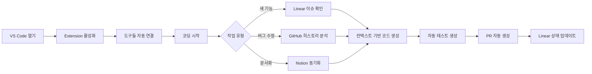

# CodeContext OS: 실제 제공 방식 & 사용법 완벽 가이드

## 🎯 한 줄 요약
**"VS Code Extension 설치 → 도구들 연결 → AI가 모든 컨텍스트 이해 → 완벽한 코드 생성"**

---

## 📦 제공 형태 (어떻게 받나요?)

### 1️⃣ **VS Code Extension** (메인)
```yaml
설치 방법:
1. VS Code 열기
2. Extensions 마켓플레이스 검색: "CodeContext OS"
3. Install 클릭
4. 자동으로 활성화

크기: ~50MB
요구사항: VS Code 1.80+
```

### 2️⃣ **Chrome Extension** (보조)
```yaml
설치 방법:
1. Chrome Web Store 접속
2. "CodeContext GitHub Helper" 검색
3. Add to Chrome
4. GitHub에서 자동 동작

역할: GitHub PR 리뷰 시 도움
```

### 3️⃣ **Desktop App** (옵션)
```yaml
다운로드:
- Windows: .exe 설치 파일
- macOS: .dmg 파일
- Linux: .AppImage

역할: 시스템 트레이에서 상시 동작
크기: ~200MB
```

### 4️⃣ **CLI Tool** (개발자용)
```bash
# 설치
npm install -g codecontext-cli
# 또는
brew install codecontext

# 사용
codecontext init
codecontext analyze
codecontext generate
```

---

## 🚀 초기 설정 (5분 소요)

### Step 1: Extension 설치 후 첫 화면
```typescript
// VS Code 하단에 팝업 표시
"👋 CodeContext OS가 설치되었습니다! 설정을 시작하시겠습니까?"
[시작하기] [나중에]
```

### Step 2: 도구 연결 마법사
```yaml
🔗 연결할 도구 선택:

✅ GitHub (필수)
   [Authorize with GitHub] 클릭
   → GitHub OAuth 인증
   → 권한: 코드 읽기, PR 관리

☐ Linear (선택)
   [Connect Linear] 클릭
   → API Key 입력
   → 프로젝트 선택

☐ Notion (선택)
   [Connect Notion] 클릭
   → Workspace 접근 허용
   → 연동할 페이지 선택

☐ AI 도구 (선택)
   ☐ Claude API Key
   ☐ OpenAI API Key
   ☐ 로컬 Cursor 연동
```

### Step 3: 프로젝트 인덱싱
```typescript
// 자동으로 시작됨
"🔍 프로젝트 분석 중..."

진행 상황:
[████████░░] 80% - 파일 스캔 중
- ✅ 파일 구조 분석 (2,341개 파일)
- ✅ 의존성 매핑 (156개 패키지)
- ✅ 코드 패턴 학습
- ⏳ 그래프 DB 구축 중...

예상 시간: 3-5분 (프로젝트 크기에 따라)
```

---

## 💻 실제 사용 방법

### 🎬 **시나리오 1: 코드 작성 시**

#### 기존 방식 (Cursor/Copilot만 사용)
```typescript
// 개발자가 입력
// TODO: 사용자 로그인 구현

// Copilot 제안 (일반적인 코드)
function login(username, password) {
  if (username && password) {
    return true;
  }
  return false;
}
// 😔 프로젝트와 맞지 않는 코드
```

#### CodeContext OS 사용
```typescript
// 개발자가 입력
// TODO: 사용자 로그인 구현

// CodeContext OS가 자동으로 컨텍스트 수집 & 제안
async function login(email: string, password: string): Promise<AuthResponse> {
  // ✨ Linear 이슈 AUTH-123 요구사항 반영
  // ✨ Notion API 문서의 스펙 준수
  // ✨ 기존 auth.service.ts 패턴 따름
  
  try {
    // 프로젝트가 사용하는 Prisma ORM
    const user = await prisma.user.findUnique({
      where: { email: email.toLowerCase() }
    });
    
    // 프로젝트가 사용하는 bcrypt
    if (!user || !await bcrypt.compare(password, user.hashedPassword)) {
      // 프로젝트의 에러 처리 패턴
      throw new APIError('Invalid credentials', 401, 'AUTH_FAILED');
    }
    
    // 프로젝트가 사용하는 JWT 설정
    const token = generateJWT(user.id, JWT_SECRET);
    
    // 프로젝트가 사용하는 Redis 세션
    await redis.setSession(token, user.id);
    
    // Linear 이슈 자동 업데이트
    await updateLinearIssue('AUTH-123', 'in-progress');
    
    return {
      token,
      user: user.toPublicJSON()
    };
  } catch (error) {
    logger.error('Login failed:', error);
    throw error;
  }
}
```

### 🎬 **시나리오 2: 코드 리뷰 시**

#### VS Code에서 PR 생성
```bash
# 터미널에서
git commit -m "feat: 로그인 기능 구현"
git push

# CodeContext OS 자동 동작
🤖 "PR 생성을 도와드릴까요?"
```

#### 자동으로 생성되는 PR
```markdown
## 📋 변경 사항
- 사용자 로그인 기능 구현 (Linear: AUTH-123)
- JWT 토큰 기반 인증
- Redis 세션 관리

## 🔍 영향 범위 (자동 분석)
- `auth.controller.ts` - 새 엔드포인트 추가
- `user.service.ts` - 로그인 로직
- `redis.service.ts` - 세션 관리
- **주의**: `dashboard.tsx`도 영향받음 (인증 체크 로직)

## ✅ 체크리스트 (자동 생성)
- [x] 단위 테스트 작성
- [x] API 문서 업데이트 (Notion 자동 동기화)
- [x] Linear 이슈 연결
- [ ] 코드 리뷰 필요

## 🧪 테스트 (자동 생성됨)
\```bash
npm test auth.test.ts
✓ 올바른 credentials로 로그인 성공
✓ 잘못된 password로 로그인 실패
✓ 존재하지 않는 이메일로 로그인 실패
✓ JWT 토큰 생성 확인
✓ Redis 세션 저장 확인
\```
```

---

## 🎨 사용자 인터페이스

### 1. **VS Code 사이드바**
```
📁 EXPLORER
📊 CODECONTEXT OS
  ├── 🔗 Connected Tools
  │   ├── ✅ GitHub (jihoon/project)
  │   ├── ✅ Linear (3 active issues)
  │   ├── ✅ Notion (API Docs)
  │   └── ⚠️ Claude (API limit: 80%)
  │
  ├── 📈 Project Insights
  │   ├── Code Health: 78/100
  │   ├── Test Coverage: 65%
  │   ├── Tech Debt: Medium
  │   └── AI Suggestions: 12 new
  │
  └── 🚀 Quick Actions
      ├── Generate Test
      ├── Update Documentation
      ├── Sync Linear Issue
      └── Create PR
```

### 2. **명령 팔레트 (Cmd/Ctrl+Shift+P)**
```
> CodeContext: 
  📝 Generate code with full context
  🔍 Analyze impact of changes
  🧪 Generate tests for current file
  📚 Update documentation
  🔗 Sync with Linear/Notion
  🤖 Ask AI with project context
  📊 Show project insights
  ⚙️ Settings
```

### 3. **인라인 제안**
```typescript
// 코드 작성 중 실시간 제안
function processPayment(amount: number) {
  // 입력하면...
  
  // 💡 CodeContext OS 제안 (인라인 표시)
  // "이 함수는 payment.service.ts의 패턴을 따라야 합니다"
  // "Linear 이슈 PAY-456과 관련됨"
  // [Accept] [Modify] [Ignore]
}
```

### 4. **호버 정보**
```typescript
// 함수에 마우스 호버 시
processPayment() 
╭─────────────────────────────────╮
│ 📊 CodeContext Insights         │
│ • 15곳에서 호출됨               │
│ • 최근 수정: 2일 전 (PR #234)   │
│ • Linear: PAY-456 (In Progress) │
│ • 테스트 커버리지: 45%          │
│ • [View Details] [Go to Tests]  │
╰─────────────────────────────────╯
```

---

## 🎮 주요 사용 명령어

### 1. **컨텍스트 기반 코드 생성**
```typescript
// 방법 1: 주석으로
// @context: 결제 시스템 리팩토링
// @linear: PAY-456
// @notion: Payment API v2 스펙
// TODO: Stripe 웹훅 처리

// 방법 2: 명령 팔레트
Cmd+Shift+P → "CodeContext: Generate with context"

// 방법 3: 단축키
Cmd+K, Cmd+G (Generate)
```

### 2. **영향 범위 분석**
```bash
# 터미널에서
codecontext analyze --file payment.ts

# 결과
📊 Impact Analysis for payment.ts:
  Direct dependencies: 12 files
  Indirect impact: 34 files
  Test files affected: 8
  
  ⚠️ Breaking changes detected:
  - dashboard.tsx:45 (type mismatch)
  - checkout.tsx:78 (missing parameter)
  
  Suggested fixes available.
```

### 3. **자동 동기화**
```typescript
// 코드에 특별한 주석 추가
// @sync-linear: AUTH-123
// @sync-notion: "API Documentation/Auth"
async function newFeature() {
  // 구현...
}
// 저장 시 자동으로 Linear 상태 업데이트, Notion 문서 갱신
```

---

## 📱 모바일/웹 대시보드

### 웹 대시보드 (app.codecontext.io)
```yaml
접속 방법:
1. 브라우저에서 app.codecontext.io
2. GitHub으로 로그인
3. 프로젝트 선택

주요 기능:
- 프로젝트 전체 현황 보기
- AI 사용량 모니터링  
- 팀 협업 상태 확인
- 코드 품질 메트릭스
- 비용 관리
```

### 모바일 앱 (선택사항)
```yaml
iOS/Android:
- 알림 받기 (PR 리뷰 요청 등)
- 프로젝트 상태 확인
- 간단한 이슈 업데이트
- AI 사용량 모니터링
```

---

## 🔧 커스터마이징

### 설정 파일 (.codecontext.yml)
```yaml
# 프로젝트 루트에 생성
version: 1.0

# 연결할 도구들
integrations:
  github:
    repo: "jihoon/my-project"
    auto_pr: true
  linear:
    workspace: "my-team"
    auto_sync: true
  notion:
    database_id: "xxx-xxx"
    
# AI 설정
ai:
  preferred_model: "claude-3.5"
  max_context: 100000
  quality_threshold: 0.8
  
# 프로젝트 규칙
rules:
  code_style: "airbnb"
  test_framework: "jest"
  language: "typescript"
  
# 자동화
automation:
  auto_test: true
  auto_doc: true
  auto_linear_update: true
```

---

## 💰 가격별 사용 가능 기능

### Free (무료)
```yaml
제공:
- VS Code Extension 기본 기능
- GitHub 연동
- 월 100회 AI 요청
- 1개 프로젝트

제한:
- Linear/Notion 연동 불가
- 팀 기능 없음
```

### Pro ($29/월)
```yaml
제공:
- 모든 도구 연동
- 월 10,000회 AI 요청  
- 무제한 프로젝트
- 웹 대시보드 접근
- 우선 지원

적합한 대상:
- 개인 개발자
- 프리랜서
```

### Team ($99/월, 사용자당)
```yaml
제공:
- Pro의 모든 기능
- 무제한 AI 요청
- 팀 협업 기능
- 관리자 대시보드
- SSO 로그인
- SLA 보장

적합한 대상:
- 스타트업
- 중소 개발팀
```

---

## 🎯 실제 사용 흐름 정리



---

## 🤔 자주 묻는 질문

### Q: 기존 Cursor나 Copilot과 함께 쓸 수 있나요?
**A: 네! CodeContext OS는 기존 도구들을 대체하는 게 아니라 더 똑똑하게 만들어줍니다.**

### Q: 회사 코드가 외부로 나가나요?
**A: 선택 가능합니다. 온프레미스 설치나 로컬 모드 지원합니다.**

### Q: 설정이 복잡한가요?
**A: 5분이면 기본 설정 완료! 점진적으로 기능 추가 가능합니다.**

### Q: 팀원 모두 설치해야 하나요?
**A: 아니요. 한 명만 써도 되고, 팀 전체가 쓰면 더 강력해집니다.**

---

## 🚀 지금 시작하기

```bash
# 1. VS Code Extension 설치
code --install-extension codecontext.codecontext-os

# 2. 초기 설정 (5분)
codecontext init

# 3. 첫 번째 컨텍스트 기반 코드 생성
# VS Code에서 Cmd+K, Cmd+G

# 축하합니다! 🎉
```

**이제 AI가 당신의 프로젝트를 완벽히 이해합니다!**