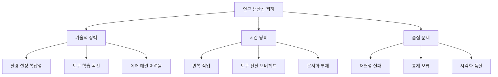
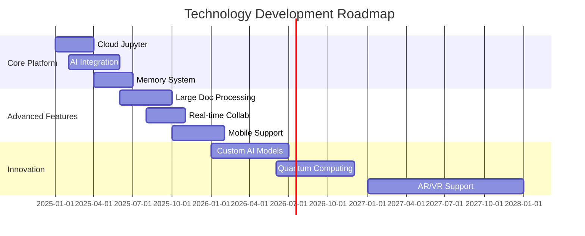

# ScienceLab AI - Project Documentation
## AI-Powered Research Platform for Non-Programming Scientists

> **"Your Research, Amplified by AI"**  
> 코딩 장벽 없이 Nature급 연구를 가능하게 하는 AI 연구 플랫폼

---

## 📊 Executive Summary

### 프로젝트 개요
ScienceLab AI는 프로그래밍 경험이 부족한 자연과학 연구자들을 위한 차세대 AI 기반 연구 플랫폼입니다. Jupyter Notebook의 강력함, Cursor의 AI 지능, Notion의 직관적 UX를 결합하여 연구자들이 코딩 없이도 고급 데이터 분석과 시각화를 수행할 수 있도록 지원합니다.

### 핵심 수치
- **TAM (Total Addressable Market)**: $10.2B (2025년 기준)
- **목표 시장**: 전 세계 500만 명의 STEM 대학원생 및 연구자
- **문제 해결**: 70% 연구자가 겪는 재현성 위기 해결
- **예상 성장률**: 연 13.7% (STEM 교육 시장 성장률)

---

## 🎯 1. Customer Persona (고객 페르소나)

### 1.1 Primary Persona: "초보 연구자 김박사"

#### 인구통계학적 특성
- **나이**: 25-35세
- **학력**: 석사과정 ~ 박사 후 연구원
- **분야**: 생명과학, 물리학, 화학 등 자연과학
- **위치**: 전 세계 연구중심 대학 및 연구소
- **연봉**: $30,000-60,000 (대학원생) / $60,000-100,000 (포닥)

#### 기술적 배경
- **프로그래밍 경험**: 
  - Python 기초 수준 (for문, if문 정도)
  - 주로 복사-붙여넣기로 코드 사용
  - Stack Overflow 의존도 높음
- **사용 도구**:
  - Excel (주 데이터 분석 도구)
  - GraphPad Prism (통계 및 그래프)
  - ImageJ (이미지 분석)
- **코딩 학습 시간**: 주 5시간 이하

#### Pain Points (구체적 고통점)
1. **환경 설정 지옥**
   - "pip install만 했는데 에러 100줄"
   - "conda와 pip 충돌로 환경 완전 재설치"
   - 평균 환경 설정 시간: 4-6시간

2. **재현성 실패**
   - 논문 코드 실행 성공률: 10% 미만
   - "GitHub 코드 다운받았는데 안 돌아감"
   - 버전 충돌로 인한 좌절감

3. **시간 낭비**
   - 연구 시간의 40%를 기술적 문제 해결에 소비
   - 단순 그래프 하나에 2시간 소요
   - 통계 분석 코드 이해 불가

4. **심리적 장벽**
   - "나는 과학자지, 프로그래머가 아니야"
   - 터미널 공포증
   - 에러 메시지 = 암호문

#### Goals & Motivations
- **단기 목표**: 오늘 실험 데이터 분석 완료
- **중기 목표**: 논문 Figure 제작
- **장기 목표**: Nature/Science 논문 게재
- **동기**: 연구 성과로 인정받고 싶음

### 1.2 Secondary Personas

#### "시니어 연구자 이교수" (35-50세)
- 연구실 운영, 학생 지도
- 코딩보다 연구 방향 설정에 집중
- **Needs**: 팀 협업 도구, 연구 관리 시스템

#### "학부 인턴 박학생" (20-24세)
- 첫 연구 경험
- 프로그래밍 경험 전무
- **Needs**: 쉬운 시작점, 학습 가이드

---

## 🔍 2. Problem Definition (문제 정의)

### 2.1 시장 데이터 기반 문제 검증

#### 재현성 위기 (Reproducibility Crisis)
- **70%** 연구자가 타인 연구 재현 실패 (Nature, 2016)
- **50.1%** 논문이 코드 미공개
- **90%** 공개 코드도 실행 불가
- **경제적 손실**: 연간 $280억 (미국 기준)

#### 프로그래밍 장벽
- **96%** 과학자가 독학으로 코딩 학습
- **35%** 만 정식 프로그래밍 교육 경험
- **130%** Software Carpentry 교육 후 실력 향상
- **하지만** 실제 적용률 20% 미만

#### 도구 파편화
- 평균 연구자가 사용하는 도구: 8-12개
- 도구 간 데이터 이동 시간: 주 10시간
- 버전 관리 사용률: 15% 미만

### 2.2 Root Cause Analysis



---

## 💡 3. Solution Architecture (솔루션 아키텍처)

### 3.1 핵심 가치 제안 (Value Proposition)

#### 🚀 "Zero to Paper in 30 Days"
```
Day 1: 데이터 업로드 → 첫 그래프
Day 7: AI 도움으로 통계 분석
Day 14: 논문 Figure 완성
Day 30: 투고 준비 완료
```

### 3.2 기능별 솔루션 매핑

| 문제 | 기존 방식 | ScienceLab AI 솔루션 | 개선 효과 |
|------|----------|-------------------|-----------|
| **환경 설정** | 4-6시간 구글링 | 브라우저 접속만으로 시작 | 99% 시간 절감 |
| **코드 작성** | 복사-붙여넣기 | AI 자연어 명령 | 10배 속도 향상 |
| **에러 해결** | Stack Overflow 검색 | 자동 에러 수정 | 95% 자동 해결 |
| **데이터 분석** | Excel 수작업 | 드래그앤드롭 분석 | 5배 효율 증가 |
| **논문 재현** | 10% 성공률 | 90% 자동 재현 | 9배 성공률 |
| **협업** | 파일 주고받기 | 실시간 공동작업 | 즉시 공유 |

### 3.3 기술 스택

#### Frontend Architecture
```
┌─────────────────────────────────────┐
│         React 18 + TypeScript        │
├─────────────────────────────────────┤
│   UI Components                      │
│   ├── Monaco Editor (코드 편집)      │
│   ├── Plotly.js (시각화)            │
│   ├── Slate.js (리치 텍스트)        │
│   └── React DnD (드래그앤드롭)       │
├─────────────────────────────────────┤
│   State Management                   │
│   ├── Redux Toolkit                  │
│   └── React Query (서버 상태)        │
├─────────────────────────────────────┤
│   Real-time Features                 │
│   ├── WebSocket (협업)              │
│   └── WebRTC (화면 공유)            │
└─────────────────────────────────────┘
```

#### Backend Architecture
```
┌─────────────────────────────────────┐
│        FastAPI (Python 3.11+)        │
├─────────────────────────────────────┤
│   Core Services                      │
│   ├── Jupyter Kernel Gateway        │
│   ├── Code Execution Engine         │
│   ├── File Management System        │
│   └── User Authentication (Auth0)   │
├─────────────────────────────────────┤
│   AI Services                        │
│   ├── OpenAI GPT-4 API              │
│   ├── Anthropic Claude API          │
│   ├── Local LLM (Llama 3.1 7B)     │
│   └── Embedding Service (Ada-002)   │
├─────────────────────────────────────┤
│   Data Processing                    │
│   ├── Pandas & NumPy                │
│   ├── SciPy & Scikit-learn         │
│   ├── Ray (분산 처리)               │
│   └── DuckDB (빠른 쿼리)            │
└─────────────────────────────────────┘
```

#### Infrastructure
```
┌─────────────────────────────────────┐
│           AWS Cloud                  │
├─────────────────────────────────────┤
│   Compute                            │
│   ├── ECS Fargate (앱 서버)         │
│   ├── Lambda (서버리스 함수)        │
│   └── EC2 GPU (AI 모델)            │
├─────────────────────────────────────┤
│   Storage                            │
│   ├── S3 (파일 저장)                │
│   ├── EFS (공유 스토리지)           │
│   └── DynamoDB (메타데이터)         │
├─────────────────────────────────────┤
│   Database                           │
│   ├── PostgreSQL (RDS)              │
│   ├── Redis (캐싱)                  │
│   └── Pinecone (벡터 DB)            │
└─────────────────────────────────────┘
```

### 3.4 핵심 기능 상세

#### 🤖 1. AI Research Assistant
```python
# 자연어 명령 예시
user: "이 데이터에서 outlier 제거하고 t-test 해줘"
AI: 
1. IQR 방법으로 outlier 감지
2. 12개 outlier 제거
3. Shapiro-Wilk 정규성 검정 통과
4. Independent t-test 수행
5. p-value: 0.023 (유의미한 차이)
6. Cohen's d: 0.82 (큰 효과 크기)
```

#### 📊 2. Smart Visualization
```python
# 자동 논문 스타일 적용
plot_config = {
    "journal": "Nature",
    "figure_type": "multi_panel",
    "color_scheme": "colorblind_safe",
    "statistics": "auto_annotate"
}
```

#### 🧠 3. Research Memory System
```yaml
연구 컨텍스트:
  프로젝트: "CRISPR 효율성 연구"
  기간: "2024.01 - 현재"
  
  실험 이력:
    - 2024.01.15: sgRNA 설계
    - 2024.02.20: 형질전환 실험
    - 2024.03.10: Western blot 분석
  
  자주 사용 분석:
    - normalize_to_control()
    - calculate_fold_change()
    - plot_with_statistics()
  
  선호 스타일:
    - 색상: ["#E69F00", "#56B4E9", "#009E73"]
    - 폰트: "Arial"
    - DPI: 300
```

#### 🔬 4. Domain-Specific Templates

**생명과학 템플릿**
- RNA-seq 파이프라인
- Western blot 정량화
- Cell viability 분석
- qPCR 분석

**물리학 템플릿**
- 데이터 피팅 & 모델링
- 시뮬레이션 시각화
- 오차 분석
- 스펙트럼 분석

**화학 템플릿**
- NMR 스펙트럼 분석
- 반응 속도론
- 분자 구조 시각화
- 열역학 계산

---

## 💼 4. Business Model (비즈니스 모델)

### 4.1 Revenue Model

#### Pricing Strategy (SaaS)
| Plan | Price | Target | Features | Expected Users |
|------|-------|--------|----------|----------------|
| **Free** | $0 | 학부생 | 월 30시간, 2GB RAM, 기본 AI | 100,000 |
| **Academic** | $19/월 | 대학원생 | 무제한, GPU, 고급 AI | 50,000 |
| **Pro** | $49/월 | 포닥/연구원 | 우선 지원, 커스텀 환경 | 20,000 |
| **Team** | $199/월 | 연구실 | 5명, 협업 기능, 관리 도구 | 5,000 teams |
| **Enterprise** | Custom | 기관 | 무제한, 온프레미스, SLA | 500 orgs |

#### Revenue Projections
```
Year 1 (2025):
- Users: 10,000
- Conversion: 5%
- MRR: $30,000
- ARR: $360,000

Year 2 (2026):
- Users: 100,000
- Conversion: 10%
- MRR: $380,000
- ARR: $4.56M

Year 3 (2027):
- Users: 500,000
- Conversion: 15%
- MRR: $2.8M
- ARR: $33.6M
```

### 4.2 Market Analysis

#### TAM-SAM-SOM Analysis
- **TAM**: $10.2B (전체 과학 연구 소프트웨어 시장)
- **SAM**: $2.1B (학술 연구용 컴퓨팅 도구)
- **SOM**: $210M (1년차 1%, 3년차 10% 목표)

#### Competition Analysis
| Competitor | Strengths | Weaknesses | Our Advantage |
|------------|-----------|------------|---------------|
| **Google Colab** | 무료, GPU 제공 | 세션 타임아웃, 제한적 | 연구 메모리, 도메인 특화 |
| **Deepnote** | 협업 기능 | 비싼 가격, 복잡함 | 더 쉬운 UX, AI 통합 |
| **Jupyter** | 표준, 생태계 | 설치 복잡, 협업 없음 | 100% 호환, 클라우드 |
| **ChatGPT** | 강력한 AI | 코드 실행 불가 | 실행 환경 통합 |

### 4.3 Growth Strategy

#### User Acquisition
1. **Bottom-up Academic**
   - 대학원 세미나 스폰서
   - 학회 부스 운영
   - 교수 추천 프로그램

2. **Content Marketing**
   - "30분 만에 Nature Figure" 튜토리얼
   - 연구 분야별 템플릿 공유
   - Success story 블로그

3. **Freemium Funnel**
   ```
   무료 가입 → 첫 성공 경험 → 
   한계 도달 → 유료 전환 → 
   팀 확장 → Enterprise
   ```

4. **Partnership**
   - 학술 출판사 (Elsevier, Springer)
   - 연구 장비 회사
   - 대학 IT 부서

---

## 🔨 5. Development Methodology (개발 방법론)

### 5.1 Agile Development Process

#### Sprint Structure (2주 단위)
```
Week 1:
월: Sprint Planning (4h)
화-금: Development
  - Daily Standup (15min)
  - Core Development (6h)
  - Code Review (1h)

Week 2:
월-목: Development + Testing
금: 
  - Sprint Review (2h)
  - Retrospective (1h)
  - Deployment
```

#### Team Structure
```
Engineering (15명)
├── Frontend (5명)
│   ├── UI/UX Lead
│   ├── React Developers (3)
│   └── Designer
├── Backend (5명)
│   ├── Python Lead
│   ├── API Developers (2)
│   └── DevOps Engineers (2)
└── AI/ML (5명)
    ├── ML Engineer Lead
    ├── Data Scientists (2)
    └── NLP Engineers (2)

Product (5명)
├── Product Manager
├── Product Designer
├── User Researcher
└── Technical Writer (2)

Business (5명)
├── CEO
├── Marketing (2)
├── Sales
└── Customer Success
```

### 5.2 Technical Development Phases

#### Phase 1: MVP (Month 1-3)
**Goal**: Basic Jupyter + AI Integration
- [ ] Cloud Jupyter 환경 구축
- [ ] GPT-4 통합
- [ ] 기본 시각화 도구
- [ ] 사용자 인증 시스템
- **Success Metric**: 100 beta users

#### Phase 2: Core Features (Month 4-6)
**Goal**: Differentiation Features
- [ ] Research Memory System
- [ ] Domain Templates
- [ ] Error Guardian
- [ ] Collaboration Features
- **Success Metric**: 1,000 active users

#### Phase 3: Scale (Month 7-12)
**Goal**: Production Ready
- [ ] Enterprise Features
- [ ] Advanced AI Models
- [ ] Plugin Ecosystem
- [ ] Mobile Support
- **Success Metric**: 10,000 users, $1M ARR

### 5.3 Quality Assurance

#### Testing Strategy
```python
test_coverage = {
    "unit_tests": 80,      # 단위 테스트 커버리지
    "integration": 70,     # 통합 테스트
    "e2e": 50,            # End-to-end 테스트
    "performance": True,   # 성능 테스트
    "security": True,      # 보안 테스트
    "user_testing": 100    # 사용자 수
}
```

#### Performance Targets
- **Page Load**: < 2초
- **Code Execution**: < 500ms
- **AI Response**: < 3초
- **File Upload**: 100MB/s
- **Uptime**: 99.9%

---

## 📈 6. Success Metrics & KPIs

### 6.1 Product Metrics

#### Activation Metrics
| Metric | Target (3mo) | Target (6mo) | Target (12mo) |
|--------|-------------|--------------|---------------|
| Sign-up to First Code | < 5 min | < 3 min | < 2 min |
| First Graph Creation | 80% | 85% | 90% |
| 7-day Retention | 40% | 50% | 60% |
| 30-day Retention | 20% | 30% | 40% |

#### Engagement Metrics
- **DAU/MAU**: 25% (목표)
- **Session Duration**: 45분 (평균)
- **Code Cells/Session**: 20개
- **AI Interactions/User**: 50/day

### 6.2 Business Metrics

#### Revenue Metrics
- **MRR Growth**: 20% MoM
- **Churn Rate**: < 5%
- **LTV/CAC**: > 3
- **Payback Period**: < 12 months

#### User Metrics
- **NPS Score**: > 50
- **Support Tickets**: < 5% users
- **Feature Adoption**: > 60%
- **Referral Rate**: > 30%

---

## 🚀 7. Go-to-Market Strategy

### 7.1 Launch Plan

#### Soft Launch (Month 1)
- **Target**: 100 베타 테스터
- **Channels**: 개인 네트워크, 연구실
- **Focus**: 제품 피드백, 버그 수정

#### Public Beta (Month 3)
- **Target**: 1,000 사용자
- **Channels**: 
  - Product Hunt 런칭
  - Hacker News 포스팅
  - Twitter/LinkedIn 캠페인
- **Incentive**: 평생 50% 할인

#### Official Launch (Month 6)
- **Target**: 10,000 사용자
- **PR Strategy**:
  - TechCrunch 독점 공개
  - Nature/Science 광고
  - 학회 스폰서십

### 7.2 Marketing Campaigns

#### Content Marketing
1. **"From Excel to Nature" Series**
   - 주간 튜토리얼 블로그
   - YouTube 비디오 시리즈
   - 실제 논문 사례 연구

2. **Template Library**
   - 100+ 연구 템플릿
   - 커뮤니티 기여 가능
   - 월간 베스트 템플릿 상

3. **AI Research Newsletter**
   - 주간 10,000 구독자 목표
   - 최신 연구 도구 소개
   - 사용자 성공 사례

#### Community Building
- **Discord Server**: 연구 분야별 채널
- **Office Hours**: 주간 라이브 Q&A
- **Ambassador Program**: 대학별 대표자
- **Hackathon**: 분기별 연구 해커톤

---

## 🛡️ 8. Risk Analysis & Mitigation

### 8.1 Technical Risks

| Risk | Probability | Impact | Mitigation |
|------|------------|--------|------------|
| **AI API 비용 폭증** | High | High | 로컬 LLM 백업, 캐싱 최적화 |
| **보안 침해** | Medium | Critical | SOC2 인증, 펜테스팅 |
| **스케일링 실패** | Medium | High | 자동 스케일링, CDN |
| **데이터 손실** | Low | Critical | 3중 백업, 재해복구 |

### 8.2 Business Risks

| Risk | Probability | Impact | Mitigation |
|------|------------|--------|------------|
| **대형 플레이어 진입** | High | High | 빠른 실행, 네트워크 효과 |
| **낮은 전환율** | Medium | High | 제품 개선, 가격 조정 |
| **학계 채택 지연** | Medium | Medium | 교수 파트너십, 무료 제공 |
| **규제 변화** | Low | Medium | 법률 자문, 컴플라이언스 |

---

## 🌟 9. Future Roadmap

### 9.1 Product Evolution

#### 2025: Foundation
- MVP 출시
- 1,000 유료 사용자
- 3개 도메인 템플릿

#### 2026: Expansion
- 10,000 유료 사용자
- 모바일 앱 출시
- API 오픈

#### 2027: Platform
- 100,000 유료 사용자
- 마켓플레이스 런칭
- Enterprise 버전

#### 2028: Ecosystem
- 1M 사용자
- IPO 준비
- 글로벌 확장

### 9.2 Technology Roadmap



---

## 💰 10. Financial Projections

### 10.1 Revenue Forecast (5 Years)

| Year | Users | Paid Users | ARR | Expenses | Net |
|------|-------|------------|-----|----------|-----|
| 2025 | 10K | 500 | $360K | $2M | -$1.64M |
| 2026 | 100K | 10K | $4.56M | $5M | -$440K |
| 2027 | 500K | 75K | $33.6M | $15M | $18.6M |
| 2028 | 1M | 200K | $96M | $40M | $56M |
| 2029 | 2M | 400K | $192M | $80M | $112M |

### 10.2 Funding Strategy

#### Seed Round (2025 Q1)
- **Target**: $2M
- **Valuation**: $10M
- **Use**: MVP 개발, 팀 구성

#### Series A (2026 Q2)
- **Target**: $10M
- **Valuation**: $50M
- **Use**: 제품 확장, 마케팅

#### Series B (2027 Q4)
- **Target**: $30M
- **Valuation**: $200M
- **Use**: 글로벌 확장, Enterprise

---

## 📞 11. Contact & Next Steps

### Team
- **CEO**: [TBD] - 전 Google Research
- **CTO**: [TBD] - 전 Jupyter Core Team
- **Head of AI**: [TBD] - 전 OpenAI

### Immediate Action Items
1. [ ] 베타 테스터 100명 모집
2. [ ] MVP 프로토타입 완성
3. [ ] Seed 투자자 미팅
4. [ ] 핵심 팀 채용 (5명)
5. [ ] 파트너십 협상 시작

### Contact
- **Email**: team@sciencelab.ai
- **Website**: www.sciencelab.ai
- **Demo**: demo.sciencelab.ai

---

## 📎 Appendix

### A. Market Research Sources
- Nature Survey on Reproducibility (2016)
- Stack Overflow Developer Survey (2024)
- Jupyter Usage Statistics (2024)
- STEM Education Market Report (Grand View Research, 2024)

### B. Technical Specifications
- Detailed API Documentation
- Security & Compliance Framework
- Infrastructure Cost Analysis
- Performance Benchmarks

### C. User Research
- 50 In-depth Interviews
- 500 Survey Responses
- Usability Testing Results
- Competitive Analysis Matrix

---

> **"Empowering every scientist to do computational research without computational barriers"**

*Last Updated: 2025-01-16*
*Version: 1.0*