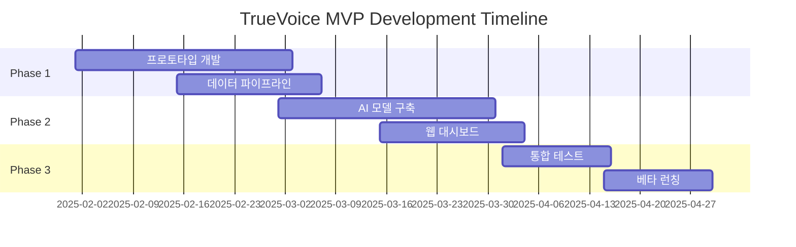

# 🚀 TrueVoice MVP 개발 로드맵

## Executive Summary

3개월 내 MVP 출시를 목표로 하는 단계별 개발 계획입니다. 핵심 기능에 집중하여 빠르게 시장 검증을 받고, 피드백을 기반으로 반복 개선합니다.

## 📅 Timeline Overview



## 🎯 MVP Goals & Success Metrics

### Primary Goals
```yaml
기술적 목표:
- Perigon API 통합 완료
- 기본 AI 모델 구현
- 실시간 데이터 처리
- 웹 대시보드 구축

비즈니스 목표:
- 10개 파일럿 고객 확보
- 70% 예측 정확도 달성
- Product-Market Fit 검증
- 신용보증기금 대회 우승

Success Metrics:
- Daily Active Users: 50+
- 예측 정확도: 70%+
- 고객 만족도: 4.0/5.0+
- 처리 속도: <5초
```

## 🔄 Phase 1: Foundation (Month 1)

### Week 1-2: 프로젝트 설정 및 인프라

#### 개발 환경 구축
```bash
# 프로젝트 구조
truevoice-mvp/
├── backend/
│   ├── api/          # FastAPI 서버
│   ├── collectors/   # 데이터 수집
│   ├── ml/          # AI 모델
│   └── db/          # 데이터베이스
├── frontend/
│   ├── dashboard/   # Next.js 대시보드
│   └── landing/     # 랜딩 페이지
├── infrastructure/
│   ├── docker/      # Docker 설정
│   └── k8s/         # Kubernetes 설정
└── tests/           # 테스트 코드
```

#### 기술 스택 결정
```yaml
Backend:
- Python 3.11 + FastAPI
- PostgreSQL + Redis
- Celery + RabbitMQ

Frontend:
- Next.js 14 + TypeScript
- Tailwind CSS + shadcn/ui
- Recharts + D3.js

Infrastructure:
- AWS (EC2, RDS, S3)
- Docker + Kubernetes
- GitHub Actions CI/CD
```

#### 팀 구성
```yaml
개발팀 (3명):
- 백엔드 개발자: API, 데이터 파이프라인
- AI 엔지니어: ML 모델, NLP
- 프론트엔드 개발자: 대시보드, UX

지원 (2명):
- 프로덕트 매니저: 요구사항, 우선순위
- 디자이너: UI/UX 디자인
```

### Week 3-4: 데이터 수집 파이프라인

#### Perigon API 통합
```python
# perigon_collector.py
import asyncio
from typing import List, Dict
import aiohttp
from datetime import datetime, timedelta

class PerigonCollector:
    def __init__(self, api_key: str):
        self.api_key = api_key
        self.base_url = "https://api.goperigon.com/v1"
        
    async def collect_articles(
        self, 
        keywords: List[str],
        timeframe_hours: int = 24
    ) -> List[Dict]:
        """
        키워드 기반 기사 수집
        """
        from_date = (datetime.now() - timedelta(hours=timeframe_hours))
        
        params = {
            "apiKey": self.api_key,
            "q": " OR ".join(keywords),
            "from": from_date.isoformat(),
            "language": "ko",
            "sortBy": "relevance",
            "size": 100
        }
        
        async with aiohttp.ClientSession() as session:
            async with session.get(
                f"{self.base_url}/search",
                params=params
            ) as response:
                data = await response.json()
                return data.get("articles", [])
    
    async def analyze_sentiment(self, articles: List[Dict]) -> Dict:
        """
        수집된 기사 감성 분석
        """
        sentiments = []
        for article in articles:
            # Perigon의 내장 센티먼트 사용
            sentiment = article.get("sentiment", {})
            sentiments.append({
                "title": article["title"],
                "sentiment_score": sentiment.get("score", 0),
                "url": article["url"],
                "published_at": article["pubDate"]
            })
        
        return {
            "total_articles": len(sentiments),
            "average_sentiment": sum(s["sentiment_score"] for s in sentiments) / len(sentiments),
            "articles": sentiments
        }
```

#### 소셜미디어 크롤러
```python
# social_crawler.py
class SocialMediaCrawler:
    def __init__(self):
        self.platforms = {
            "twitter": TwitterCrawler(),
            "instagram": InstagramCrawler(),
            "youtube": YouTubeCrawler()
        }
    
    async def crawl_mentions(
        self,
        brand: str,
        platforms: List[str] = None
    ) -> Dict:
        """
        브랜드 멘션 크롤링
        """
        if not platforms:
            platforms = list(self.platforms.keys())
        
        results = {}
        tasks = []
        
        for platform in platforms:
            if platform in self.platforms:
                crawler = self.platforms[platform]
                task = crawler.search(brand)
                tasks.append((platform, task))
        
        for platform, task in tasks:
            try:
                data = await task
                results[platform] = data
            except Exception as e:
                logger.error(f"Error crawling {platform}: {e}")
                results[platform] = []
        
        return results
```

## 🤖 Phase 2: AI Development (Month 2)

### Week 5-6: NLP 모델 구축

#### 한국어 감성 분석 모델
```python
# sentiment_analyzer.py
from transformers import AutoTokenizer, AutoModelForSequenceClassification
import torch

class KoreanSentimentAnalyzer:
    def __init__(self):
        self.model_name = "tunib/electra-ko-base-sentiment"
        self.tokenizer = AutoTokenizer.from_pretrained(self.model_name)
        self.model = AutoModelForSequenceClassification.from_pretrained(
            self.model_name
        )
        
    def analyze(self, text: str) -> Dict:
        """
        텍스트 감성 분석
        """
        # 전처리
        text = self._preprocess(text)
        
        # 토크나이징
        inputs = self.tokenizer(
            text,
            return_tensors="pt",
            truncation=True,
            padding=True,
            max_length=512
        )
        
        # 예측
        with torch.no_grad():
            outputs = self.model(**inputs)
            predictions = torch.nn.functional.softmax(
                outputs.logits, 
                dim=-1
            )
            
        # 결과 매핑
        labels = ["negative", "neutral", "positive"]
        scores = predictions[0].tolist()
        
        return {
            "sentiment": labels[scores.index(max(scores))],
            "confidence": max(scores),
            "scores": dict(zip(labels, scores))
        }
    
    def _preprocess(self, text: str) -> str:
        """
        텍스트 전처리 (은어, 이모티콘 처리)
        """
        # 이모티콘 → 텍스트 변환
        text = text.replace("ㅋㅋ", "웃음")
        text = text.replace("ㅠㅠ", "슬픔")
        
        # 은어 정규화
        slang_dict = {
            "ㄹㅇ": "진짜",
            "ㅇㅈ": "인정",
            "ㄱㅅ": "감사"
        }
        
        for slang, normal in slang_dict.items():
            text = text.replace(slang, normal)
            
        return text
```

#### 신뢰도 평가 모델
```python
# credibility_scorer.py
class CredibilityScorer:
    def __init__(self):
        self.bot_patterns = self._load_bot_patterns()
        self.authentic_signals = self._load_authentic_signals()
        
    def calculate_score(self, post: Dict) -> float:
        """
        포스트 신뢰도 점수 계산 (0-100)
        """
        score = 50  # 기본 점수
        
        # 봇 신호 체크 (-점수)
        if self._is_bot_like(post):
            score -= 30
            
        # 계정 나이 (+점수)
        account_age_days = self._get_account_age(post)
        if account_age_days > 365:
            score += 15
        elif account_age_days < 30:
            score -= 10
            
        # 팔로워/팔로잉 비율
        ratio = post.get("followers", 0) / max(post.get("following", 1), 1)
        if ratio > 2:
            score += 10
        elif ratio < 0.5:
            score -= 15
            
        # 개인 경험 언급
        if self._has_personal_experience(post["text"]):
            score += 20
            
        # 극단적 언어
        if self._has_extreme_language(post["text"]):
            score -= 20
            
        # 미디어 포함
        if post.get("has_media"):
            score += 10
            
        return max(0, min(100, score))
    
    def _is_bot_like(self, post: Dict) -> bool:
        """
        봇 패턴 감지
        """
        indicators = [
            post.get("username", "").isdigit(),  # 숫자로만 된 이름
            len(post.get("bio", "")) == 0,       # 빈 프로필
            post.get("posts_count", 0) > 10000,  # 과도한 포스팅
        ]
        return sum(indicators) >= 2
```

### Week 7-8: 예측 모델 개발

#### 실제 반응 예측 모델
```python
# prediction_model.py
import numpy as np
from sklearn.ensemble import RandomForestRegressor
import joblib

class RealWorldPredictor:
    def __init__(self):
        self.model = self._load_or_train_model()
        self.feature_names = [
            "online_sentiment",
            "credibility_avg",
            "volume",
            "velocity",
            "platform_diversity",
            "influencer_ratio"
        ]
        
    def predict(self, online_data: Dict) -> Dict:
        """
        온라인 데이터 → 실제 반응 예측
        """
        # 특징 추출
        features = self._extract_features(online_data)
        
        # 예측
        prediction = self.model.predict([features])[0]
        
        # 신뢰구간 계산
        predictions = []
        for tree in self.model.estimators_:
            predictions.append(tree.predict([features])[0])
        
        confidence_interval = np.percentile(predictions, [25, 75])
        
        return {
            "predicted_purchase_intent": prediction,
            "confidence_interval": confidence_interval,
            "confidence_score": self._calculate_confidence(predictions),
            "key_drivers": self._identify_key_drivers(features)
        }
    
    def _extract_features(self, data: Dict) -> List[float]:
        """
        예측 특징 추출
        """
        features = []
        
        # 온라인 감성 점수
        sentiments = [p["sentiment"] for p in data["posts"]]
        features.append(np.mean(sentiments))
        
        # 평균 신뢰도
        credibilities = [p["credibility"] for p in data["posts"]]
        features.append(np.mean(credibilities))
        
        # 볼륨 (멘션 수)
        features.append(len(data["posts"]))
        
        # 속도 (시간당 멘션)
        features.append(data.get("mentions_per_hour", 0))
        
        # 플랫폼 다양성
        platforms = set(p["platform"] for p in data["posts"])
        features.append(len(platforms))
        
        # 인플루언서 비율
        influencer_posts = [
            p for p in data["posts"] 
            if p.get("followers", 0) > 10000
        ]
        features.append(len(influencer_posts) / max(len(data["posts"]), 1))
        
        return features
```

## 💻 Phase 3: Frontend Development (Month 2-3)

### Week 7-8: 대시보드 개발

#### 메인 대시보드
```typescript
// dashboard/page.tsx
import React from 'react';
import { Card, CardContent, CardHeader, CardTitle } from '@/components/ui/card';
import { LineChart, Line, XAxis, YAxis, CartesianGrid, Tooltip } from 'recharts';

export default function Dashboard() {
  const [data, setData] = useState(null);
  const [loading, setLoading] = useState(true);
  
  useEffect(() => {
    fetchDashboardData();
  }, []);
  
  const fetchDashboardData = async () => {
    try {
      const response = await fetch('/api/dashboard');
      const data = await response.json();
      setData(data);
    } finally {
      setLoading(false);
    }
  };
  
  if (loading) return <LoadingSpinner />;
  
  return (
    <div className="p-6 space-y-6">
      {/* 핵심 지표 카드 */}
      <div className="grid grid-cols-1 md:grid-cols-4 gap-4">
        <MetricCard
          title="실제 반응 예측"
          value={data.prediction.score}
          change={data.prediction.change}
          unit="%"
        />
        <MetricCard
          title="온라인 감성"
          value={data.sentiment.score}
          change={data.sentiment.change}
          unit="점"
        />
        <MetricCard
          title="신뢰도 점수"
          value={data.credibility.score}
          change={data.credibility.change}
          unit="%"
        />
        <MetricCard
          title="바이럴 잠재력"
          value={data.viral.score}
          change={data.viral.change}
          unit="%"
        />
      </div>
      
      {/* 실시간 차트 */}
      <Card>
        <CardHeader>
          <CardTitle>온라인 vs 실제 반응 비교</CardTitle>
        </CardHeader>
        <CardContent>
          <LineChart width={800} height={400} data={data.timeline}>
            <CartesianGrid strokeDasharray="3 3" />
            <XAxis dataKey="time" />
            <YAxis />
            <Tooltip />
            <Line 
              type="monotone" 
              dataKey="online" 
              stroke="#8884d8" 
              name="온라인 여론"
            />
            <Line 
              type="monotone" 
              dataKey="predicted" 
              stroke="#82ca9d" 
              name="예측 실제 반응"
            />
          </LineChart>
        </CardContent>
      </Card>
      
      {/* 밈/트렌드 분석 */}
      <MemeAnalysisSection data={data.memes} />
      
      {/* 위험 신호 알림 */}
      <RiskAlertsSection alerts={data.alerts} />
    </div>
  );
}
```

#### 실시간 모니터링
```typescript
// components/RealTimeMonitor.tsx
import { useWebSocket } from '@/hooks/useWebSocket';

export function RealTimeMonitor({ campaignId }: { campaignId: string }) {
  const { data, isConnected } = useWebSocket(
    `wss://api.truevoice.ai/ws/${campaignId}`
  );
  
  return (
    <div className="relative">
      <div className="absolute top-2 right-2">
        <StatusIndicator connected={isConnected} />
      </div>
      
      <div className="space-y-4">
        {/* 실시간 멘션 피드 */}
        <Card>
          <CardHeader>
            <CardTitle>실시간 멘션</CardTitle>
          </CardHeader>
          <CardContent>
            <div className="space-y-2 max-h-96 overflow-y-auto">
              {data?.mentions?.map((mention) => (
                <MentionCard key={mention.id} mention={mention} />
              ))}
            </div>
          </CardContent>
        </Card>
        
        {/* 실시간 감성 게이지 */}
        <SentimentGauge value={data?.sentiment} />
        
        {/* 트렌딩 키워드 */}
        <TrendingKeywords keywords={data?.trending} />
      </div>
    </div>
  );
}
```

## 🧪 Phase 4: Testing & Launch (Month 3)

### Week 9-10: 통합 테스트

#### 테스트 계획
```yaml
Unit Tests:
- API 엔드포인트 테스트
- AI 모델 정확도 테스트
- 데이터 파이프라인 테스트

Integration Tests:
- End-to-end 워크플로우
- 실시간 데이터 처리
- 에러 핸들링

Performance Tests:
- 동시 사용자 100명
- 응답 시간 < 2초
- 처리량 1000 req/min

Security Tests:
- API 인증/인가
- SQL Injection
- XSS 방어
```

#### 테스트 자동화
```python
# tests/test_api.py
import pytest
from fastapi.testclient import TestClient
from app.main import app

client = TestClient(app)

def test_create_campaign():
    response = client.post(
        "/api/campaigns",
        json={
            "brand": "TestBrand",
            "keywords": ["keyword1", "keyword2"],
            "platforms": ["twitter", "instagram"]
        }
    )
    assert response.status_code == 200
    assert "campaign_id" in response.json()

def test_get_predictions():
    campaign_id = "test-campaign-123"
    response = client.get(f"/api/predictions/{campaign_id}")
    assert response.status_code == 200
    data = response.json()
    assert "predicted_purchase_intent" in data
    assert 0 <= data["confidence_score"] <= 100
```

### Week 11-12: 베타 런칭

#### 파일럿 고객 모집
```yaml
대상 고객 (10개):
1. 대구 지역 스타트업 5개
2. 중소기업 3개
3. 마케팅 에이전시 2개

제공 혜택:
- 3개월 무료 사용
- 전담 지원
- 피드백 반영 우선권
- 정식 런칭 시 50% 할인

요구사항:
- 주 1회 피드백 미팅
- 사용 데이터 제공 동의
- 사례 연구 참여
```

#### 런칭 체크리스트
```yaml
Technical:
□ 프로덕션 서버 설정
□ 모니터링 대시보드 구축
□ 백업 시스템 구축
□ SSL 인증서 설치
□ CDN 설정

Business:
□ 이용약관 작성
□ 개인정보처리방침
□ 가격 정책 확정
□ 결제 시스템 통합
□ 고객 지원 채널 오픈

Marketing:
□ 랜딩 페이지 완성
□ 제품 데모 비디오
□ 블로그 포스트 5개
□ 프레스 릴리스
□ 소셜미디어 계정
```

## 📊 MVP Feature Set

### Core Features (필수)
```yaml
데이터 수집:
✅ Perigon API 통합
✅ 3개 소셜미디어 크롤링
✅ 실시간 데이터 수집

AI 분석:
✅ 한국어 감성 분석
✅ 신뢰도 평가
✅ 기본 예측 모델

대시보드:
✅ 실시간 모니터링
✅ 핵심 지표 시각화
✅ 기본 리포팅

API:
✅ RESTful API
✅ 인증/인가
✅ Rate limiting
```

### Nice-to-Have (선택)
```yaml
고급 기능:
⚠️ 밈 분석 (Phase 2)
⚠️ 경쟁사 비교 (Phase 2)
⚠️ 예측 모델 고도화 (Phase 2)

통합:
⚠️ Slack 알림 (Phase 2)
⚠️ Google Analytics (Phase 2)
⚠️ CRM 연동 (Phase 3)
```

## 💰 MVP Budget

### 개발 비용 (3개월)
```yaml
인건비:
- 개발자 3명 x ₩8M x 3개월 = ₩72M
- PM/디자이너 2명 x ₩6M x 3개월 = ₩36M
소계: ₩108M

인프라:
- AWS: ₩2M x 3개월 = ₩6M
- API 비용: ₩1M x 3개월 = ₩3M
- 도구/라이선스: ₩3M
소계: ₩12M

마케팅:
- 컨텐츠 제작: ₩5M
- 광고: ₩10M
- 이벤트: ₩5M
소계: ₩20M

총 예산: ₩140M
```

## 🎯 신용보증기금 대회 전략

### 대회 준비 (병행)
```yaml
Week 1-4:
- 사업계획서 작성
- 팀 구성 완료
- 시장 조사 완료

Week 5-8:
- MVP 프로토타입 개발
- 파일럿 고객 확보
- 데모 영상 제작

Week 9-12:
- 발표 자료 준비
- 피칭 연습
- 실제 사례 확보
```

### 심사 대응 전략
```yaml
창의성 (20점):
- "온라인≠실제" 독창적 접근
- 밈 마케팅 분석 혁신

기술성 (20점):
- AI 모델 시연
- 실시간 처리 데모

사업성 (30점):
- 파일럿 고객 증언
- 명확한 수익 모델
- ROI 계산 제시

보유역량 (20점):
- 팀 경력 소개
- 기술 스택 증명

지역기여 (10점):
- 대구경북 기업 지원
- 일자리 창출 계획
```

## 📈 Post-MVP Roadmap

### Phase 2 (Month 4-6)
```yaml
제품 고도화:
- 밈 분석 엔진
- 고급 예측 모델
- 모바일 앱

시장 확대:
- 100개 고객 확보
- Series A 준비
- 파트너십 구축
```

### Phase 3 (Month 7-12)
```yaml
스케일업:
- 글로벌 진출
- 엔터프라이즈 기능
- AI 모델 특허
```

## ✅ Success Criteria

### MVP 성공 지표
```yaml
Technical:
□ 99% Uptime
□ <2초 응답 시간
□ 70% 예측 정확도

Business:
□ 10개 파일럿 고객
□ NPS 40+
□ 1개 유료 전환

Competition:
□ 신용보증기금 대회 수상
□ 언론 보도 3건+
□ 투자 관심 표명 2곳+
```

## 🚀 Launch Announcement

```markdown
# TrueVoice MVP 런칭! 🎉

시끄러운 소수가 아닌, 조용한 다수의 진짜 목소리를 들어보세요.

## 🎯 주요 기능
- 실시간 온라인 여론 모니터링
- AI 기반 신뢰도 평가
- 실제 고객 반응 예측
- 한국어 밈/트렌드 분석

## 💡 특별 혜택
- 베타 기간 3개월 무료
- 전담 컨설팅 제공
- 정식 런칭 시 50% 할인

## 🚀 지금 시작하기
[app.truevoice.ai](https://app.truevoice.ai)

문의: hello@truevoice.ai
```

---

*MVP Roadmap v1.0*
*Last Updated: 2025년 1월*
*TrueVoice Team*