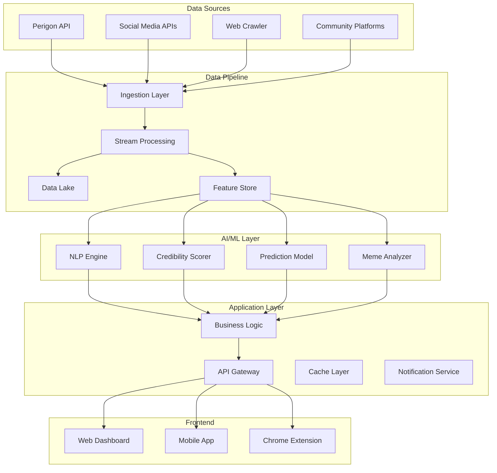

# 🏗️ TrueVoice 기술 아키텍처 설계

## 1. 시스템 아키텍처 개요

### 🎯 핵심 설계 원칙

```yaml
Design Principles:
1. Scalability First: 마이크로서비스 아키텍처
2. Real-time Processing: 이벤트 기반 스트리밍
3. AI-Native: ML 파이프라인 내장
4. Privacy by Design: 개인정보 보호 우선
5. Multi-tenancy: 엔터프라이즈 지원
```

### 🏛️ High-Level Architecture



## 2. 데이터 수집 레이어

### 📊 Multi-Source Data Collection

#### 2.1 Perigon API Integration
```python
class PerigonConnector:
    """
    Perigon API 통합 모듈
    - 70,000+ 글로벌 뉴스 소스
    - 실시간 웹 콘텐츠 수집
    - 내장 센티먼트 분석
    """
    
    def __init__(self, api_key: str):
        self.base_url = "https://api.perigon.com/v1"
        self.headers = {"x-api-key": api_key}
        self.rate_limiter = RateLimiter(requests_per_minute=100)
    
    async def fetch_articles(self, query: str, filters: dict) -> List[Article]:
        """
        실시간 기사 수집
        - 키워드 기반 검색
        - 지역/언어 필터링
        - 시간 범위 설정
        """
        params = {
            "q": query,
            "language": filters.get("language", "ko"),
            "from": filters.get("from_date"),
            "to": filters.get("to_date"),
            "size": 100
        }
        
        async with self.rate_limiter:
            response = await self.http_client.get(
                f"{self.base_url}/search",
                headers=self.headers,
                params=params
            )
            
        return self._parse_articles(response.json())
```

#### 2.2 Social Media APIs
```python
class SocialMediaCollector:
    """
    소셜미디어 통합 수집기
    """
    
    platforms = {
        "twitter": TwitterAPI(),      # X(Twitter) API v2
        "instagram": InstagramAPI(),   # Instagram Basic Display API
        "youtube": YouTubeAPI(),       # YouTube Data API v3
        "tiktok": TikTokAPI(),        # TikTok API
        "reddit": RedditAPI()          # Reddit API
    }
    
    async def collect_mentions(self, brand: str, timeframe: int) -> dict:
        """
        브랜드 멘션 수집
        - 실시간 멘션 추적
        - 댓글/리플라이 수집
        - 밈/이미지 포함
        """
        results = {}
        
        tasks = []
        for platform_name, api in self.platforms.items():
            task = api.search_mentions(
                query=brand,
                hours_back=timeframe,
                include_replies=True,
                include_media=True
            )
            tasks.append(task)
        
        platform_data = await asyncio.gather(*tasks)
        
        for platform_name, data in zip(self.platforms.keys(), platform_data):
            results[platform_name] = data
            
        return results
```

#### 2.3 Korean Community Crawler
```python
class KoreanCommunityCrawler:
    """
    한국 커뮤니티 특화 크롤러
    """
    
    target_sites = {
        "dcinside": DCInsideCrawler(),
        "fmkorea": FMKoreaCrawler(),
        "clien": ClienCrawler(),
        "ruliweb": RuliwebCrawler(),
        "naver_cafe": NaverCafeCrawler(),
        "blind": BlindCrawler()
    }
    
    async def crawl_posts(self, keywords: List[str]) -> List[Post]:
        """
        커뮤니티 게시글 크롤링
        - 실시간 인기글
        - 댓글 반응
        - 추천/비추천 수
        """
        all_posts = []
        
        for site_name, crawler in self.target_sites.items():
            try:
                posts = await crawler.search_posts(
                    keywords=keywords,
                    sort_by="popular",
                    limit=100
                )
                all_posts.extend(posts)
            except Exception as e:
                logger.error(f"Error crawling {site_name}: {e}")
                
        return all_posts
```

### 📈 Data Volume Estimation

```yaml
일일 데이터 수집량:
- 뉴스 기사: 50,000건
- 소셜미디어 포스트: 500,000건
- 커뮤니티 게시글: 100,000건
- 댓글/리플라이: 2,000,000건
- 이미지/밈: 50,000건

총 일일 처리량: ~3TB
월간 스토리지: ~90TB
```

## 3. AI/ML 파이프라인

### 🤖 3.1 NLP 엔진

```python
class KoreanNLPEngine:
    """
    한국어 특화 자연어 처리 엔진
    """
    
    def __init__(self):
        # KoELECTRA for Korean sentiment analysis
        self.sentiment_model = AutoModelForSequenceClassification.from_pretrained(
            "tunib/electra-ko-base-sentiment"
        )
        
        # GPT-4 for intent analysis
        self.intent_analyzer = OpenAI(
            model="gpt-4",
            temperature=0.3
        )
        
        # Custom slang/meme dictionary
        self.slang_dict = self._load_slang_dictionary()
        self.meme_patterns = self._load_meme_patterns()
    
    async def analyze_text(self, text: str) -> dict:
        """
        텍스트 종합 분석
        """
        # 1. 전처리 (은어/신조어 정규화)
        normalized_text = self._normalize_slang(text)
        
        # 2. 감성 분석
        sentiment = await self._analyze_sentiment(normalized_text)
        
        # 3. 의도 분석
        intent = await self._analyze_intent(normalized_text)
        
        # 4. 밈/트렌드 감지
        memes = self._detect_memes(text)
        
        # 5. 구매 의도 점수
        purchase_intent = self._calculate_purchase_intent(
            sentiment, intent, text
        )
        
        return {
            "sentiment": sentiment,
            "intent": intent,
            "memes": memes,
            "purchase_intent": purchase_intent,
            "original_text": text,
            "normalized_text": normalized_text
        }
```

### 🎯 3.2 신뢰도 평가 모델

```python
class CredibilityScorer:
    """
    댓글/포스트 신뢰도 평가 모델
    진짜 의견 vs 봇/어뷰징 구분
    """
    
    def __init__(self):
        self.bot_detector = BotDetectionModel()
        self.authenticity_scorer = AuthenticityModel()
        self.user_profiler = UserProfileAnalyzer()
    
    def calculate_credibility(self, post: dict) -> float:
        """
        신뢰도 점수 계산 (0-100)
        """
        score = 100  # 기본 점수
        
        # 봇 감지 (-50점)
        if self.bot_detector.is_bot(post):
            score -= 50
            
        # 계정 나이 (+10점 if > 1년)
        account_age = self._get_account_age(post["user"])
        if account_age > 365:
            score += 10
            
        # 팔로워/팔로잉 비율 체크
        follower_ratio = post["followers"] / max(post["following"], 1)
        if follower_ratio < 0.1:  # 팔로워가 너무 적음
            score -= 20
            
        # 극단적 언어 사용 (-20점)
        if self._contains_extreme_language(post["text"]):
            score -= 20
            
        # 구체적 경험 언급 (+30점)
        if self._mentions_personal_experience(post["text"]):
            score += 30
            
        # 이미지/영상 포함 (+15점)
        if post.get("media"):
            score += 15
            
        # 과도한 해시태그 (-15점)
        hashtag_count = len(post.get("hashtags", []))
        if hashtag_count > 10:
            score -= 15
            
        # 반복적 패턴 감지 (-30점)
        if self._detect_repetitive_pattern(post["user"]):
            score -= 30
            
        return max(0, min(100, score))
```

### 📊 3.3 실제 반응 예측 모델

```python
class RealWorldPredictor:
    """
    온라인 반응 → 실제 행동 예측 모델
    """
    
    def __init__(self):
        # 과거 데이터로 학습된 변환 모델
        self.conversion_model = self._load_trained_model()
        
        # 플랫폼별 가중치
        self.platform_weights = {
            "news_comment": 0.3,
            "twitter": 0.5,
            "instagram": 0.7,
            "community": 0.8,
            "review_site": 0.9
        }
        
        # 인구통계 가중치
        self.demographic_weights = self._load_demographic_weights()
    
    def predict_real_reaction(self, online_data: dict) -> dict:
        """
        실제 세상 반응 예측
        """
        # 1. 플랫폼별 데이터 집계
        platform_sentiments = {}
        for platform, posts in online_data.items():
            # 신뢰도 높은 포스트만 필터링
            credible_posts = [
                p for p in posts 
                if p["credibility_score"] > 60
            ]
            
            # 가중 평균 감성 계산
            weighted_sentiment = self._calculate_weighted_sentiment(
                credible_posts,
                self.platform_weights.get(platform, 0.5)
            )
            
            platform_sentiments[platform] = weighted_sentiment
        
        # 2. 인구통계 보정
        adjusted_sentiment = self._apply_demographic_adjustment(
            platform_sentiments,
            self.demographic_weights
        )
        
        # 3. 실제 행동 예측
        prediction = self.conversion_model.predict({
            "online_sentiment": adjusted_sentiment,
            "volume": len(online_data),
            "velocity": self._calculate_velocity(online_data),
            "diversity": self._calculate_diversity(online_data)
        })
        
        return {
            "predicted_purchase_intent": prediction["purchase_intent"],
            "predicted_brand_sentiment": prediction["brand_sentiment"],
            "predicted_viral_potential": prediction["viral_potential"],
            "confidence_score": prediction["confidence"],
            "risk_factors": self._identify_risks(online_data),
            "opportunities": self._identify_opportunities(online_data)
        }
```

### 🎭 3.4 밈/바이럴 분석기

```python
class MemeAnalyzer:
    """
    밈 트렌드 및 바이럴 잠재력 분석
    """
    
    def __init__(self):
        # 이미지 인식 모델 (밈 템플릿 감지)
        self.vision_model = CLIPModel.from_pretrained("openai/clip-vit-base-patch32")
        
        # 밈 데이터베이스
        self.meme_db = MemeDatabase()
        
        # 바이럴 예측 모델
        self.viral_predictor = ViralPredictionModel()
    
    async def analyze_meme(self, content: dict) -> dict:
        """
        밈 콘텐츠 분석
        """
        analysis = {}
        
        # 1. 밈 템플릿 인식
        if content.get("image"):
            template = await self._identify_meme_template(content["image"])
            analysis["template"] = template
            analysis["template_popularity"] = self.meme_db.get_popularity(template)
        
        # 2. 텍스트 밈 패턴 감지
        if content.get("text"):
            text_memes = self._detect_text_memes(content["text"])
            analysis["text_memes"] = text_memes
        
        # 3. 바이럴 잠재력 계산
        viral_score = self.viral_predictor.predict({
            "engagement_rate": content.get("engagement_rate", 0),
            "share_velocity": content.get("share_velocity", 0),
            "platform": content.get("platform"),
            "meme_freshness": self._calculate_freshness(content),
            "cultural_relevance": self._assess_cultural_relevance(content)
        })
        
        analysis["viral_potential"] = viral_score
        
        # 4. 수명 예측
        lifespan = self._predict_meme_lifespan(content)
        analysis["predicted_lifespan_days"] = lifespan
        
        # 5. 브랜드 적합성 평가
        brand_fit = self._assess_brand_fit(content)
        analysis["brand_safety_score"] = brand_fit["safety"]
        analysis["brand_alignment_score"] = brand_fit["alignment"]
        
        return analysis
```

## 4. 데이터 처리 및 저장

### 💾 4.1 Data Pipeline Architecture

```python
class DataPipeline:
    """
    실시간 데이터 처리 파이프라인
    """
    
    def __init__(self):
        # Apache Kafka for streaming
        self.kafka_producer = KafkaProducer(
            bootstrap_servers=['localhost:9092'],
            value_serializer=lambda v: json.dumps(v).encode('utf-8')
        )
        
        # Apache Flink for stream processing
        self.flink_env = StreamExecutionEnvironment.get_execution_environment()
        
        # PostgreSQL for structured data
        self.postgres = PostgresClient()
        
        # MongoDB for unstructured data
        self.mongodb = MongoClient()
        
        # Redis for caching
        self.redis = RedisClient()
        
        # S3 for data lake
        self.s3 = S3Client()
    
    async def process_incoming_data(self, raw_data: dict):
        """
        실시간 데이터 처리
        """
        # 1. Kafka로 스트리밍
        self.kafka_producer.send('raw-data-topic', raw_data)
        
        # 2. 실시간 처리 (Flink)
        processed_data = await self._stream_process(raw_data)
        
        # 3. 데이터 저장
        await self._store_data(processed_data)
        
        # 4. 캐시 업데이트
        await self._update_cache(processed_data)
        
        # 5. 실시간 알림 트리거
        await self._trigger_alerts(processed_data)
```

### 🗄️ 4.2 Database Schema

```sql
-- PostgreSQL Schema

-- 브랜드 테이블
CREATE TABLE brands (
    id UUID PRIMARY KEY DEFAULT gen_random_uuid(),
    name VARCHAR(255) NOT NULL,
    industry VARCHAR(100),
    created_at TIMESTAMP DEFAULT CURRENT_TIMESTAMP
);

-- 캠페인 테이블
CREATE TABLE campaigns (
    id UUID PRIMARY KEY DEFAULT gen_random_uuid(),
    brand_id UUID REFERENCES brands(id),
    name VARCHAR(255) NOT NULL,
    start_date DATE,
    end_date DATE,
    budget DECIMAL(12, 2),
    target_keywords TEXT[],
    created_at TIMESTAMP DEFAULT CURRENT_TIMESTAMP
);

-- 멘션 테이블
CREATE TABLE mentions (
    id UUID PRIMARY KEY DEFAULT gen_random_uuid(),
    campaign_id UUID REFERENCES campaigns(id),
    platform VARCHAR(50),
    author_id VARCHAR(255),
    content TEXT,
    sentiment_score FLOAT,
    credibility_score FLOAT,
    engagement_count INTEGER,
    created_at TIMESTAMP,
    collected_at TIMESTAMP DEFAULT CURRENT_TIMESTAMP
);

-- 예측 결과 테이블
CREATE TABLE predictions (
    id UUID PRIMARY KEY DEFAULT gen_random_uuid(),
    campaign_id UUID REFERENCES campaigns(id),
    prediction_type VARCHAR(50), -- 'purchase_intent', 'viral_potential', etc.
    predicted_value FLOAT,
    confidence_score FLOAT,
    actual_value FLOAT, -- 실제 결과 (나중에 업데이트)
    predicted_at TIMESTAMP DEFAULT CURRENT_TIMESTAMP
);

-- 밈 분석 테이블
CREATE TABLE meme_analysis (
    id UUID PRIMARY KEY DEFAULT gen_random_uuid(),
    mention_id UUID REFERENCES mentions(id),
    meme_template VARCHAR(255),
    viral_score FLOAT,
    predicted_lifespan_days INTEGER,
    brand_safety_score FLOAT,
    analyzed_at TIMESTAMP DEFAULT CURRENT_TIMESTAMP
);

-- 인덱스 생성
CREATE INDEX idx_mentions_campaign ON mentions(campaign_id);
CREATE INDEX idx_mentions_platform ON mentions(platform);
CREATE INDEX idx_mentions_created ON mentions(created_at);
CREATE INDEX idx_predictions_campaign ON predictions(campaign_id);
```

### 📊 4.3 Feature Store

```python
class FeatureStore:
    """
    ML 모델을 위한 Feature Store
    """
    
    def __init__(self):
        self.store = FeatureStoreClient()
    
    def create_features(self):
        """
        피처 정의 및 생성
        """
        # 브랜드 피처
        brand_features = self.store.create_feature_group(
            name="brand_features",
            features=[
                Feature("brand_id", ValueType.STRING),
                Feature("industry", ValueType.STRING),
                Feature("avg_sentiment_30d", ValueType.FLOAT),
                Feature("mention_volume_30d", ValueType.INT64),
                Feature("top_keywords", ValueType.STRING_LIST)
            ]
        )
        
        # 캠페인 피처
        campaign_features = self.store.create_feature_group(
            name="campaign_features",
            features=[
                Feature("campaign_id", ValueType.STRING),
                Feature("days_active", ValueType.INT64),
                Feature("daily_mention_avg", ValueType.FLOAT),
                Feature("sentiment_trend", ValueType.FLOAT),
                Feature("viral_score_avg", ValueType.FLOAT)
            ]
        )
        
        # 실시간 피처
        realtime_features = self.store.create_feature_group(
            name="realtime_features",
            features=[
                Feature("current_velocity", ValueType.FLOAT),
                Feature("spike_detected", ValueType.BOOL),
                Feature("trending_topics", ValueType.STRING_LIST),
                Feature("risk_score", ValueType.FLOAT)
            ]
        )
        
        return [brand_features, campaign_features, realtime_features]
```

## 5. API 및 서비스 레이어

### 🚀 5.1 RESTful API Design

```python
from fastapi import FastAPI, HTTPException, Depends
from pydantic import BaseModel

app = FastAPI(title="TrueVoice API", version="1.0.0")

# API Models
class CampaignRequest(BaseModel):
    brand_name: str
    keywords: List[str]
    platforms: List[str]
    date_range: dict

class PredictionResponse(BaseModel):
    campaign_id: str
    predictions: dict
    confidence: float
    insights: List[str]
    recommendations: List[str]

# API Endpoints
@app.post("/api/v1/campaigns", response_model=dict)
async def create_campaign(request: CampaignRequest):
    """
    새 캠페인 생성 및 모니터링 시작
    """
    campaign = await campaign_service.create(
        brand=request.brand_name,
        keywords=request.keywords,
        platforms=request.platforms
    )
    
    # 백그라운드 태스크로 데이터 수집 시작
    background_tasks.add_task(
        data_collector.start_collection,
        campaign.id
    )
    
    return {
        "campaign_id": campaign.id,
        "status": "active",
        "monitoring_started": True
    }

@app.get("/api/v1/predictions/{campaign_id}")
async def get_predictions(campaign_id: str) -> PredictionResponse:
    """
    캠페인 예측 결과 조회
    """
    predictions = await prediction_service.get_latest(campaign_id)
    
    return PredictionResponse(
        campaign_id=campaign_id,
        predictions=predictions,
        confidence=predictions["confidence_score"],
        insights=insight_generator.generate(predictions),
        recommendations=recommendation_engine.suggest(predictions)
    )

@app.get("/api/v1/realtime/{campaign_id}")
async def get_realtime_data(campaign_id: str):
    """
    실시간 데이터 스트림 (WebSocket)
    """
    return await websocket_manager.stream_realtime_data(campaign_id)

@app.post("/api/v1/analyze/meme")
async def analyze_meme(content: dict):
    """
    밈 콘텐츠 분석
    """
    analysis = await meme_analyzer.analyze(content)
    return analysis
```

### 🔌 5.2 WebSocket for Real-time Updates

```python
class WebSocketManager:
    """
    실시간 업데이트를 위한 WebSocket 관리
    """
    
    def __init__(self):
        self.active_connections: Dict[str, List[WebSocket]] = {}
    
    async def connect(self, websocket: WebSocket, campaign_id: str):
        await websocket.accept()
        if campaign_id not in self.active_connections:
            self.active_connections[campaign_id] = []
        self.active_connections[campaign_id].append(websocket)
    
    async def broadcast_update(self, campaign_id: str, data: dict):
        """
        특정 캠페인 구독자들에게 실시간 업데이트 전송
        """
        if campaign_id in self.active_connections:
            for connection in self.active_connections[campaign_id]:
                try:
                    await connection.send_json({
                        "type": "update",
                        "timestamp": datetime.now().isoformat(),
                        "data": data
                    })
                except:
                    # 연결 끊김 처리
                    self.active_connections[campaign_id].remove(connection)

@app.websocket("/ws/{campaign_id}")
async def websocket_endpoint(websocket: WebSocket, campaign_id: str):
    await manager.connect(websocket, campaign_id)
    try:
        while True:
            # 클라이언트로부터 메시지 수신
            data = await websocket.receive_text()
            
            # 실시간 데이터 전송
            realtime_data = await get_realtime_metrics(campaign_id)
            await websocket.send_json(realtime_data)
            
    except WebSocketDisconnect:
        manager.disconnect(websocket, campaign_id)
```

## 6. 보안 및 성능 최적화

### 🔐 6.1 Security Implementation

```python
class SecurityLayer:
    """
    보안 레이어 구현
    """
    
    def __init__(self):
        self.encryptor = Fernet(settings.ENCRYPTION_KEY)
        self.rate_limiter = RateLimiter()
        self.auth_manager = AuthenticationManager()
    
    # API 인증
    async def verify_api_key(self, api_key: str) -> bool:
        """
        API 키 검증
        """
        hashed_key = hashlib.sha256(api_key.encode()).hexdigest()
        return await self.auth_manager.verify_key(hashed_key)
    
    # 데이터 암호화
    def encrypt_sensitive_data(self, data: str) -> str:
        """
        민감 데이터 암호화
        """
        return self.encryptor.encrypt(data.encode()).decode()
    
    # Rate Limiting
    @app.middleware("http")
    async def rate_limit_middleware(request: Request, call_next):
        client_ip = request.client.host
        
        if not rate_limiter.is_allowed(client_ip):
            raise HTTPException(
                status_code=429,
                detail="Too many requests"
            )
        
        response = await call_next(request)
        return response
    
    # Data Privacy
    def anonymize_user_data(self, data: dict) -> dict:
        """
        개인정보 익명화
        """
        anonymized = data.copy()
        
        # 이메일 마스킹
        if "email" in anonymized:
            anonymized["email"] = self._mask_email(data["email"])
        
        # 이름 해싱
        if "name" in anonymized:
            anonymized["name"] = hashlib.md5(
                data["name"].encode()
            ).hexdigest()[:8]
        
        # IP 주소 제거
        if "ip_address" in anonymized:
            del anonymized["ip_address"]
        
        return anonymized
```

### ⚡ 6.2 Performance Optimization

```python
class PerformanceOptimizer:
    """
    성능 최적화 전략
    """
    
    def __init__(self):
        # Redis 캐싱
        self.cache = RedisCache(
            host='localhost',
            port=6379,
            ttl=300  # 5분 캐시
        )
        
        # Connection pooling
        self.db_pool = create_pool(
            min_size=10,
            max_size=100
        )
        
        # Async processing
        self.executor = ThreadPoolExecutor(max_workers=20)
    
    # 캐싱 전략
    @cache_result(ttl=300)
    async def get_cached_predictions(self, campaign_id: str):
        """
        예측 결과 캐싱
        """
        cache_key = f"predictions:{campaign_id}"
        
        # 캐시 확인
        cached = await self.cache.get(cache_key)
        if cached:
            return cached
        
        # 캐시 미스 시 계산
        predictions = await self._calculate_predictions(campaign_id)
        
        # 캐시 저장
        await self.cache.set(cache_key, predictions)
        
        return predictions
    
    # 배치 처리
    async def batch_process_mentions(self, mentions: List[dict]):
        """
        대량 멘션 배치 처리
        """
        batch_size = 1000
        batches = [
            mentions[i:i + batch_size]
            for i in range(0, len(mentions), batch_size)
        ]
        
        tasks = []
        for batch in batches:
            task = self._process_batch(batch)
            tasks.append(task)
        
        results = await asyncio.gather(*tasks)
        return list(itertools.chain(*results))
    
    # 쿼리 최적화
    def optimize_database_queries(self):
        """
        데이터베이스 쿼리 최적화
        """
        # 인덱스 생성
        create_indexes = [
            "CREATE INDEX CONCURRENTLY idx_mentions_timestamp ON mentions(created_at DESC)",
            "CREATE INDEX idx_mentions_sentiment ON mentions(sentiment_score)",
            "CREATE INDEX idx_campaigns_brand ON campaigns(brand_id)"
        ]
        
        # 파티셔닝
        partition_tables = """
        CREATE TABLE mentions_2025_01 PARTITION OF mentions
        FOR VALUES FROM ('2025-01-01') TO ('2025-02-01');
        """
        
        # Materialized Views
        create_materialized_view = """
        CREATE MATERIALIZED VIEW campaign_daily_stats AS
        SELECT 
            campaign_id,
            DATE(created_at) as date,
            COUNT(*) as mention_count,
            AVG(sentiment_score) as avg_sentiment,
            AVG(credibility_score) as avg_credibility
        FROM mentions
        GROUP BY campaign_id, DATE(created_at)
        WITH DATA;
        """
```

## 7. 모니터링 및 운영

### 📊 7.1 Monitoring Stack

```yaml
monitoring_stack:
  metrics:
    - Prometheus (메트릭 수집)
    - Grafana (시각화)
    
  logging:
    - ELK Stack (Elasticsearch, Logstash, Kibana)
    - Structured logging with correlation IDs
    
  tracing:
    - Jaeger (분산 트레이싱)
    - OpenTelemetry (표준화된 관측성)
    
  alerting:
    - PagerDuty (인시던트 관리)
    - Slack notifications
    
  health_checks:
    - /health (시스템 상태)
    - /ready (준비 상태)
    - /metrics (Prometheus 메트릭)
```

### 🚨 7.2 Alert Rules

```python
alert_rules = {
    "high_error_rate": {
        "condition": "error_rate > 1%",
        "severity": "critical",
        "action": "page_oncall"
    },
    "api_latency": {
        "condition": "p99_latency > 1000ms",
        "severity": "warning",
        "action": "slack_notification"
    },
    "data_pipeline_lag": {
        "condition": "pipeline_lag > 5_minutes",
        "severity": "warning",
        "action": "email_team"
    },
    "prediction_accuracy_drop": {
        "condition": "accuracy < 70%",
        "severity": "critical",
        "action": "page_ml_team"
    }
}
```

## 8. 확장성 및 미래 계획

### 📈 8.1 Scaling Strategy

```yaml
horizontal_scaling:
  - Kubernetes for container orchestration
  - Auto-scaling based on CPU/Memory/Request rate
  - Multi-region deployment for global coverage
  
vertical_scaling:
  - GPU instances for ML workloads
  - High-memory instances for caching
  - SSD storage for hot data
  
data_scaling:
  - Data partitioning by date/campaign
  - Read replicas for query distribution
  - CDN for static content
```

### 🔮 8.2 Future Enhancements

```yaml
planned_features:
  v2.0:
    - Multi-language support (EN, JP, CN)
    - Video content analysis
    - Voice of Customer (VoC) integration
    
  v3.0:
    - Predictive campaign optimization
    - Automated A/B testing
    - Real-time bidding integration
    
  v4.0:
    - AR/VR content analysis
    - Metaverse monitoring
    - Web3 social monitoring
```

## 9. 비용 추정

### 💰 Infrastructure Cost Estimation

```yaml
월간 인프라 비용 (AWS 기준):
  compute:
    - EC2 (4x m5.xlarge): $600
    - EKS cluster: $150
    - Lambda functions: $100
    
  storage:
    - RDS PostgreSQL: $300
    - S3 (100TB): $2,300
    - ElastiCache Redis: $200
    
  ml_services:
    - SageMaker: $500
    - GPU instances: $800
    
  data_transfer:
    - CloudFront CDN: $200
    - Data transfer: $300
    
  third_party_apis:
    - Perigon API: $500
    - OpenAI GPT-4: $300
    - Social Media APIs: $200
    
  monitoring:
    - CloudWatch: $100
    - DataDog: $200
    
총 월간 비용: ~$6,550
연간 비용: ~$78,600
```

## 10. 결론

TrueVoice의 기술 아키텍처는 확장 가능하고 안전하며 고성능의 시스템으로 설계되었습니다. 

### ✅ 핵심 기술적 차별화
1. **Multi-source data fusion**: Perigon API + 소셜미디어 + 커뮤니티 통합
2. **Advanced AI pipeline**: 신뢰도 필터링 + 예측 모델
3. **Real-time processing**: 스트리밍 아키텍처로 즉각적 인사이트
4. **Korean-optimized**: 한국어 NLP 및 문화적 맥락 이해
5. **Enterprise-ready**: 보안, 확장성, 신뢰성 보장

이 아키텍처는 MVP부터 엔터프라이즈 규모까지 성장 가능한 견고한 기반을 제공합니다.

---

*Technical Architecture v1.0*
*Last Updated: 2025년 1월*