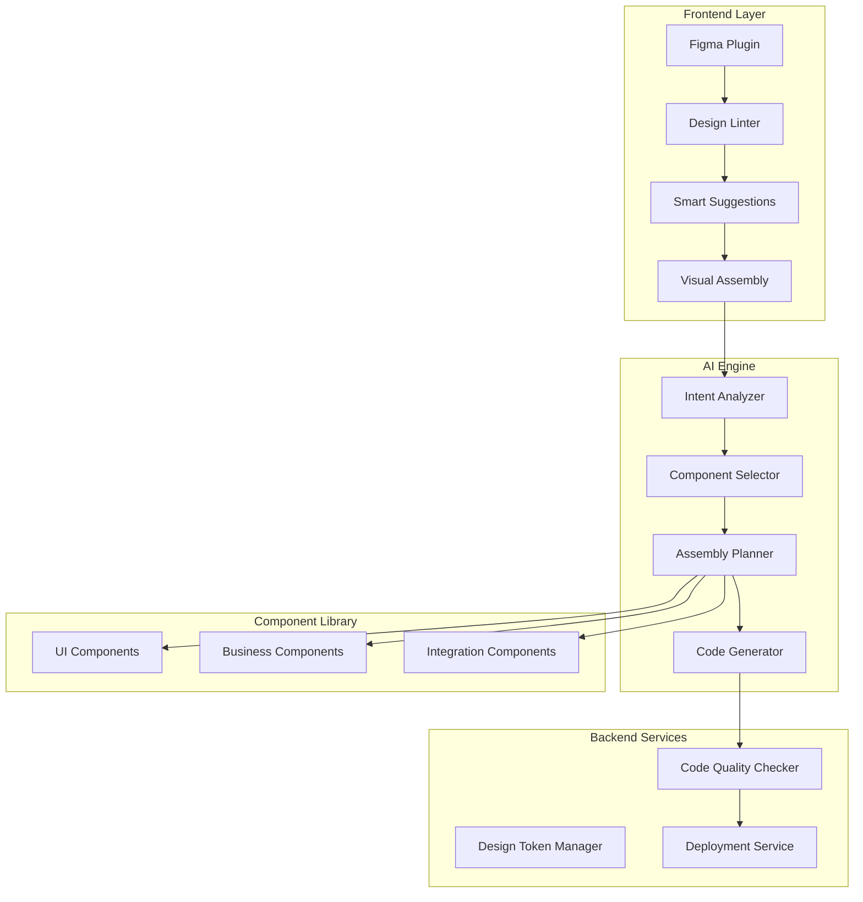

# 🚀 Vibe-NoCode Builder Project

> AI 기반 비주얼 컴포넌트 조립 플랫폼 & 피그마-코드 완벽 변환 솔루션

## 📁 프로젝트 문서 구조

```
vibe-nocode-builder/
├── README.md                           # 프로젝트 개요 (현재 문서)
├── vibe-blueprint-builder.md           # AI 컴포넌트 조립 플랫폼 상세
├── figma-to-code-analysis.md          # 기존 피그마→코드 도구 분석
├── figma-to-code-perfect-solution.md  # 피그마→코드 혁신 솔루션
└── seamless-figma-to-code-ux.md       # 자연스러운 UX 설계
```

## 🎯 프로젝트 비전

### 두 가지 혁신적 접근

1. **Vibe Blueprint Builder**: 언리얼 블루프린트 스타일의 AI 컴포넌트 조립 플랫폼
2. **Figma Perfect Converter**: 디자인 단계부터 개입하는 완벽한 코드 변환 시스템

## 🏗️ 시스템 아키텍처



## 💡 핵심 혁신 포인트

### 1. Progressive Disclosure UX
- **Level 0**: Silent Mode (백그라운드 분석)
- **Level 1**: Smart Suggestions (부드러운 제안)
- **Level 2**: Active Guide (실시간 피드백)

### 2. 컴포넌트 중심 접근
- 검증된 프로덕션 레디 컴포넌트
- AI 기반 지능형 조립
- 실시간 시각적 피드백

### 3. 디자인 단계 개입
- Design Linter로 코드 친화적 구조 유도
- 컨텍스트 정보 자동 주입
- 점진적 학습 시스템

## 🔗 관련 문서

- [AI 컴포넌트 조립 플랫폼 상세](./vibe-blueprint-builder.md)
- [피그마 변환 도구 시장 분석](./figma-to-code-analysis.md)
- [혁신적 피그마 솔루션](./figma-to-code-perfect-solution.md)
- [자연스러운 UX 설계](./seamless-figma-to-code-ux.md)

## 📊 예상 임팩트

- **개발 시간 80% 단축**
- **디자인-개발 핑퐁 90% 감소**
- **코드 품질 표준화 100% 달성**

## 🚦 개발 로드맵

### Phase 1 (2-3개월)
- Figma Design Linter 플러그인
- 기본 컴포넌트 라이브러리 (30개)
- React 코드 변환 엔진

### Phase 2 (2-3개월)
- AI 조립 엔진 고도화
- 다양한 프레임워크 지원
- 실시간 프리뷰 시스템

### Phase 3 (3-4개월)
- 마켓플레이스 구축
- 엔터프라이즈 기능
- 학습 시스템 최적화

---

*Last Updated: 2024*