# 🏗️ 프로젝트 전체 아키텍처

## 📐 시스템 전체 구조도

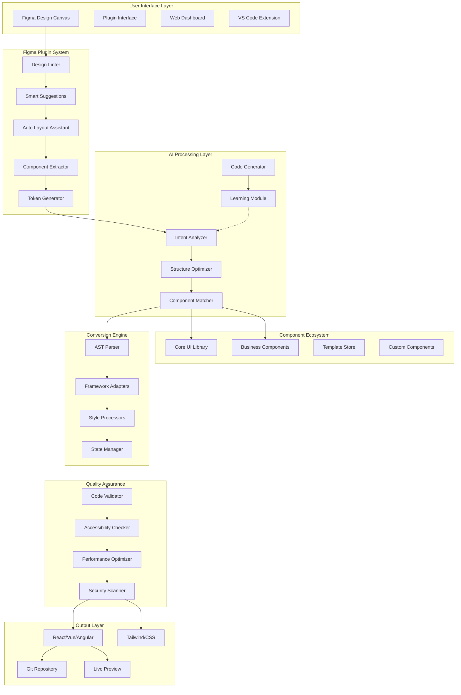

## 🔄 데이터 플로우

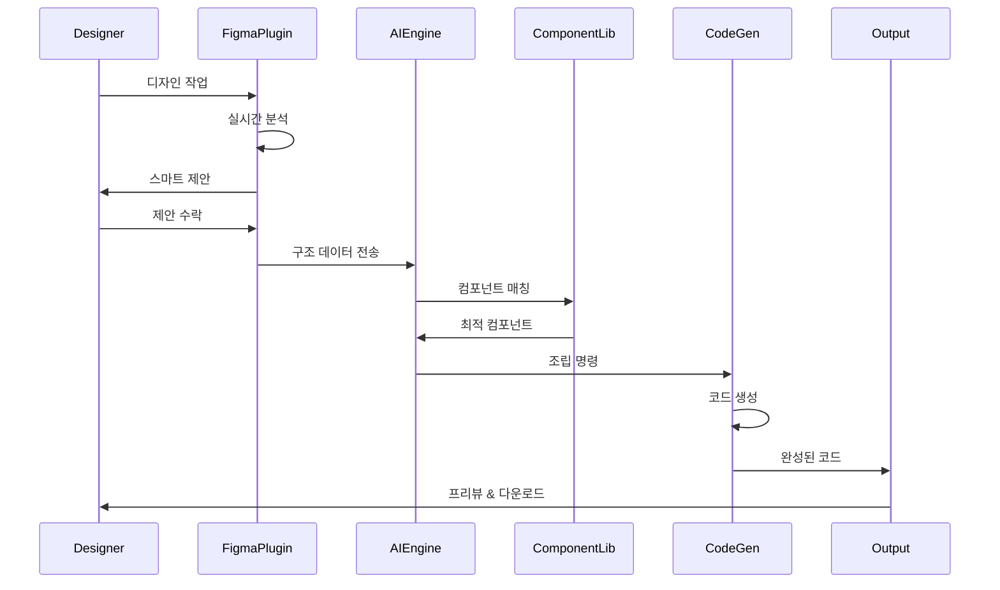

## 🎯 Progressive Disclosure 시스템

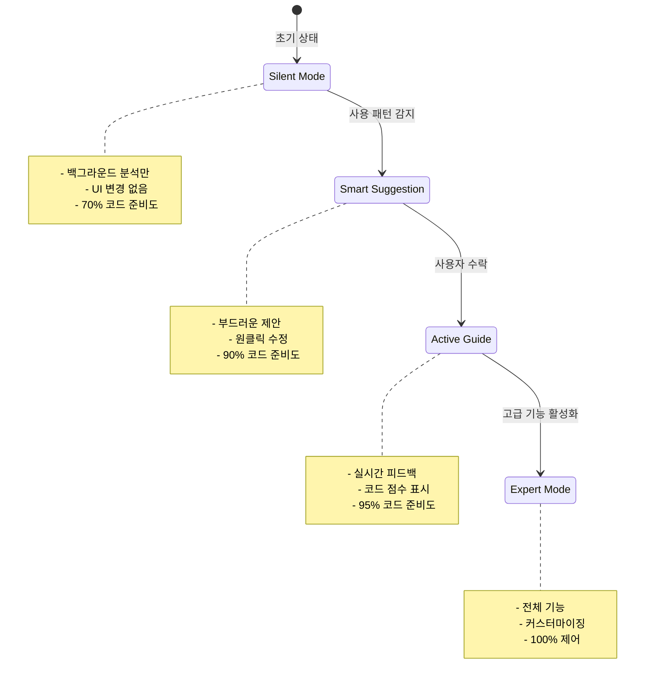

## 🧩 컴포넌트 라이브러리 구조

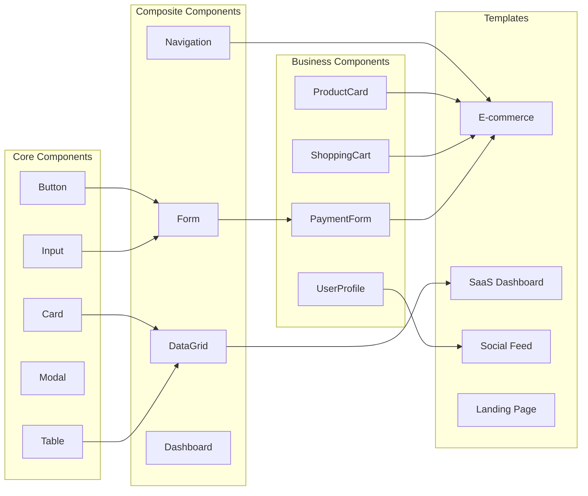

## 🤖 AI 엔진 처리 과정

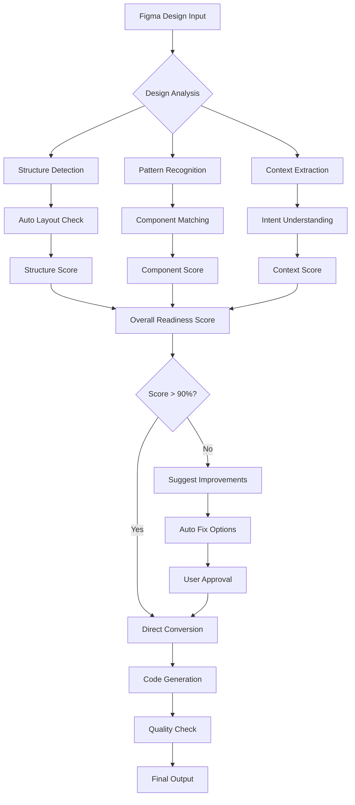

## 🔧 기술 스택

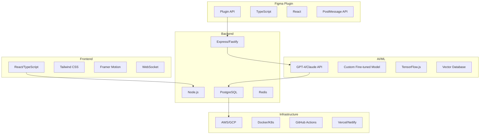

## 📊 성능 최적화 전략

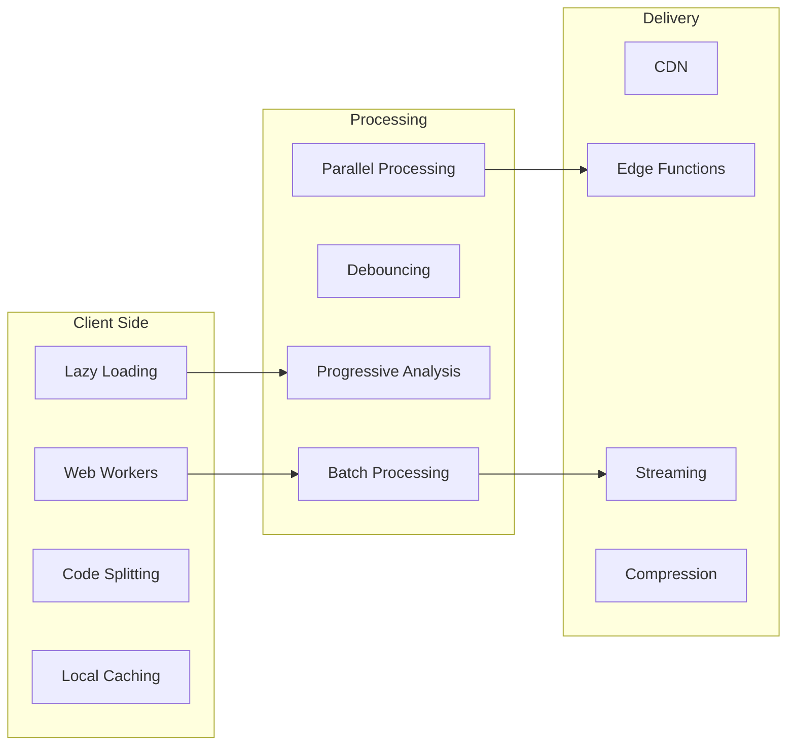

## 🔐 보안 & 프라이버시

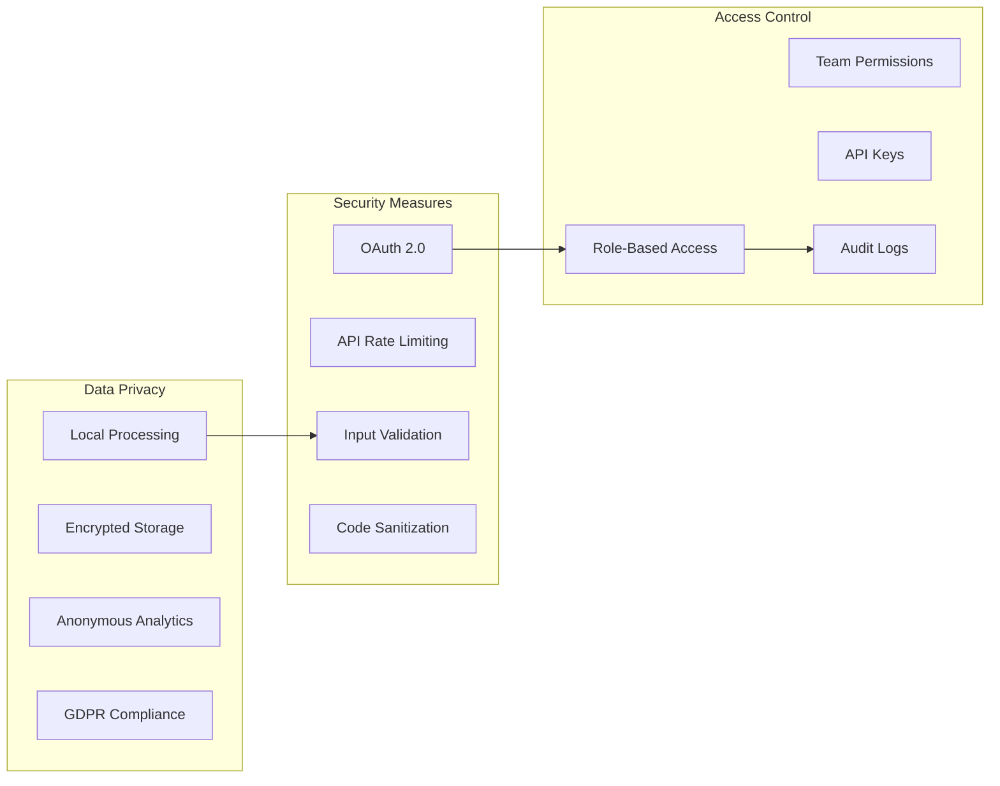

## 💰 비즈니스 모델

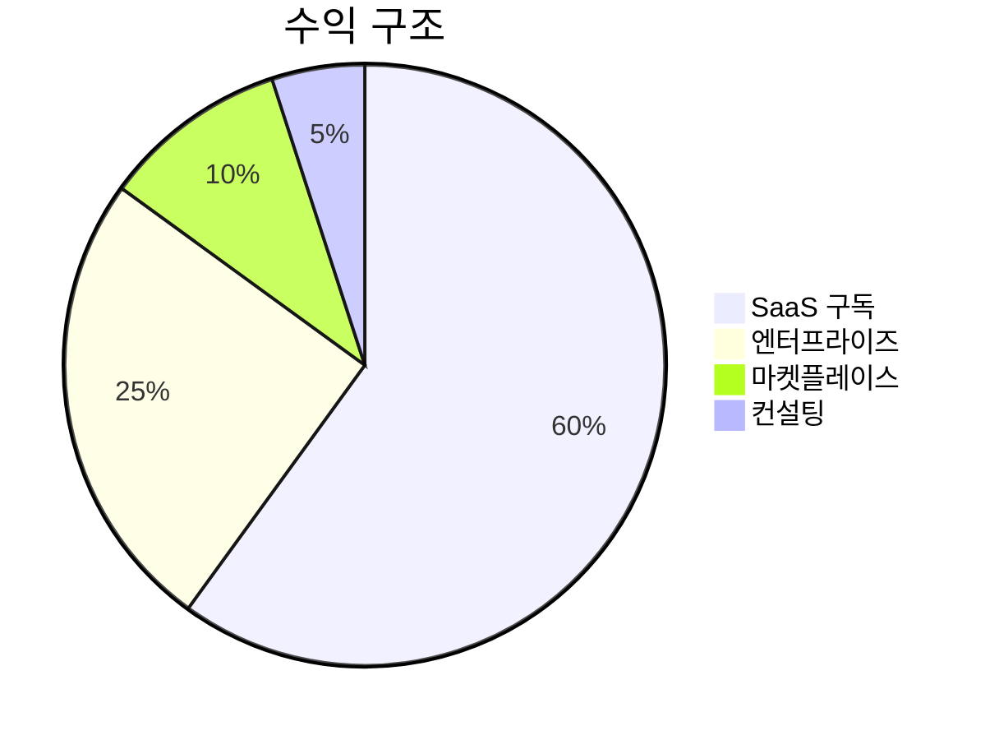

## 🚀 개발 단계

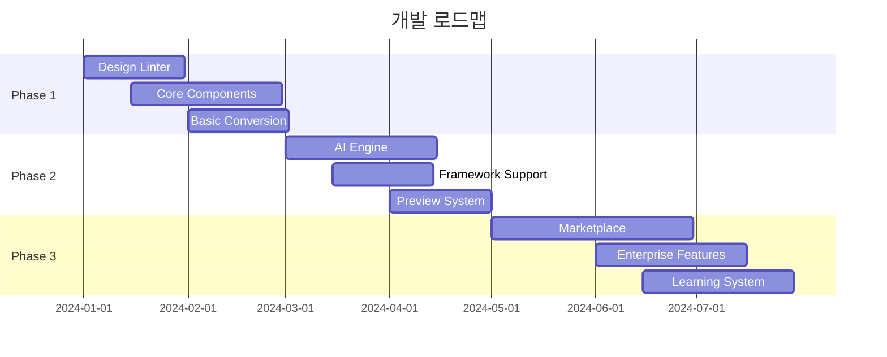

## 📈 예상 성장 곡선

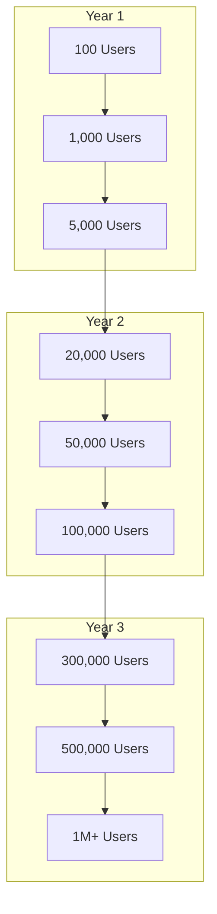

---

## 🎯 핵심 성공 지표 (KPI)

| 지표 | 목표 (6개월) | 목표 (12개월) |
|------|-------------|---------------|
| 코드 변환 정확도 | 90% | 95% |
| 사용자 만족도 (NPS) | 50+ | 70+ |
| 개발 시간 단축 | 50% | 80% |
| 월간 활성 사용자 | 1,000 | 10,000 |
| 유료 전환율 | 5% | 15% |

---

*이 문서는 프로젝트의 전체 기술 아키텍처와 비즈니스 전략을 포함합니다.*